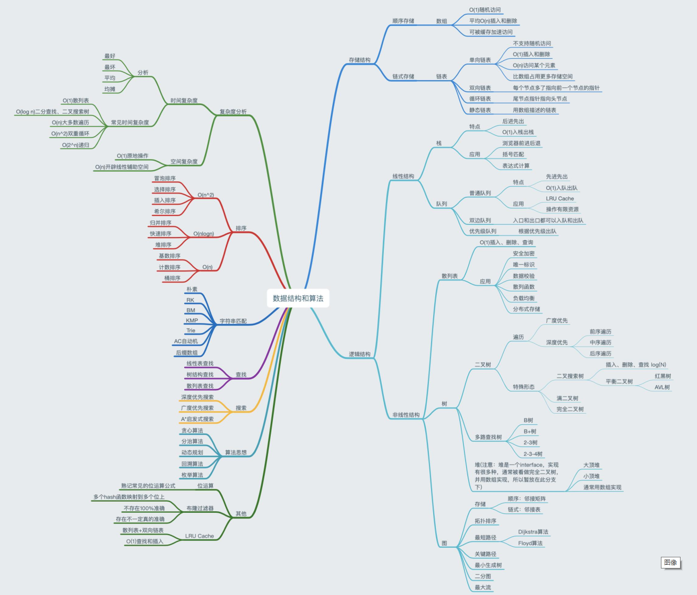
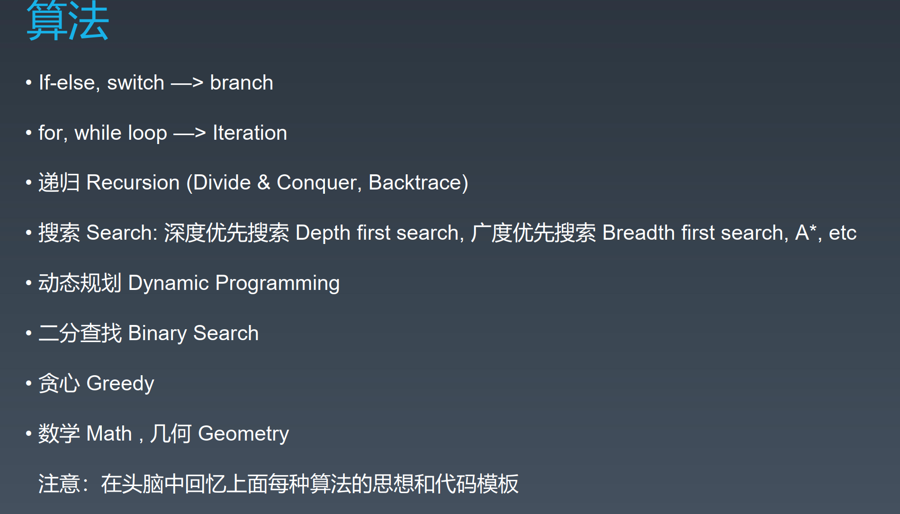
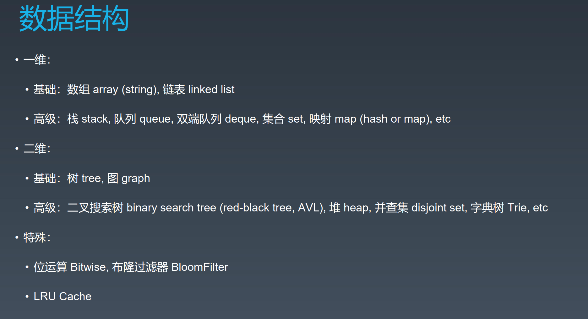

# 算法

## GC

- 标记 - 清除算法
- 复制算法
- 标记 - 整理算法

## redis

- redis内存策略

  - [LRU算法](https://github.com/helloGitHubQ/FiveYears/tree/master/docs/algorithm/LRU.md)
  - [LFU算法](https://github.com/helloGitHubQ/FiveYears/tree/master/docs/algorithm/LFU.md)

- redis分片机制

  - [一致性hash算法](https://github.com/helloGitHubQ/FiveYears/tree/master/docs/algorithm/CH.md)

  

---

## 算法和数据结构脑图：

## 算法：

## 数据结构：

