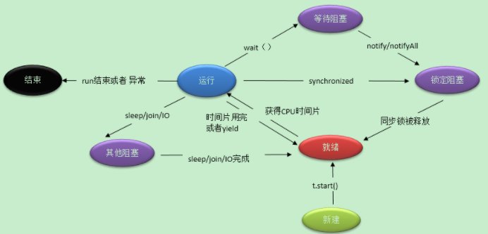
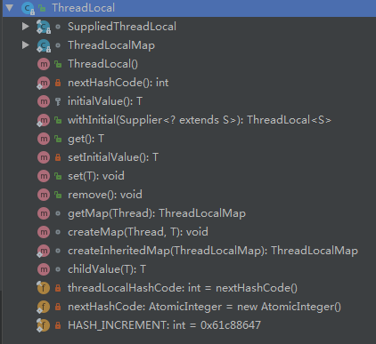

# 并发与多线程

*是以驷牡异力，而六辔如琴，并驾齐驱，而一毂统辐。行文如此，并发亦如此。*

<u>什么时候用到并发和多线程呢？</u>

在现实场景中，为了提高生产率和高效地完成任务，处处均采用多线程和并发的运作方式！

并发和并行是分不开的。它们的核心区别点是进程是否同时进行！

- 并发：在某个时间段内，多任务交替处理的能力
- 并行：同时处理多任务的能力

举个通俗的例子：

​	KTV唱歌，并行指的是多个人同时唱一首歌；并发是同一个话筒被多人轮流使用。


并发和并行的目的都是尽可能快速执行完所有任务。在并发环境下，由于程序的封闭性被打破，出现以下特点：

```
1)并发程序之间有相互制约的关系。
	直接制约体现在一个程序需要另一个程序的计算结果。
	简介制约体现为多个程序竞争共享资源，如处理器、缓冲区等。
2)并发程序的执行过程是断断续续的。
	程序需要记忆现场指令及执行点
3)当并发数设置合理并且 CPU 拥有足够的处理能力时，并发会提高程序的运行效率。
```


## 线程安全

线程是 CPU 调度和分派的基本单位，为了更充分地利用 CPU 资源，一般会使用多线程处理。多线程的作用是提高任务的平均执行速度，但是会导致程序可理解性变差，编程难度增大。


线程可以拥有自己操作栈、程序计数器、局部变量表等资源，它与同一进程内的其他线程共享该进程的所有资源。线程在生命周期内存在多种状态。有 NEW（新建状态）、RUNNABLE（就绪状态）、RUNNING（运行状态）、BLOCKED（阻塞状态），DEAD（终止状态）五种状态。



```
1)NEW 即新建状态，是线程被创建且未启动的状态。
	创建线程的方式是有 3 种：
		第一种：继承自 Thread 类，
		第二种：实现 Runnable 接口，
		第三种：实现 Callable 接口。
	相比第一种，更推荐使用第二种。因为继承自 Thread 类往往不符合里式代换原则，而实现 Runnbale 接口可以使编程更加灵活，对外暴露的细节较少，让使用专注于实现线程的 run 方法上。
    Callable 和 Runnable 有两点不同：
    	第一：可以通过 call() 获得返回值。
    	第二：call() 可以抛出异常。
2)RUNNABLE 即就绪状态，是调用 start() 之后运行之前的状态。
	线程的 start() 不能被多次调用，否则会抛出 IllegalStateException 异常
3)RUNNING 即运行状态，是 run() 正在执行时线程的状态。
	线程可能会由于某些因素而退出 RUNNING ，如时间、异常、锁、调度等。
4)BLOCKED 即阻塞状态，进入此状态，有以下几种情况。
	- 同步阻塞：锁被其他线程占用
	- 主动阻塞：调用 Thread 的某些方法，主动让出 CPU 执行权，比如sleep()、join等
	- 等待阻塞：执行了 wait().
5)DEAD 即终止状态，是 run() 运行结束，或因异常退出后的状态，此状态不可逆转。
```


线程安全问题只存在于多线程环境下，单线程串执行不存在此问题。保证并发场景下的线程安全，可以从以下四个维度考量：

1. 数据单线程内可见。

   单线程总是安全的。通过限制数据仅在单线程内可见，可以避免数据被其他线程篡改。最典型的就是线程局部变量，它存储在独立虚拟机栈帧的局部变量表中，与其他线程毫无瓜葛。 TreadLocal 就是采用这种方式来实现线程安全的。

2. 只读对象。

   只读对象总是安全的。它的特性是允许复制、拒绝写入。最典型的只读对象有 String、Integer 等。一个对象想要拒绝如何写入，必须要满足一下条件：使用 final 关键字修饰，避免被继承；使用 private final 关键字避免属性被中途修改；没有任何更新方法；返回值不能可变对象为引用。

3. 线程安全类。

   某些线程安全类的内部有非常明确的线程安全机制。比如 StringBuffer 就是一个线程安全类，它采用 synchronized 关键字来修饰相关方法。

4. 同步与锁机制。

   如果想要对某个对象进行并发更新操作，但又不属于上述三类，需要开发工程师在代码中实现安全的同步机制。虽然这个机制支持的并发场景很有价值，但非常复杂且容易出现问题。


**线程安全的核心概念就是“要么只读，要么加锁”**。合理利用好  JDK 提供的并发包，往往能化腐朽为神奇。

并发包主要分成以下几个类族：

1. 线程同步类

   这些类使线程间的协调更加容易，支持了更加丰富的线程协调场景，逐步淘汰了使用 Object 类的 wait() 和 notify() 进行同步的方式。主要代表为 CountDownLatch、Semaphore、CyclicBarrier等。

2. 并发集合类

   集合并发操作的要求是执行速度快，提取数据准。最著名的类非 ConcurrentHashMap 莫属，它不断优化，有刚开始的锁分段到后来的 CAS ，不断提升并发性能。其他还有 ConcurrentSkipListMap、CopyOnWriteArrayList、BlockingQueue等。

3. 线程管理类

   虽然 Thread 和 ThreadLocal 在 JDK1.0就已经引入，但是真正把 Thread 发扬光大的是线程池。

4. 锁相关类

   锁以 Lock 接口为核心，派生出在一些实际场景中进行互斥操作的锁相关类。最有名的是ReentrantLock。

## 锁

计算机的锁是从开始的悲观锁，发展到后来的乐观锁、偏向锁、分段锁等。锁主要有两种特性：互斥性和不可见性。

因为锁的存在，某些操作对于外界来说就是黑箱进行的，只有锁的持有者才知道对变量进行了什么修改。

**java.util.concurrent（JUC）包中基础类的解析来说明锁的本质和特性。**


Java 中常用锁实现的方式：

- 用并发包中的锁类

  并发包的类族中，Lock 是 JUC 包的顶层接口，它的实现逻辑并未用到 synchronized ，而是利用了 volatile 的可见性。

  

  [Lock的继承关系图]

​     JDK 8 提出了一个新的锁：StampedLock，改进了读写锁 ReentrantWriteLock。这些新增的锁相关类不断丰富了 JUC 包的内容，降低了并发编程的难度，提高了锁的性能和安全性。

- 利用同步代码块

同步代码块一般使用 Java 的 synchronized 关键字来实现，有两种方式对方法进行加锁操作：

第一：在方法签名处加 synchronized 关键字；

第二：使用 synchronized（对象或类）进行同步。这里原则是锁的范围尽可能的小，锁的时间尽可能的短，即能锁对象，就不要锁类；能锁代码块，就不要锁方法。

synchronized 锁特性由 JVM 负责实现。

## 线程同步

资源共享的两个原因是资源短缺和共建需求。线程共享 CPU 是从资源短缺的维度来考虑的，而多线程共享一个变量，通常是通过共建需求的角度来考虑的。

### volatile

volatile 解决的是多线程共享变量的可见性问题。类似于 synchronized ,但不具备 synchronized 的互斥性。所以对**volatile 变量的操作并非都具有原子性**，这是一个容易犯错误的地方。

这里是要注意 volatile 和 synchronized 区别！！！

一写多读的场景，使用 volatile 修饰变量则非常合适。

### 信号量同步

CountDownLatch（时间维度）

Semaphore（信号维度）

## 线程池

线程池的作用：

- 利用线程池管理并复用线程、控制最大并发数等。
- 实现任务线程队列缓存策略和拒绝机制。
- 实现某些与时间有关的功能，如定时执行、周期执行等。
- 隔离线程环境。比如，交易服务和搜索服务在同一台服务器上，分别开启两个线程池，交易线程的资源消耗明显要大；因此，通过配置独立的线程池，将较慢的交易服务于搜索服务隔离开，避免各服务线程相互影响。


友好的拒绝策略：

```
1)保存到数据库进行削峰填谷。在空闲的时候再提取出来执行
2)转向某个提示页面
3)打印日志
```


### 线程池代码详解

.....

## ThreadLocal

​    ThreadLocal 初衷是在线程并发时，解决变量共享问题，但是由于过度设计，比如弱引用和哈希碰撞，导致理解难度大、使用成本高，反而成为故障高发点。容易出现内存泄漏、脏数据、共享对象更新等问题。



### 引用类型

**强引用**：Strong Reference

​		最常见。如 Object object=new Object()；这样的变量声明和定义就会产生对该对象的强引用。只有对象有强引用指向，并且 GC  Roots 可达，那么 Java 内存回收时，即使濒临内存耗尽，也不会回收该对象。

**软引用**：Soft Reference

​		引用力弱于“强引用”，是用在非必须对象的场景。在即将 OOM 之前，垃圾回收器会把这些软引用指向的对象加入回收范围，以获得更多的内存空间，让程序能够继续健康运行。主要用来缓存服务器中间计算结果及不需要实时保存的用户行为等。

**弱引用**：Weak Reference

​		引用强度比前两者更弱，也是用在非必须对象的。如果弱引用指向的对象只存在弱引用这一条线路，则在下一次 YGC 时会被回收。由于 YGC 时间的不确定性，弱引用何时被回收也具有不确定性。弱引用主要用于指向某个易消失的对象，在强引用断开后，此引用不会劫持对象。调用 WeakReference.get() 可能返回 null ，要注意空指针异常。

**虚引用**：Phantom Reference

​		是极弱的一种引用关系，定义完成后，就无法通过该引用获取指定指向对象。为一个对象设置虚引用的唯一目的就是希望能在这个对象被回收时能够收到一个系统通知。虚引用必须于引用队列联合使用，当垃圾回收时，如果发现存在虚引用，就会在回收对象内存前，把这个虚引用加入与之关联的引用队列中。

### ThreadLocal

- set()：如果没有 set 操作的 ThreadLocal ，容易引起脏数据的问题

  ```java
  /**
       * Sets the current thread's copy of this thread-local variable
       * to the specified value.  Most subclasses will have no need to
       * override this method, relying solely on the {@link #initialValue}
       * method to set the values of thread-locals.
       *
       * @param value the value to be stored in the current thread's copy of
       *        this thread-local.
       */
      public void set(T value) {
          Thread t = Thread.currentThread();
          ThreadLocalMap map = getMap(t);
          if (map != null)
              map.set(this, value);
          else
              createMap(t, value);
      }
  ```

  

- get()：始终没有 get 操作的 ThreadLocal 对象是没有意义的

  ```java
  /**
       * Returns the value in the current thread's copy of this
       * thread-local variable.  If the variable has no value for the
       * current thread, it is first initialized to the value returned
       * by an invocation of the {@link #initialValue} method.
       *
       * @return the current thread's value of this thread-local
       */
      public T get() {
          Thread t = Thread.currentThread();
          ThreadLocalMap map = getMap(t);
          if (map != null) {
              ThreadLocalMap.Entry e = map.getEntry(this);
              if (e != null) {
                  @SuppressWarnings("unchecked")
                  T result = (T)e.value;
                  return result;
              }
          }
          return setInitialValue();
      }
  ```

  

- remove()：如果没有 remove 操作，容易引起内存泄漏

  ```java
  /**
       * Removes the current thread's value for this thread-local
       * variable.  If this thread-local variable is subsequently
       * {@linkplain #get read} by the current thread, its value will be
       * reinitialized by invoking its {@link #initialValue} method,
       * unless its value is {@linkplain #set set} by the current thread
       * in the interim.  This may result in multiple invocations of the
       * {@code initialValue} method in the current thread.
       *
       * @since 1.5
       */
       public void remove() {
           ThreadLocalMap m = getMap(Thread.currentThread());
           if (m != null)
               m.remove(this);
       }
  ```

  

### 副作用

- 脏数据

  线程复用会产生脏数据。

  由于线程池复用 Thread 对象，那么与 Thread 绑定的类的静态属性  ThreadLocal 变量也会被重用。如果在实现的线程 run 方法体中不显式的调用 remove 方法清理与线程相关的 ThreadLocal 信息，那么倘若下一个线程不调用 set() 设置初始值，就可能 get() 到重用的线程信息，包括 ThreadLocal 所关联的线程对象的 value 值。

- 内存泄漏

  在源代码注释中提示试用 static 关键字来修饰 ThreadLocal 。在此场景下，寄希望于  ThreadLocal 对象失去引用后，触发弱引用机制来回收 Enty 的 Value 就不现实了。


以上两个问题解决的办法很简单，就是每次用完 ThreadLocal 时，必须要及时调用 remove() 方法清理

