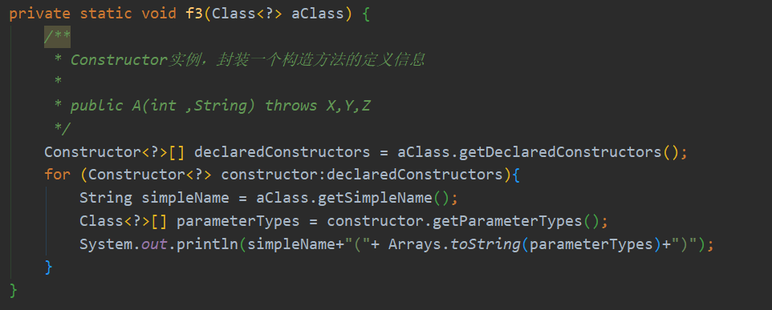

# 反射(Reflect)

首先抛几个问题，**什么是反射？为什么会有反射？反射能干嘛？**


Reflect 翻译过来叫反射，其实更好的翻译是 透射 。我的理解就是有些我们看不到的东西，想通过反射去让我们看到的。比如我们通过反射调用成员变量的时候。私有成员变量我们是没法设置值的！

**反射是什么，我现在也很难理解。**通过学习我只知道它能干什么。Sorry

### 获取类对象

- Class.forName("类的全路径")
- A.class  - A 代表类名
- a1.getClass() - a1代表类中的方法

### 获取包名，类名

- a1.getPackage().getName()      包名
- a1.getName()                              完整类名
- a1.getSimpleName()                  类名，不包含包名

测试代码：


结果：

​		

### 成员变量定义信息

- getFields()    				  **获取所有的公开的成员变量，包括继承的变量**
- getDeclaredFields()      **获取所有本类定义的成员变量，不包括继承的变量，包括私有变量**
- getField()
- getDeclaredField()


测试代码：

​		

结果：


### 构造方法定义信息

- getConstructors()  					**获得所有公开的构造方法**
- getDeclaredConstructors()       **获得所有构造方法，包括私有的**

- getConstructors(变量名)
- getDeclaredConstructor(int.class , String.class) 


测试代码：

​		

结果：


### 方法定义信息

- getMethods()       						**获得所有可见的方法，包括继承的方法**
- getDeclaredMethods()               **获得本类定义的所有方法，包括私有，不包括继承的方法**
- getMethod(方法名，参数类型列表)
- getDeclaredMethod(方法名，int.class ,String.class)


测试代码：


结果：


### 反射新建实例

- 新建实例，获取**无参构造**

  `Object obj=c.newInstance();`

- 新建实例，获取有参构造

  ```java
  //1.获取构造方法
  Constructor t=c.getDeclaredConstructor(int.class,String.class);
  
  //2.新建实例，并执行构造方法
  Object obj=t.newInstance(1,"a");
  ```


### 反射调用成员变量

```java
//1.获取变量
Field f=c.getDeclaredField(变量名);

//2.使私有变量允许访问  --  透射
f.setAccessible(true);

//3.反射给变量赋值   为指定实例的变量赋值
f.set(实例，值);

//4.反射访问变量
Object obj=f.get(实例);
```

### 反射调用成员方法

```java
//获取方法
Method m=c.getDeclaredMethod(方法名,参数列表);

//使私有方法允许被调用
m.setAccessible(true);
    
//反射调用该方法
Object returnValue=m.invoke(实例，参数数据);
```

---

结语：

​		只了解这么多了，😂