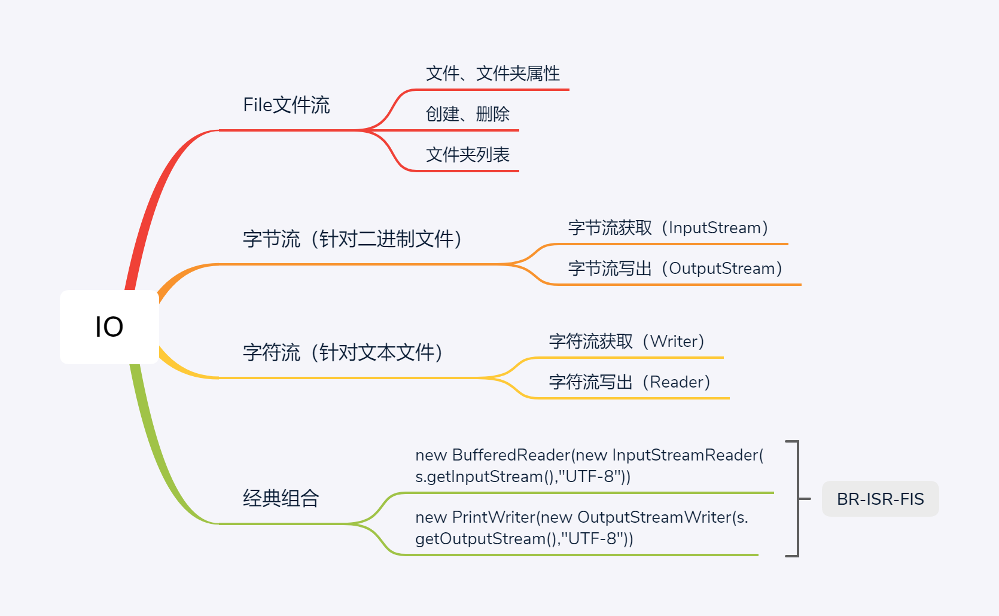
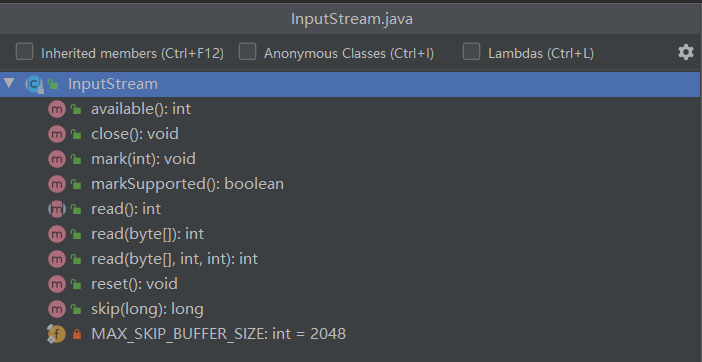
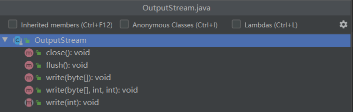
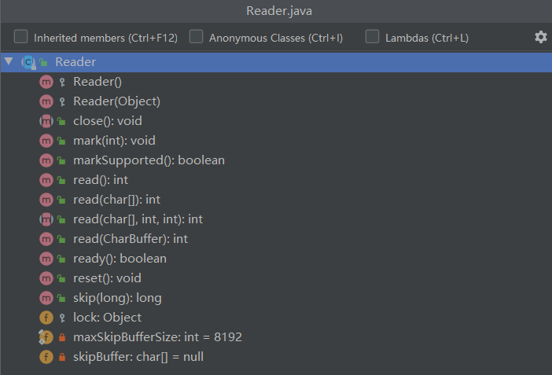
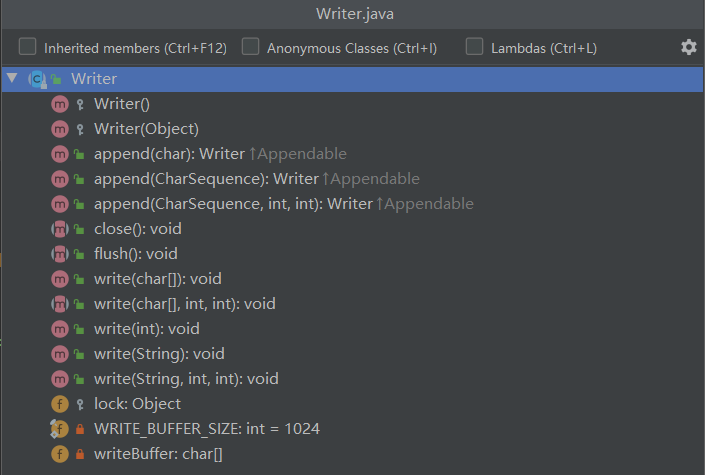

## IO
IO是什么，就是对于程序而言的输入（读取） 和输出（写出） 的过程。


API 中有 java.io 包专门提供文件的输入输出功能的实现。



### 流

数据的读写，可以抽象成数据在管道中流动。是在内存和磁盘之间做事情。

- 流只能单方向的
- 输入流用 in
- 输出流用 out
- 数据只能从头到尾的读写一次

### File文件流

常用方法

- 文件，文件夹属性

  ```xml
  getName()		文件名
  getPath()		相对路径
  getAbsolutePath()	绝对路径
  length()	文件的字节（属性->大小）
  exists()    判断文件是否存在
  isDirectory()	判断是否是目录
  getParent()		得到父类的路径
  ```

- 创建，删除

  ```xml
  createNewFile() 	新建文件，文件夹不存在会异常
  mkdir()		新建单层文件夹
  mkdirs()	新建多层文件夹
  delete()		删除文件，删除空文件夹
  ```

- 文件夹列表

  ```xml
  list()		返回值是String[]
  listFiles()		返回值是File[]
  ```

### 字节流

Java里的字符是由两个字节组成。字节流是由字节组成的。InputStream和OutputStream，主要用在处理二进制数据。

#### 字节流读取



- InputStream 抽象类：表示字节输入流的所有的超类/抽象类

  ```java
  //常用方法：
  //从输入流中读取数据的下一个字节
  public abstract int read() throws IOException;
  
  //从输入流中读取一定数量的字节，并将其存储在缓冲数组b中
  public int read(byte b[]) throws IOException {}
  
  //将输入流中最多 len 数据字节读入byte数组中
  public int read(byte b[], int off, int len) throws IOException{}
  
  //关闭输入流并释放与该流关联的的所有系统资源
  public void close() throws IOException {}
  ```

  - FileInputStream 子类

    直接插入文件中，直接读取文件数据。

    ```java
    //通过打开一个实际的文件来连接创建一个 FileInputStream ,该文件通过文件系统中的 File 对象中的 file 指定
    public FileInputStream(File file) throws FileNotFoundException{}
    
    //通过打开一个实际的文件来连接创建一个 FileInputStream,该文件通过文件系统中的路径名 name 来指定
    public FileInputStream(String name) throws FileNotFoundException{}
    ```

  - BufferedInputStream 子类

    缓冲输入 / mark / reset 方法。在创建 BufferedInputStream 时，会创建一个内部缓冲区数组(默认是8M 大小)。在读取或跳过流中的字节时，可根据需要从包含的输入流再次填充该内部缓冲区，一次填充多个字节

    ```java
    //创建一个 BufferedInputStream 并保存其参数，即输入流 in，以便将来使用。
    public BufferedInputStream(InputStream in){}
    ```

#### 字节流写出



- OutputStream 抽象类：表示输出字节流的所有的超类/抽象类

```java
//常用方法
//将指定字节写入此输出流中
public abstract void write(int b) throws IOException;

//将 b.length() 个字节从指定的 byte 数组写入此输出流
public void write(byte b[]) throws IOException{} 

//将指定 byte 数组中从偏移量 off 开始的 len 个字节写入输出流
public void write(byte b[], int off, int len) throws IOException{}

//刷新此输出流并强制写出所有缓冲的输出字节
public void flush() throws IOException{}

//关闭此输出流并释放与此流有关的所有系统资源
public void close() throws IOException{}
```

-  FileOutputStream 子类

​	直接插在文件上，直接写出文件数据

 ```java
//创建一个向指定 File 对象表示的文件中写入数据的输出文件流
public FileOutputStream(File file) throws FileNotFoundException

//创建一个向具有指定名称的文件中写入数据的输出文件流
public FileOutputStream(String name) throws FileNotFoundException

//创建一个向具有指定名称的文件中写入数据的输出文件流 追加
public FileOutputStream(File file, boolean append) throws FileNotFoundException
 ```

- BufferedOutputStream子类

  缓冲输出流。通过设置这种输出流，应用程序就可以将各个字节写入底层输出流中，而不必针对每个字节写入调用底层系统。

```java
//创建一个新的缓冲输出流，以将数据写入指定的底层输出流
public BufferedOutputStream(OutputStream out) {}
```

### 字符流

常用于处理纯文本数据.

#### 字符流读取



- Reader 抽象类

  用于读取字符流的抽象类

  ```java
  //常用方法
  //读取单个字符
  public int read() throws IOException{}
  
  //将字符读入数组
  public int read(char cbuf[]) throws IOException{}
  
  //将字符读入指定字符缓冲区中
  public int read(java.nio.CharBuffer target) throws IOException{}
  
  //将字符读入数组的某一部分
  abstract public int read(char cbuf[], int off, int len) throws IOException;
  
  //关闭流并释放与之有关的系统资源
  bstract public void close() throws IOException;
  ```

  - InputStreamReader 子类

    **字节流通向字符流的桥梁**。

  - FileReader 子类

  - BufferedReader 子类

    从字符输入流中读取文本，缓冲各个字符，从而实现字符，数组和行的高效读取。

#### 字符流写出



- Writer 抽象类

  写入字符流的抽象类

  ````java
  //常用方法
  public void write(int c) throws IOException{}
  
  public void write(char cbuf[]) throws IOException{}
  
  abstract public void write(char cbuf[], int off, int len) throws IOException;
  
  public void write(String str) throws IOException{}
  
  public void write(String str, int off, int len) throws IOException{}
  
  abstract public void close() throws IOException;
  ````

  - OutputStreamWriter 子类
  - FileWriter 子类
  - BufferedWriter 子类

### 经典组合


----

Java中流有两个重要概念，一个是字节流，另一个则为字符流。

其中字节流以字节byte为基本处理单元，通常用于处理二进制文件，最典型的类为InputStream与OutputStream。

字符流则以Unicode字符（2个字符大小）为处理单元，最典型的类为FileReader与FileWriter，相比字节流而言字符流设置了一个内存缓冲区，一般用于操作纯文本文件。

按操作方式分类结构图：


按操作对象分类结构图：

