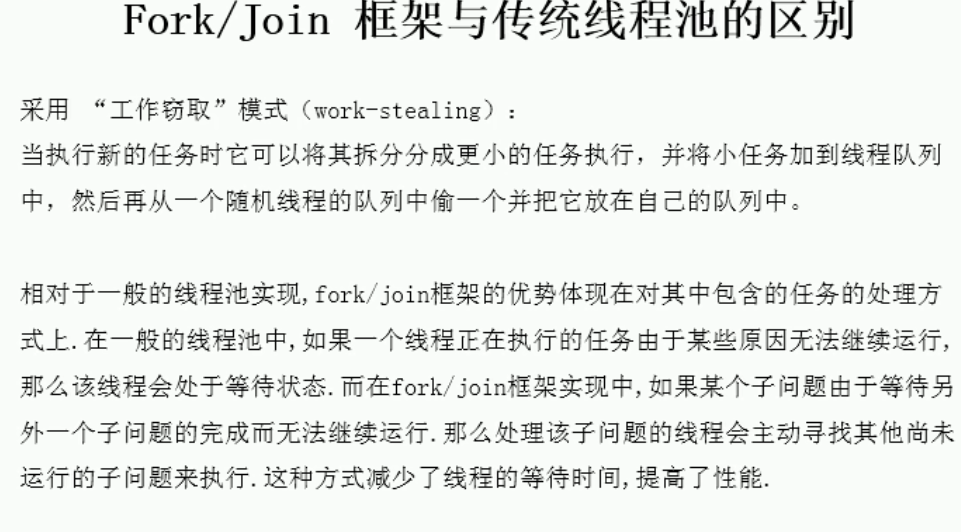
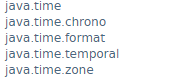
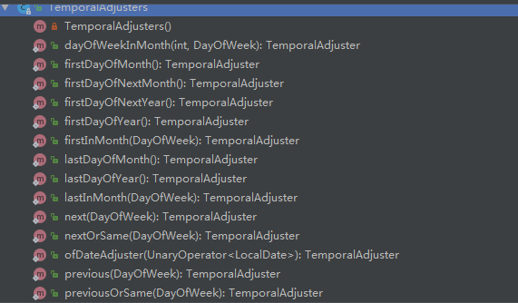

<!-- TOC -->
- [java8新特性](#java8新特性)
	- [Lambda表达式](#Lambda表达式)
	- [函数式接口](#函数式接口)
	- [方法引用与构造器引用](#方法引用与构造器引用)
	- [StreamAPI](#StreamAPI) 
	- [接口中的默认方法与静态方法](#接口中的默认方法与静态方法)
	- [新时间日期API](#新时间日期API)
	- [其他新特性](#其他新特性)

# java8新特性

atguigu

- 速度更快(HashMap、ConcurrentHashMap等)
- 代码更少（新增语法Lambda表达式）
- 强大的Stream API
- 便于并行
- 最大化减少空指针异常 Optional

jdk8 中对 ConcurrentHashMap进行了脱胎换骨式的改造，使用了大量的lock-free技术来减轻因锁的竞争而对性能造成的影响。

数组+链表+红黑树：当某个槽内的元素个数增加到超过8个且table的容量大于或等于64时，由链表转为红黑树；当某个槽内的元素个数减少到6个时，由红黑树转回链表。CAS

## Lambda表达式
[Lambda表达式](https://github.com/helloGitHubQ/FiveYears/blob/master/docs/base/java8/Lambda.md)
## 函数式接口
java 四大内置核心函数式接口：

Consumer<T>:消费型接口

void accept(T t);	

 	@Test
    public void test1(){
        happy(1000,(moneny)->System.out.println("买飞机票花费："+moneny+"元"));
    }

    public void happy(double moneny, Consumer<Double> consumer){
        consumer.accept(moneny);
    }
Supplier<T>：供给型接口
    
T get();

 	@Test
    public void test2(){
        List<Integer> list=getNumList(5,()->(int)(Math.random()*100));
        for (int i:
             list) {
            System.out.println(i);
        }
    }

    //产生一些整数并放入集合中
    public List<Integer> getNumList(int num,Supplier<Integer> supplier){
        List<Integer> list=new ArrayList<>();
    
        for (int i=0;i<num;i++){
            list.add(supplier.get());
        }
    
        return list;
    }

Function<T,R>：函数型接口

R apply(T t);

	@Test
	public void test3(){
	    String newStr=strHandler("\t\t\t hahaha",(str)->str.trim());
	    System.out.println(newStr);
	}
	
	//处理字符串
	public String strHandler(String string, Function<String,String> function){
	    return function.apply(string);
	}

Predicate<T>：断言型接口
    
boolean test(T t);

	@Test
	public void test4(){
	    List<String> list= Arrays.asList("www","ok","hello","Lambda");
	    List<String> lengthList=filterStr(list,(str)->str.length()>3);
	    for (String str :
	            lengthList) {
	        System.out.println(str);
	    }
	}
	
	//将满足条件的字符串放入集合中
	public List<String>   filterStr(List<String> list, Predicate<String> predicate){
	    List<String> stringList=new ArrayList<>();
	
	    for (String str :
	            list) {
	        if (predicate.test(str)) {
	            stringList.add(str);
	        }
	        }
	    return stringList;
	}

其他函数式接口


[练习..]
## 方法引用与构造器引用

**方法引用：**如果 Lambda 体中的内容已经实现了，我们可以使用"方法引用"（是 Lambda 表达式的另一种表达形式）

方法引用主要有三种方法：

**注意：**

1. Lambda 体中参数列表和返回值类型和函数式接口中抽象方法的参数列表和返回值类型要一致。

2. 如果 Lambda 参数列表中的第一参数是实例方法的调用者，而第二个参数是实例方法的参数时，可以使用 ClassName::method

- 对象::实例方法名

		@Test
	    public void test1(){
	        Consumer<String> consumer1=(x)-> System.out.println(x);
	        consumer1.accept("hello");
	
	        PrintStream printStream= System.out;
	        Consumer<String> consumer2=printStream::println;
	        consumer2.accept("方法引用");
	    }
	    
	    @Test
	    public void test2(){
	        Employee employee=new Employee();
	        employee.setName("张三");
	        employee.setAge(18);
	        Supplier<String> supplier1=()->employee.getName();
	        System.out.println(supplier1.get());
	    
	        Supplier<Integer> supplier2=employee::getAge;
	        System.out.println(supplier2.get());
	    }

- 类::静态方法名

	 	@Test
	    public void test3(){
	        Comparator<Integer> comparator1 = (x,y)->Integer.compare(x,y);
	
	        Comparator<Integer> comparator2=Integer::compare;
	    }

- 类::实例方法名	

		@Test
	    public void test4(){
	        BiConsumer<String,String> biConsumer1=(x,y)->x.equals(y);
	        biConsumer1.accept("1","1");
	
	        BiConsumer<Integer,Integer> biConsumer2=Integer::equals;
	        biConsumer2.accept(1,2);
	    }

**构造器引用：**

**注意：**需要调用的构造器的参数列表要与函数式接口中的抽象方法中的参数列表保持一致。

- ClassName::new

		@Test
	    public void test5(){
	        //调用的是无参构造，需要调用的构造器的参数列表要与函数式接口中的抽象方法中的参数列表保持一致。
	        Supplier<Employee> supplier1=()->new Employee();
	        Employee employee1=supplier1.get();
	        System.out.println(employee1);
	
	        Supplier<Employee> supplier2=Employee::new;
	        Employee employee2=supplier2.get();
	        System.out.println(employee2);
	        System.out.println("-------------------");
	        //调用的是有一个int类型参数的构造器
	        Function<Integer,Employee> function1=(x)->new Employee(x);
	        Employee employee3=function1.apply(10);
	        System.out.println(employee3);
	    
	        Function<Integer,Employee> function2=Employee::new;
	        Employee employee4=function2.apply(5);
	        System.out.println(employee4);
	    }

**数组引用：**

- Type[]::new

	 	@Test
	    public void test6(){
	        Function<Integer,String[]> function1=(x)->new String[x];
	        String[] strings1=function1.apply(10);
	        System.out.println(strings1.length);
	
	        Function<Integer,String[]> function2=String[]::new;
	        String[] strings2=function2.apply(5);
	        System.out.println(strings2.length);
	    }

## StreamAPI
[StreamAPI](https://github.com/helloGitHubQ/FiveYears/blob/master/docs/base/java8/StreamAPI.md)

## 接口中的默认方法与静态方法





## 新时间日期API

最重要的一点就是是线程安全的。

[java 8](https://docs.oracle.com/javase/8/docs/api/)



#### 本地时间和时间戳

LocalTime/LocalDateTime/LocalDate：

- 类的实例对象是**不可变的对象**

- in the ISO-8601 calendar system, such as `10:15:30`/such as `2007-12-03T10:15:30`/such as `2007-12-03`.

  ```
  Instant ：时间戳
  ```

  ```
  Duration：计算两个时间之间的间隔
  Period：计算两个日期之间的间隔
  ```

#### 时间校正器

```
TemporalAdjuster
TemporalAdjusters
```



#### 时间格式化和时区处理

```
DateTimeFormatter 格式化、日期
ZonedDateTime ZonedDate ZonedTime
```

## 其他新特性

- 并行流与串行流：

并行流就是把一个内容分成多个数据块，并用不同的线程分别处理每个数据块的流。

java8 中将并行进行了优化，我们可以很容易的对数据进行并行操作。Stream API 可以声明性地通过 parallel() 与 sequential() 在并行流与顺序流之间进行切换。

Fork / Join 框架：就是在必要的情况下，将一个大任务，进行拆分(fork)成若干个小任务（拆到不可拆分为止），再将一个个小任务运算的结果进行 join 汇总。

  	@Test
    public void test3(){
        Instant start=Instant.now();
        LongStream.rangeClosed(0,1000000000L).parallel().reduce(0,Long::sum);
        Instant end=Instant.now();
        System.out.println("耗时为："+ Duration.between(start,end).toMillis());
    }

- Optional类

Optional<T> 类是一个容器类。

尽量的避免空指针异常。

	 Optional.of(T t)：创建一个 Optional 实例
	 Optional.empty()：创建一个空的 Optional 实例
	 Optional.ofNullable(T t)：若 t 不为 null,则创建Optional实例，否则创建一个空实例
	 isPresent()：判断是否包含值
	 orElse(T t)：如果调用对象包含值，返回该值，否则返回t
	 orElseGet(Supplier s)：如果调用对象包含值，返回该值，否则返回 s 获取的值
	 map(Function f)：如果有值对其处理，并返回处理后的Optional,否则返回Optional.empty()
	 flatMap(Function mapper):与map类似，要求返回值必须是Optional
	
	@Test
	public void test1(){
	    Optional<Employee> optional1=Optional.of(new Employee());
	    System.out.println(optional1.get());
	
	    Optional<Employee> optional2=Optional.of(null);
	    System.out.println(optional2.get());
	}
	
	@Test
	public void test2(){
	    Optional<Employee> optional=Optional.empty();
	    System.out.println(optional.get());
	}
	
	@Test
	public void test3(){
	    Optional<Employee> optional1=Optional.ofNullable(new Employee());
	    System.out.println(optional1.get());
	
	    Optional<Employee> optional2=Optional.ofNullable(null);
	
	    if(optional2.isPresent()){
	        System.out.println(optional2.get());
	    }
	
	    Employee employee1=optional2.orElse(new Employee("张三",18,666.66, Employee.Stauts.FREE));
	    System.out.println(employee1);
	
	    Employee employee2=optional2.orElseGet(()->new Employee());
	    System.out.println(employee2);
	}
	
	@Test
	public void test4(){
	    Optional<Employee> optional=Optional.ofNullable(new Employee("张三",18,666.66, Employee.Stauts.FREE));
	    Optional<String> str=optional.map((e)->e.getName());
	    System.out.println(str.get());
	
	    Optional<String> str2= optional.flatMap((e)->Optional.of(e.getName()));
	    System.out.println(str2.get());
	}
- 重复注解与类型注解

  