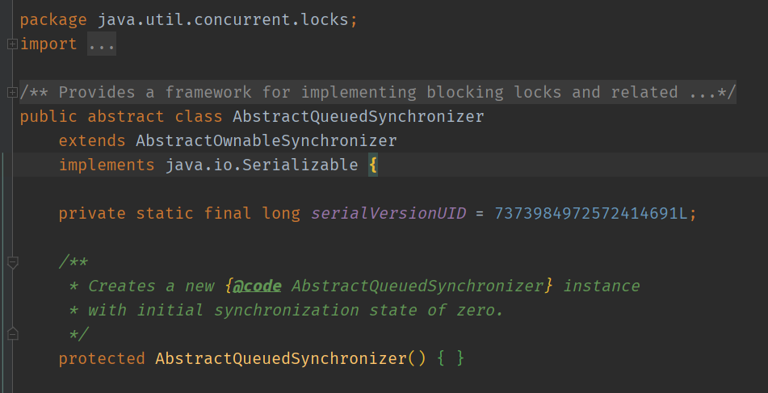
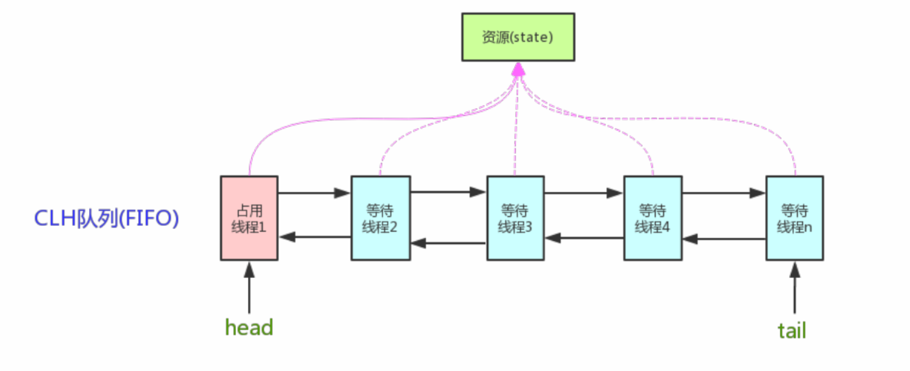

<!--TOC-->

- [AQS](#AQS)
  - [AQS原理分析](#AQS原理分析)
  - [AQS对资源的共享方式](#AQS对资源的共享方式)
  - [AQS底层使用了模板方法模式](#AQS底层使用了模板方法模式)
  - [AQS组件](#AQS组件)
  - [Reference](#Reference)

<!--TOC-->

# AQS

全称为 AbstractQueuedSynchronizer

JUC -- java.uil.concurrent.locks 包下



AQS   是用来构建锁和同步器的框架，使用 AQS 能简单且高效地构造出应用广泛地大量的同步器，比如 ReentrantLock，Semaphore ，ReebtrantReadWriteLock，SynchronousQueue，FutureTask等等

当然也可以创建满足自己需求的同步器。

## AQS原理分析

AQS核心思想是，如果被请求的共享资源空间，则将当前请求资源的线程设置为有效的工作线程，并且将共享资源设置为锁定状态。如果被请求的共享资源被占用，那么就需要一套线程阻塞等待以及被唤醒时锁分配的机制，这个机制 AQS 是用 CLH 队列锁实现的，即将暂时获取不到锁的线程加入到队列中。

>CLH 队列，是一个虚拟的双向队列(虚拟的双向队列即不存在队列实例，仅存在节点之间的关联关系)。AQS 是将每条请求共享资源的线程封装成一个 CLH 锁队列的一个节点(Node)来实现锁的分配。

原理图如下：



AQS 使用一个 int 成员变量来表示同步状态，通过内置 FIFO 队列来完成获取资源线程的排序工作。

AQS 使用 CAS 对该同步状态进行原子操作实现对其值的修改。

```java
private volatile int state;//共享变量，使⽤volatile修饰保证线程可⻅性
```

状态信息通过 protected 类型的 getState，setState，compareAndSetState 进行操作。

```java
//返回同步状态的当前值
protected final int getState() {
return state;
}
// 设置同步状态的值
protected final void setState(int newState) {
state = newState;
}
//原⼦地（CAS操作）将同步状态值设置为给定值update如果当前同步状态的值等于expect（期望值）
protected final boolean compareAndSetState(int expect, int update) {
return unsafe.compareAndSwapInt(this, stateOffset, expect, update);
}
```

### 

## AQS对资源的共享方式

AQS 定义了两种资源共享方式

- Excusive(独占)

  只有一个线程能执行，如 ReentrantLock。又分公平锁和非公平锁

  - 公平锁

    按照线程在队列中的排队顺序，先到者先拿到锁

  - 非公平锁

    当线程要获取锁时，无视队列顺序直接取抢锁，谁抢到就是谁的

- Share(共享)

  多个线程同时执行，如 Semaphore / CountDownLatch。

ReentrantReadWriteLock 可以看成是组合式，因为 ReentrantReadWriteLock 也就是读写锁允许多个线程同时对某一资源进行读。

不同的自定义同步器争用到共享资源的方式也不同。自定义同步器在实现时只需要实现共享资源 state 的获取与释放方法即可，至于具体线程等待队列的维护（如获取资源失败入队/唤醒出队等），AQS已经在顶层实现好了。

## AQS底层使用了模板方法模式

同步器的设计是基于模板方法模式的，如果需要自定义同步器一般的方式是这样的：

- 使用者继承 AbstractQueuedSynchronizer 并重写指定的方法
- 将 AQS 组合在自定义同步组件的实现中，并调用其模板方法，而这些模板方法会调用使用者重写的方法。


AQS 使用了模板方法模式，自定义同步器是需要重写下面几个 AQS 提供的模板方法：

```java
isHeldExclusively()//该线程是否正在独占资源。只有⽤到condition才需要去实现它。
tryAcquire(int)//独占⽅式。尝试获取资源，成功则返回true，失败则返回false。
tryRelease(int)//独占⽅式。尝试释放资源，成功则返回true，失败则返回false。
tryAcquireShared(int)//共享⽅式。尝试获取资源。负数表示失败； 0表示成功，但没有剩余可⽤资源；正数表示成功，且有剩余资源。
tryReleaseShared(int)//共享⽅式。尝试释放资源，成功则返回true，失败则返回false。
```

默认情况下，每个方法都抛出 UnsupportedOperationException .这些方法的实现必须是内部线程安全的，并且通常应该简短而不是阻塞。 AQS类 中的其他方法都是 final ，所以无法被其他类使用，只有这几个方法可以被其他类使用。

> 以 ReentrantLock 为例， state 初始化为 0 ，表示未锁定状态。A 线程 lock() 时，会调用 tryAcquire() 独占该锁并将 state+1 。此后，其他线程再 tryAcquire() 时就会失败，直到 A 线程 unlock() 到 state=0 （即释放锁）为止，其他线程才有机会获取该锁。当然，释放锁之前，A 线程自己是可以重复获取此锁的(state会累加)，这就是可重入的概念。但要注意，获取多少次就要释放多少次，这样才能保证 state 是能回到零态的。
>
> 再以 CountDownLatch 为例，任务分为 N个子线程去执行，state 也初始化为 N （注意 N 要与线程个数一致）。这 N 个线程是并行执行的，每个子线程执行完后 countDown() 一次， state 会CAS 减 1。等到所有子线程都执行完后(即state=0)，会 unpark() 主调用线程，然后主调用线程就会从 await() 函数返回，继续后续动作。

一般来说，自定义同步器要么是独占方法，要么是共享方式，他们也只需要实现 tryAcquire-tryRelease，tryAcquireShared-tryReleaseShared 中的一种即可。但 AQS 也支持自定义同步器同时实现独占和共享两种方法，如ReentrantReadWriteLock。

参考文章：

- [Java并发之AQS详解](https://www.cnblogs.com/waterystone/p/4920797.html)

- [Java并发包基石-AQS详解](https://www.cnblogs.com/chengxiao/archive/2017/07/24/7141160.html)

## AQS组件

- Semaphore(信号量) - 允许多线同时访问：

  synchronized 和 ReentrantLock 都是一次只允许一个线程访问某个资源。

  Semaphore（信号量）可以指定多个线程同时访问某个资源。

- CountDownLatch(倒计数器)

  同步工具类，用来协调多个线程之间的同步。

  通常用来控制线程等待，它可以让某一个线程等待直到倒计时结束，再开始执行。

- CyclicBarrier(循环栅栏)

  和 CountDownLatch 非常类似，它也可以实现线程间的技术等待，但是它的功能比 CountDownLatch 更加复杂和强大。

  主要应用场景和 CountDownLatch 类似。

  它要做的事情是，让一组线程到达一个屏障时被阻塞，直到最后一个线程到达屏障时，才会开门，所有被屏障拦截的线程才会继续干活。

  CyclicBarrier 默认的构造方法时 CyclicBarrier(int parties)，其参数表示屏障拦截的线程数量，每个线程调用 await() 方法高速 CyclicBarrier 我已经到达了屏障，然后当前线程被阻塞。

  

## Reference

[Reference - 待学习](https://github.com/helloGitHubQ/FiveYears/blob/master/docs/base/thread/Reference.md)

