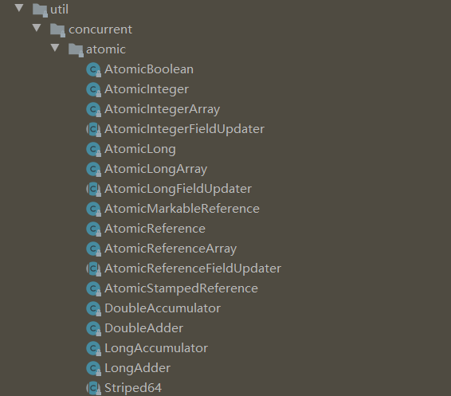

# Atomic 原子类

原子类（具有原子 / 原子操作特性的类），说的是操作不可中断。即使多个线程一起执行的时候，一个操作一旦开始，就不会被其他线程干扰。

就是我们常说的 ACID 中的 A 呗。缩写认识，全程差点就不认识了。


并发包 JUC -- java.util.concurrent 下的原子类都放在包 java.util.concurrent.atomic 下，看图：



### JUC包下原子类分类

#### 基本类型

使用原子的方式更新基本类型

- AtomicBoolean  布尔型原子类
- AtomicLong   长整型原子类
- AtomicInteger   整型原子类

#### 数组类型

使用原子的方式更新数组里的某个元素

- AtomicIntegerArray  整型数组原子类
- AtomicLongArray  长整型数组原子类
- AtomicReferenceArray   引用类型数组原子类

#### 引用类型

- AtomicMarkableReference 原子更新带有标记的引用类型
- AtomicReference 引用类型原子类
- AtomicStampedReference  原子更新引用类型里的字段原子类

#### 对象的属性修改类型

- AtomicIntegerFieldUpdater  原子更新整形字段的更新器
- AtomicLongFieldUpdater  原子更新长整型字段的更新器
- AtomicStampedReference   原子更新带有版本号的引用类型。该类将整数值与引用关联起来。可用于解决原子的更新数据和数据的版本号，可以解决使用 CAS 进行原子更新时可能出现的 ABA 问题

### AtomicInteger

常用方法：

```java
public final int get() //获取当前的值
public final int getAndSet(int newValue)//获取当前的值，并设置新的值
public final int getAndIncrement()//获取当前的值，并⾃增
public final int getAndDecrement() //获取当前的值，并⾃减
public final int getAndAdd(int delta) //获取当前的值，并加上预期的值
boolean compareAndSet(int expect, int update) //如果输⼊的数值等于预期值，则以原⼦
⽅式将该值设置为输⼊值（update）
public final void lazySet(int newValue)//最终设置为newValue,使⽤ lazySet 设置之
后可能导致其他线程在之后的⼀⼩段时间内还是可以读到旧的值。
```

**使用 AtomicInteger 之后，不用对 increment() 方法加锁也可以保证线程安全。**

```java
class AtomicIntegerTest {
    private AtomicInteger count = new AtomicInteger();
    //使⽤AtomicInteger之后，不需要对该⽅法加锁，也可以实现线程安全。
    public void increment() {
    count.incrementAndGet();
    }
    public int getCount() {
    return count.get();
    }
}
```

#### AtomicInteger原理

AtomicInteger 类部分源码

```java
// setup to use Unsafe.compareAndSwapInt for updates（更新操作时提供“⽐较并替
换”的作⽤）
private static final Unsafe unsafe = Unsafe.getUnsafe();
private static final long valueOffset;
static {
    try {
    valueOffset = unsafe.objectFieldOffset
    (AtomicInteger.class.getDeclaredField("value"));
    } catch (Exception ex) { throw new Error(ex); }
}
private volatile int value;
```

AtomicInteger 类主要利用 CAS 和 volatile 和 native 方法来保证原子操作，从而避免 synchronized 的高开小，执行效率大为提升。


CAS 原理：拿到期望的值和原本的一个值作比较，如果相同则更新成新的值。 UnSafe 类的 objectFieldOffset（） 方法是一个 volatile 变量，在内存中可见，因此 JVM 可以保证任何时刻任何线程总能拿到该变量的最新值。