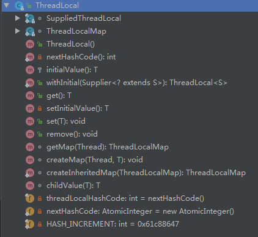

# 线程池

通常情况下，我们创建的变量时可以被任何一个线程访问并修改的。**如果想实现每一个线程都有自己的专属本地变量该如何解决呢**？

TheadLocal 来了，解决了这个问题。

ThreadLocal 类主要解决的就是让每一个线程绑定自己的值。可以将 ThreadLocal 类形象的比喻成存放数据的盒子，盒子中可以存储每个线程的私有数据。

如果你创建了一个 ThreadLocal 变量，那么访问这个变量的每个线程都会有这个变量的本地副本，这也是 ThreadLocal 变量名的由来。可以使用 get() 和 set() 方法来获取默认值或将其值更改为当前线程所存的副本的值，从而避免了线程安全问题。



### ThreadLocal的原理

让我们通过代码来说更好一点。从 Thread 类入手

```java
public class Thread implements Runnable {
    ......
    //与此线程有关的ThreadLocal值。由ThreadLocal类维护
    ThreadLocal.ThreadLocalMap threadLocals = null;
    //与此线程有关的InheritableThreadLocal值。由InheritableThreadLocal类维护
    ThreadLocal.ThreadLocalMap inheritableThreadLocals = null;
    ......
}
```

Thread类中有一个 threadLocals 和 inheritableThreadLocals 类型的变量，我们可以把 ThreadLocalMap 理解为 ThreadLocal 类实现的定制化的 HashMap 。默认情况下这两个变量都是 null 。只有当前线程调用 ThreadLocal类的 set 或 get 方法时才创建他们，实际上调用这两个方法的时候，我们调用的是 ThreadLocalMap 类对应的 get() ， set() 方法。

### ThreadLocal的set()方法

```java
 public void set(T value) {
        Thread t = Thread.currentThread();
        ThreadLocalMap map = getMap(t);
        if (map != null)
            map.set(this, value);
        else
            createMap(t, value);
}

 ThreadLocalMap getMap(Thread t) {
        return t.threadLocals;
}
```

ThreadLocal类中可以通过 Thread.currentThread()获取到当前线程对象后，直接通过 getMap（Thread t）可以访问到该线程的 ThreadLocalMap对象。

看了上面代码是不是发现了点什么。没错，最终变量是放在了当前线程的 ThredLocalMap 中，并不是存在 ThreadLocal 上；这里可以把 ThreadLocal 理解成 ThreadLocalMap 的封装，传递了变量值。


**ThreadLocal 内部维护的是一个类似 Map 的 ThreadLocalMap 数据结构，key 为当前对象的 Thread 对象，值为 Object 对象。**

```java
//ThreadLocalMap的构造函数
ThreadLocalMap(ThreadLocal<?> firstKey, Object firstValue) {
            table = new Entry[INITIAL_CAPACITY];
            int i = firstKey.threadLocalHashCode & (INITIAL_CAPACITY - 1);
            table[i] = new Entry(firstKey, firstValue);
            size = 1;
            setThreshold(INITIAL_CAPACITY);
}
```


ThreadLocalMap 是 ThreadLocal 的静态内部类。

### 内存泄漏问题

ThreadLocalMap（和 ThreadLocal 写在同一个类中，不过是 static ） 中使用的 key 为 ThreadLocal 的弱引用（可有可无），而 value 是强引用（必需品）。所以，如果 ThreadLocal 没有被外部强引用的情况下，在垃圾回收的时候，key 会被清理掉的。而 value 不会被清理掉。那么这样 ThreadLocalMap 中就会出现 key 为 null 的 Entry 。假如我们不做任何措施的话，value 永远无法被 GC 回收，这个时候就可能会产生**内存泄漏**。

```java
static class Entry extends WeakReference<ThreadLocal<?>> {
            /** The value associated with this ThreadLocal. */
            Object value;

            Entry(ThreadLocal<?> k, Object v) {
                super(k);
                value = v;
            }
}
```

ThreadLocalMap 已经考虑到这种情况，在调用 set() ，get()，remove() 方法的时候，会清理掉 key 为 null 的记录。

**使用完 ThreadLocal 方法后，最好手动调用 remove() 方法。**

### 引用类型

**强引用**：Strong Reference

​		最常见。如 Object object=new Object()；这样的变量声明和定义就会产生对该对象的强引用。只有对象有强引用指向，并且 GC  Roots 可达，那么 Java 内存回收时，即使濒临内存耗尽，也不会回收该对象。

**软引用**：Soft Reference

​		引用力弱于“强引用”，是用在非必须对象的场景。在即将 OOM 之前，垃圾回收器会把这些软引用指向的对象加入回收范围，以获得更多的内存空间，让程序能够继续健康运行。主要用来缓存服务器中间计算结果及不需要实时保存的用户行为等。

**弱引用**：Weak Reference

​		引用强度比前两者更弱，也是用在非必须对象的。如果弱引用指向的对象只存在弱引用这一条线路，则在下一次 YGC 时会被回收。由于 YGC 时间的不确定性，弱引用何时被回收也具有不确定性。弱引用主要用于指向某个易消失的对象，在强引用断开后，此引用不会劫持对象。调用 WeakReference.get() 可能返回 null ，要注意空指针异常。

**虚引用**：Phantom Reference

​		是极弱的一种引用关系，定义完成后，就无法通过该引用获取指定指向对象。为一个对象设置虚引用的唯一目的就是希望能在这个对象被回收时能够收到一个系统通知。虚引用必须于引用队列联合使用，当垃圾回收时，如果发现存在虚引用，就会在回收对象内存前，把这个虚引用加入与之关联的引用队列中。

## 线程池

### 为什么要有线程池？

为什么要有线程池？当然是因为她给我们带来了很多好处了。

- 降低资源消耗：

  通过重复利用已创建的线程降低线程创建和销毁造成的消耗

- 提高响应速度：

  当任务到达时，任务可以不需要等到线程创建就能立即执行

- 提高线程的可管理性：

  线程时稀缺资源，如果无限制的创建，不仅会消耗系统资源，还会降低系统的稳定性，使用线程池可以进行统一的分配，调优和监控。

### 怎么创建线程池呢？

