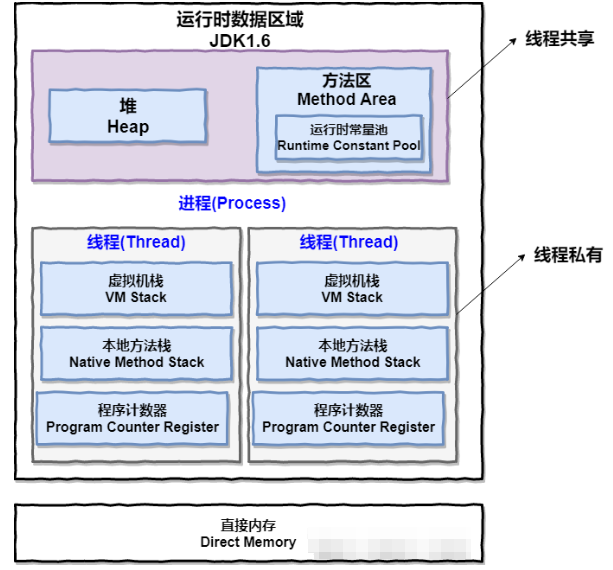

# 多线程

多线程，多线程首先要搞懂什么是线程？什么是进程才能往下走。

### 线程和进程

- 线程：轻量级进程。

  同类的多个线程共享进程的堆和方法区资源，但是每个线程有自己的程序计数器，虚拟机栈和本地方法栈。

- 进程：程序的一次执行过程，是系统运行程序的基本单位。

上图表述线程和进程的关系。一个进程中可以有多个线程，多个线程共享进程的堆和方法区（ JDK1.8 之后的元空间）资源，但是每个线程有自己的程序计数器，本方法栈，虚拟机栈。

总结：线程和进程最大的不同在于基本上各进程是独立的，而各线程之间则不一定。因为同一个进程中线程极有可能相互影响。线程执行开销小，但不利于资源的管理和保护；而进程相反。

**程序计数器为什么私有？**

程序计数器的两个作用：

- 字节码解释器通过改变程序计数器来一次读取指令，从而实现代码的流程控制，如：顺序执行，选择，循环，异常处理等。
- 在多线程的情况下，程序计数器用于记录当前线程执行的位置，从而当线程切换回来的时候能够知道该线程上次运行到哪里了？

所以呢？程序计数器私有主要是为了线程切换后能恢复到正确的执行位置！！！

**虚拟机栈和本地方法栈为什么私有？**

- 虚拟机栈：每个 Java 方法在执行的通知会创建一个栈帧用于存储局部变量表，操作数栈，常量池引用等信息。从方法调用直至执行完成的过程，就对应一个栈帧在 Java 虚拟机栈中入栈和出战的过程。
- 本地方法栈：和虚拟机栈所发挥的作用非常类似。区别就是：虚拟机栈为虚拟机执行 Java 方法服务。而本地方法栈则为虚拟机使用到的 Native 方法覆去。在 HotSpot 虚拟机中和 Java 虚拟机栈合二为一。

所以呢？保证线程中的局部变量不被别的线程访问到。

### 并发和并行

然后也不得不说并发和并行。

- 并发：同一时间段，多个任务都在执行
- 并行：单位时间内，多个任务同时执行。

### 线程的生命周期和状态

...

### 线程死锁

简单说就是一个线程在等待另一个线程释放锁，而另一个线程在等待第一个线程释放锁。结果是不会等到对方释放锁。这种现象就是**线程死锁**。

这里我们要知道产生死锁的四个条件：

- 互斥条件：该资源任意一个时刻只由一个线程占用
- 请求和保持条件：一个进程因请求资源而阻塞时，对己获得的资源保持不放。
- 不剥夺条件：线程已获得的资源在未使用完值卡不能被其他线程强行剥夺，只有自己使用完毕后才释放资源。
- 循环等待条件：若干进程之间形成一种头尾相接的循环等待资源关系。

也就是说上面四个条件全部满足的时候才会发现死锁。

那么我们如何避免死锁就很简单了（破坏条件就行了）。

#### 如何避免死锁？

- 破坏互斥条件

  因为锁本来就是互斥的，所以这个条件没有办法破坏。

- 破坏请求与保持条件

  一次性申请所有资源

- 破坏不剥夺条件

  占用部分资源的线程进一步申请其他资源时，如果申请不到，可以互动释放它占有的资源。

- 破坏循环等待条件

  靠按序申请资源来预防。按某一顺序申请资源，释放资源则反序释放。破坏循环等待条件。