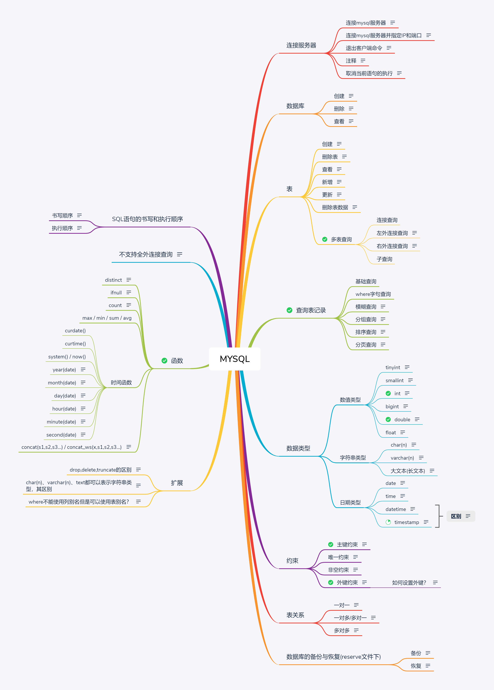

# MYSQL



## 连接MYSQL服务器

- 连接 MYSQL 服务器

打开 cmd 窗口

```
C:\Users\Q>mysql -uroot(用户名) -p(后跟密码,也可省略) 
```

- 连接 MYSQL 服务器并指定 IP 和端口

```
C:\Users\Q>mysql -uroot(用户名) -p(密码) -h127.0.0.1(IP) -P3306(端口)
```

- 退出客户端命令

```
1.quit
2.exit
3.\q
```

输入完命令之后 MYSQL 会发送一个 Bye 跟你说再见！

- 注释

```
1./**/
2.-- 
3.#
```

- 取消当前语句执行

```
\c
```

## 数据库及表操作

- 创建数据库

```
-- 创建 mydb1 数据库
create database mydb1;

-- 创建 mydb1 数据库并指定编码为 utf8
create database mydb1 charset utf8;

-- 创建 mydb1 数据库如果不存在的话，并指定 utf8 编码
create database if not exits mydb1 charset utf8;
```

- 使用库

```
use 库名;
```

- 删除数据库

```
-- 删除 mydb1 数据库
drop database mydb1;

-- 如果 mydb1 数据库存在的话就删除
drop database if exits mydb1;
```

- 查看数据库

```
-- 查看所有的数据库
show databases;

-- 查询某一个数据库中的所有表
show tables;

-- 查看数据库 mydb1 建库语句
show create database mydb1; 
```

---

- 创建表

```
create table 表名(
	列名 数据类型，

    列名 数据类型

	.....
);
```

- 删除表

```
drop table 表名;
drop table if exits 表名;
```

- 查看表结构

```
desc 表名;
```

## 表记录操作

- 新增表记录

```
insert into 表名(列名1,列名2...) values(值1,值2...) 
```

- 查看表记录

```
select 列名 | * from 表名
```

- 更新表

```
update 表名 set 列=值,列=值,....[where 子句]
```

- 删除表数据

```
delete from 表名 [ where条件 ]
```

### 查询表记录

- 基础查询
- where 子句查询
- 模糊查询

```
like 关键字
语法: select 列 | * from 表名 where 列名 like 值
LIKE 操作符用在 where 子句中搜索列中的指定模式。

通配符：
% 表示0或多个任意的字符
_ 表示1个任意的字符

-- 26.查询emp表中姓名中以"刘"字开头的员工，显示员工姓名。

select * from emp where name like '刘%';
```

- 多行函数查询

多行函数也叫做聚合 (聚集) 函数,根据某一列或所有列进行统计

count(*)  | sum | max | min |avg

- 分组查询

```
group by 关键字
语法: select 列名 from 表名 [where 子句] group by 列;

-- 按照部门分组，统计每个部门的最高薪资

select dept, max(sal) from emp group by dept;
```

- 排序查询

```
desc 降序，即从高到低.
asc(默认)升序，即从低到高.

语法:select 列名 from 表名 order by 列名 [asc|desc]

-- 根据奖金和薪资进行排序（奖金是降序排序，薪资是升序排序，先根据奖金排序，如果奖金相同再根据薪资进行排序）

select name,bonus,sal from emp order by bonus desc,sal asc;
```

- 分页查询

```
limit (页码-1)*煤业显示记录数,每页显示记录数

-- 查询emp表中薪资最高的前三个员工的信息(小技巧,排序分页)

select * from emp order by sal desc limit 0,3;
```

---

### 多表查询

- 连接查询

```
select * from dept, emp;

上面的查询叫做笛卡尔积查询：如果同时查询两张表，其中一张表有m条数据，另外一张表有n条数据，笛卡尔积查询的结果是 m*n 条

笛卡尔积查询的结果中有大量错误数据，我们通常不会直接使用。

但可以通过where子句、条件剔除错误数据，保留正确数据。

-- 42.查询部门和部门对应的员工信息

select * from dept, emp where dept.id=emp.dept_id;
```


- 左外连接查询

将左边表中的所有记录都查询出来，右边表只显示和左边表对应的数据，如果左边表在右边没有对应数据，可以对应null值。

```
-- 43.查询所有部门和部门下的员工，如果部门下没有员工，员工显示为null

select * from dept left join emp on dept.id=emp.dept_id;
```


- 右外连接查询

会将右边表中的所有记录都查询出来，左边表只显示和右边表对应的数据，如果右边表在左边没有对应数据，可以对应null值。

```
- 44.查询部门和所有员工，如果员工没有所属部门，部门显示为null

select * from dept right join emp on dept.id=emp.dept_i
```

- 子查询

将一条SQL语句的执行结果，作为另外一条SQL语句的条件进行查询

- 全外连接查询

```
mysql不支持全外连接查询，但我们可以通过union（联合）查询来模拟：

select * from dept left join emp on dept.id=emp.dept_id

union

select * from dept right join emp on dept.id=emp.dept_id;

使用union可以将两个查询结果合并在一起显示，但要注意的，两个查询结果的列数和列名必须一致
```


## 数据类型

### 数值类型

- **tinyint**：占用1个字节，相对于java中的byte

- **smallint**：占用2个字节，相对于java中的short

- **int**：占用4个字节，相对于java中的int

- **bigint**：占用8个字节，相对于java中的long


- **float**：4字节单精度浮点类型，相对于java中的float

- **double**：8字节双精度浮点类型，相对于java中的double

### 字符串类型

- char(n)  定长字符串，最长255个字符。n表示字符数

- varchar(n)  变长字符串，最长不超过 65535个字节，n表示字符数

- text  最长65535个字节，一般超过255个字符列的会使用text。

  text也分多种，其中bigtext存储数据的长度约为4GB。

### 日期类型

- date 	年月日
- time     时分秒
- datetime    年月日 时分秒
- timestamp   时间戳

**datetime 和 timestamp 的区别：**

1. timestamp 最大表示 2038 年， datetime 范围是 1000~999
2. timestamp 在插入数据，修改数据的时候，会自动更新成系统当前 时间

## 字段约束

### 主键约束(primary key)

唯一并且不能为空


关于主键自增：

1. 设置了主键自增后, 再往表中插入记录,就可以不用给主键赋值,直接插入一个null值即可

2. 设置了主键自增后, 也可以为id赋值,只要赋的值与已有的id值不冲突即可! 在底层会将auto_increment变量的值和插入的id值进行比较, 如果插入的值较大, 将会将插入的值加1后赋值给auto_increment变量。

### 非空约束(not null)

不能为空但是可以重复

### 唯一约束(unique)

唯一并且可以为空

### 外键约束

外键其实就是用于通知数据库两张表数据之间对应关系的这样一个列。

这样数据库就会帮我们维护两张表中数据之间的关系。


```
create table emp(

    id int,

    name varchar(50),

    dept_id int,

    foreign key(dept_id) references dept(id)

);
```

## 表关系

一对多（多对一）：在多的一方添加列保存一的一方的主键作为外键，从而保存两张表之间的对应关系。

一对一：在任意一张表中添加列保存另一方的主键作为外键，从而保存两张表之间的对应关系。

多对多：不能在任意一方添加列保存另一方的主键。此时可以创建一张第三方表，分别保存两张表的主键作为外键，从而保存两张表之间的对应关系。

## 数据库备份与恢复

### 备份

在cmd窗口中(未登录的状态下)，可以通过如下命令对指定的数据库进行备份：

`mysqldump -u用户名 -p 数据库的名字 > 备份文件的位置`

例如: 对db40库中的数据(表，表记录)进行备份，备份到 c:/db40.sql文件中

`mysqldump -uroot -p db40 > c:/db40.sql`

键入密码，如果没有提示，即表示备份成功！

 

也可以一次性备份所有库，例如：

对mysql服务器中所有的数据库进行备份，备份到 d:/all.sql文件中

`mysqldump -uroot -p --all-database > d:/all.sql`

键入密码，如果没有提示，即表示备份成功！

### 恢复

在cmd窗口中(未登录的状态下)，可以通过如下命令对指定的数据库进行恢复：

`mysql -u用户名 -p 数据库的名字 < 备份文件的位置`

例如: 将d:/db40.sql文件中的数据恢复到db60库中

```
-- 在cmd窗口中（已登录的状态下）， 先创建db60库：

create database db60 charset utf8;

-- 在cmd窗口中（未登录的状态下）

mysql -uroot -p db60 < d:/db40.sql
```


或 例如: 将d:/db40.sql文件中的数据恢复到db80库中

```
-- 在cmd窗口中（已登录的状态下），先创建db80库，进入db80库：

create database db80 charset utf8;

use db80;

-- 再通过source执行指定位置下的sql文件：

source d:/db40.sql
```

## SQL 语句的书写顺序

```
select * | 列名       -- 确定要查询的列有哪些

from 表名         -- 确定查询哪张表

where 条件        -- 通过筛选过滤，剔除不符合条件的记录

group by 分组的列  -- 指定根据哪一列进行分组

having 条件       -- 通过条件对分组后的数据进行筛选过滤

order by 排序的列  -- 指定根据哪一列进行排序

limit (countPage-1)*rowCount, rowCount -- 指定返回第几页记录以及每页显示多少条
```

## SQL语句的执行顺序

```
from 表名         -- 确定查询哪张表

where 条件        -- 通过筛选过滤，剔除不符合条件的记录

select * | 列名 列别名 -- 确定要查询的列有哪些，

group by 分组的列  -- 指定根据哪一列进行分组

having 条件       -- 通过条件对分组后的数据进行筛选过滤

order by 排序的列  -- 指定根据哪一列进行排序

limit (countPage-1)*rowCount, rowCount
```

## 函数

- count(*) | sum | max | min |avg
- ifnull( 列 , 值 )
- curdate() 	获取当前日期 年月日
- curtime()      获取当前日期 时分秒
- sysdate() / now()    获取当前日期+时间 年月日  时分秒
- year(date)   获取 date 中的年份
- month(date)    获取 date 中的月份
- day(date)    获取 date 中的月中天数
- hour(date)   获取 date 中的小时
- minute(date)    获取 date 中的分钟
- second(date)   获取 date 中的秒数
- concat(s1,s2,...)   将 s1 , s2 等字符串合并为一个字符串
- concat_ws(x,s1,s2,..)  将 s1 ,s2 等字符串以 x 为分隔符拼接成一个字符串

## 扩展内容

- drop,delete,truncate三者的区别？
- char(n),varchar(n),text都可以表示字符串类型，其区别？
- where 和 having 的区别？