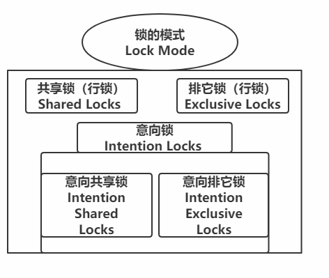

<!--TOC-->

- [二叉树](#二叉树)
  - [BTree](#BTree)
  - [B+Tree](#B+Tree)
  - [回表问题](#回表问题)
- [隔离级别](#隔离级别)
  - [事务并发问题](#事务并发问题)
  - [事务的隔离级别](事务的隔离级别)
- [MYSQL的锁](#MYSQL的锁)
  - [表级锁/行级锁](#表级锁/行级锁)
  - [锁的算法](#锁的算法)
- [存储引擎大全](#存储引擎大全)

<!--TOC-->

# MYSQL进阶知识

还记得那句话嘛？:slightly_smiling_face:
mysql 默认存储引擎 innodb 只显式支持 B-Tree (从技术上来说是 B+Tree )索引.

## 二叉树

so，我们就来说说树。话说树是怎么存储数据的呢？就是把数据放在自己的节点中。

### BTree

树因为一个节点只能存储一个数据的先天缺陷。所以会导致树的高度（从根节点到最下面的叶子节点的距离）会很大。针对这个缺陷，BTree 就诞生了。

[BTree的生成](https://www.cs.usfca.edu/~galles/visualization/BTree.html)

从图中可以看出BTree的树的特性。**它的一个节点可以存储多个数据。**而且**高度自动平衡**

所以在高度方面可以做的很好。这是它的优点。

但是无奈，任何设计都有缺陷。BTree 也不例外，例如：我想查找大于 5 的数值。

BTree 会这样做，先找到 5 ，然后发现 6 大于 5 把 6 加入到结果集中；发现 8 也大于 5  把 8 也加入到结果集中。然后查看 8 的子节点的值.....

这就是 BTree 的缺点：范围查询性能低。

### B+Tree

[B+Tree的生成](https://www.cs.usfca.edu/~galles/visualization/BPlusTree.html)

在 BTree 的设计之上， B+Tree 的出现就是为了改变 它的缺点而生的。（图中箭头是双向的箭头哦）

我们可以看出如果要找大于 5 的值的话，直接从 6 开始往后走就好了。所以说B+Tree更加厉害些。

### 回表问题

左边是主键 ID 索引，右边是根据 NAME 生成的索引。

回表就是 在一个索引（B+Tree）中根据数据拿到值，再去另外一个 索引（B+Tree）中去取剩下想要的数据。（我不知道这样理解可以不，狗头保命）。

我想要 Jack 的全部信息，那我先在 NAME 索引中找到 jack 这个人拿到对应数据（12346），然后再去主键 ID 索引中查找，找到 12346 信息，然后在返回查找好的信息。

## 隔离级别

了解隔离级别之前先要知道 脏读，可不重复读，幻读 这几个伙🦃。

#### 事务并发问题

- **脏读（Dirty read ）**：就说一个事务操作的时候，另一个事务也来操作这个数据并且它还提交了。此时对于第一个事务来说有可能读到 脏数据（不正确的数据）。在脏数据上进行的任何操作都有可能不正确。这个过程就是 脏读 。 

- **不可重复读（Unrepeatableread ）**：就是一个事务多次读取同一数据，数据不一致的问题。一个事务进行还没结束的时候，另一个事务也访问了该数据。那么第一个事务两次读数据之间，由于第二个事务进行了操作，有可能导致第一个事务读取的结果不太一致。
- **幻读（Phantom read ）**：幻读通常发生在 delete / insert 的时候。一个事务进行操作，另一个事务这时删除或新增了记录。第一个事务再去查询数据的时候发现记录数和之前第一次读取的时候不一样了。仿佛出现了幻觉。

不可重读和幻读的区别：

不可重复读在于修改数据，幻读在于新增或删除数据。

#### 事务的隔离级别

- **读取未提交（READ UNCOMMITED）**：最低的事务隔离级别，允许读取尚未提交的数据。脏读，不可重复读，幻读都会发生。

- **读取已提交（READ COMMITED）**：允许读取并发事务已提交的数据。能够防止脏读，但是不可重复读和幻读还是会发生。

  - Oracle 的默认级别

- **可重复读（REPEATABLE READ）**：对同一字段的多次读取结果都是一致的。能够防止脏读，不可重复读。但是幻读还是会发生的。

  - MYSQL的默认级别

- **可串行化（SERIALIZABLE）**：最高的事务隔离级别，完全服从事务的ACID操作（所有事务逐个进行，这样的话事务之间就不会进行干扰了）。可防止脏读，不可重复读，幻读的发生。

  

## MYSQL的锁

MYSQL有了锁就解决了幻读的问题。让我们看看MYSQL中的锁吧！

#### 表级锁/行级锁

- 表级锁：MYSQL 中锁定粒度最大的一种锁。对当前操作的整张表加锁显示简单，消耗资源少，加锁快，不会出现死锁。但是并发度最低。（HashTable 就是用的表级锁，目前已逐渐被淘汰了）
- 行级锁：MYSQL 中锁粒度最小的一种锁。对行进行加锁。行级锁能大大减少数据库操作的冲突，其加锁粒度最小，并发量最高。

1. 两个事务不能锁同一个索引。

2. insert，delete，update 在事务中都会自动默认加上**排他锁**。
3. 行级锁的话，必须有索引才能实现。否则就会自动锁全表，那就不是行级锁了。

表锁该怎么去解锁呢？

- unlock tables
- begin

#### 锁的算法

锁的算法有三种，记录锁 / 间隙锁 / 临建锁

锁的范围：

- **记录锁（Record Locks）**

  当行记录上锁。

- **间隙锁（Gap Locks）**

  锁定一个范围，不包括记录本身。

- **临建锁（Next-Key Locks）**

  它是记录锁加上间隙锁，锁定一个范围，加记录本身。

## 存储引擎大全

存储相关命令 -- 印象笔记

- MyISAM：MYSQL 5.5 默认的存储引擎。

  存储引擎有 MYD 和 MYI 组成。

  虽然性能极佳，而且提供了大量的特性，包括全文索引，压缩（表压缩，表压缩之后就不能进行插入数据了），空间函数等，但是 **MyISAM 不支持事务和行级锁，而且最大的缺陷就是崩溃之后无法安全恢复。**

  

​		适用场景：

​         1） 非事务型的应用

​		 2）只读类应用

​		 3）空间类应用（空间函数，坐标）

- InnoDB：MYSQL 5.5 之后默认的存储引擎。

  事务型存储引擎。

  完全支持事务的 ACID 操作。

  Redo Log 和 Undo Log

  同时支持行级锁和表级锁

  具有崩溃修复能力（crash recovery capabilities ）的事务安全（transaction-safe (ACID compliant) ）型表。

MyISAM 和 InnoDB 的区别：

- CSV

  以 csv 格式进行数据存储

  所有列的值都不能为 null 

  不支持索引（不适合大表，不是在线处理）

  可以对数据文件直接编辑（保存文本文件内容）

- Archive

  以 zlib 对表进行压缩，磁盘 I/O 更少。数据存储在 arz 后缀的文件中。

  特点：只支持 insert 和 select 操作；只允许在自增 ID 列上加索引。

- Ferdereated

  提供了访问远程 MYSQL 服务器上表的方法

  本地不存数据，数据都存在远程服务器上

  本地需要保存表结构和远程服务器的连接信息

使用场景：

​	偶尔的统计分析及手工查询（某些游戏行业）	

默认禁止，启用需要再启动时增加  federated 参数

:boxing_glove: