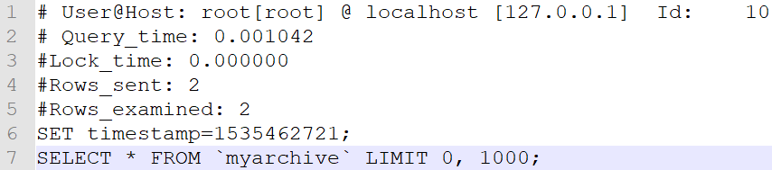
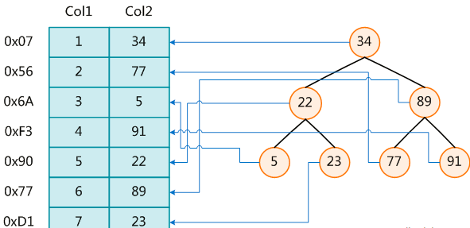
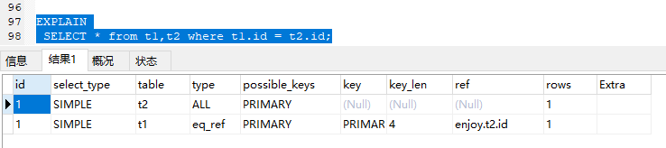
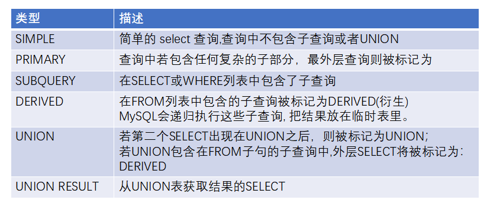
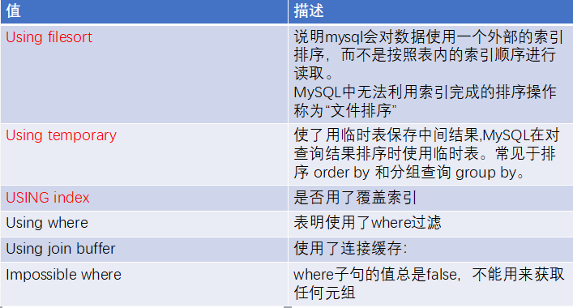
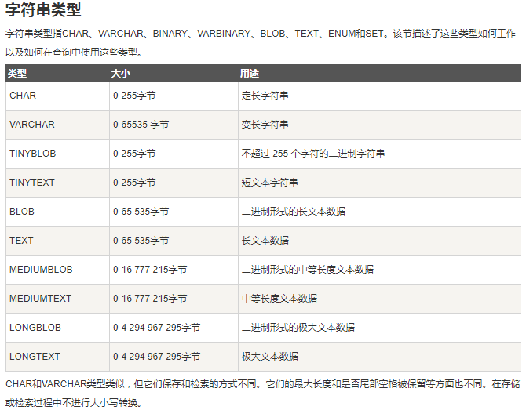
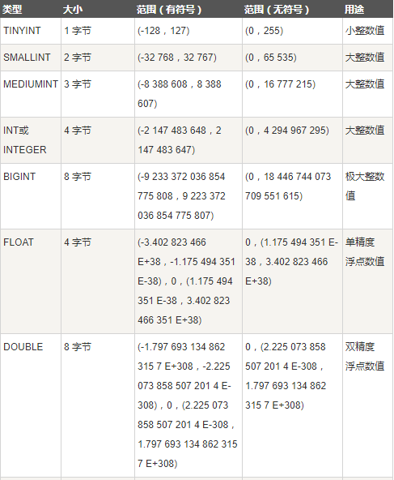
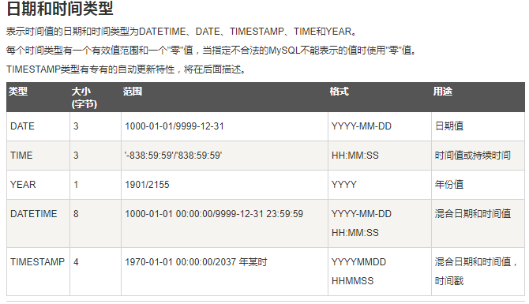

<!--TOC-->

- [从慢查询开始谈优化](#从慢查询开始谈优化)
  - [慢查询基本配置](#慢查询基本配置)
  - [慢查询解读](#慢查询解读)
- [SQL优化全家桶](#SQL优化全家桶)
  - [SQL本身优化](#SQL本身优化)
  - [反范式化设计](#反范式化设计)
    - [范式化设计](#范式化设计)
    - [范式化设计的优缺点](#范式化设计的优缺点)
    - [反范式化设计的优缺点](#反范式化设计的优缺点)
  - [索引优化](#索引优化)
    - [MYSQL中的索引](#MYSQL中的索引)
    - [索引的分类](#索引的分类)
    - [基础语法](#基础语法)
- [执行计划全面解析](#执行计划全面解析)
  - [执行计划的语法](#执行计划的语法)
  - [执行计划详解](#执行计划详解)
  - [字符类型](#字符类型)
  - [数值类型](#数值类型)
  - [日期和时间](#日期和时间)
  - [key_len类型总结](#key_len类型总结)
- [优化10大策略](#优化10大策略)
  - [1.尽量全值匹配](#1.尽量全值匹配)
  - [2.最佳左前缀法则](#2.最佳左前缀法则)
  - [3.不要再索引上做任何操作](#3.不要再索引上做任何操作)
  - [4.范围条件放最后](#4.范围条件放最后)
  - [5.覆盖索引尽量用](#5.覆盖索引尽量用)
  - [6.不等于要慎用](#6.不等于要慎用)
  - [7.Null/Not有影响](#7.Null/Not有影响)
  - [8.Like查询要当心](#8.Like查询要当心)
  - [9.字符类型加引号](#9.字符类型加引号)
  - [10.OR改UNION效率高](#10.OR改UNION效率高)

<!--TOC-->

## :ok_hand:MYSQL优化

MYSQL优化，必备知识 **+1**  

### 从慢查询开始谈优化

那什么是慢查询呢？就是查询很慢简称慢查询。

在此之前需要找到慢查询日志，它就是查询慢的日志。指 mysql 记录所有执行超过 long_query_time 参数设定的时间阈值（默认值是 10 s）的 SQL 语句的日志。它的出现能够为我们 SQL 语句优化带来很好的帮助。

默认情况下是关闭的，要使用慢查询日志功能，首先要开启慢查询日志功能。ok ?


#### 慢查询基本配置

- slow_query_log	启动 / 停止慢查询日志  OFF / ON
- slow_query_log_file 指定慢查询日志的存储路径及文件（默认情况下和数据文件放在一起）
- long_query_time 指定记录慢查询日志 SQL 执行时间的阈值（单位：秒 ，默认是 10 s）
- log_queries_not_using_indexes 是否记录未使用索引的 SQL
- log_output 日志存放的地方 TABLE / FILE / FILE,TABLE


配置了慢查询之后 它会记录哪些数据呢？

1. 查询语句
2. 数据修改语句
3. 已经回滚的语句


然后配置了之后我们怎么去看配置是否生效了呢？

```sql
show VARIABLES like '%slow_query_log%'

show VARIABLES like '%slow_query_log_file%'

show VARIABLES like '%long_query_time%'

show VARIABLES like '%log_queries_not_using_indexes%'

show VARIABLES like 'log_output'
```


ok，到现在为止就好了。之后会发现已经有了慢查询日志文件


#### 慢查询解读



1：用户名 、用户的IP信息、线程ID号

2：执行花费的时间（单位：毫秒）

3：执行获得锁的时间

4：获得的结果行数

5：扫描的数据行数

6：这SQL执行的具体时间

7：具体的SQL语句


so，有了慢查询日志之后，怎么去找出里面 SQL 语句执行最慢的那条呢？因为 慢查询的日志是非常非常多的！

**Mysqldumpslow**  - - 慢查询分析工具

常用慢查询分析工具，汇总除查询条件外其他完全相同的 SQL ，并将分析结果按照参数中所指定的顺序输出。


```
perl mysqldumpslow.pl -s r -t 10 D:\DESKTOP-2EKGEE5-slow.log --windows系统

mysqldumpslow -s t -t 10 /usr/local/mysql/data/mysql-slow.log  --Linux系统


-s order (c,t,l,r,at,al,ar) 

​         c:总次数

​         t:总时间

​         l:锁的时间

​         r:总数据行

​         at,al,ar  :t,l,r平均数  【例如：at = 总时间/总次数】

 

  -t  top   指定取前面作为结果输出
```

[结果图]

### SQL优化全家桶

- 服务器硬件
- MYSQL 服务器优化
- SQL 本身优化
- 反范式设计优化
- 索引优化

服务器硬件和 MYSQL 服务器优化这些都属于硬件优化！

#### SQL本身优化

```mysql
SELECT
a.date_str,
 a.shopCode,
 a.add_car_pv,
 (
	SELECT
		b.shop_type
	FROM
		dp_shop b
	WHERE
		a.shopCode = b.shop_code
) shop_type
FROM
	dp_car_copy a
ORDER BY
	a.shopCode,
	a.add_car_pv,
	a.date_str;
```

显而易见，SQL 语句中使用到了 子查询 ，而**子查询对性能的影响是非常大的.**   


-- 26 s 这在生产中是不允许存在的！！！

稍稍修改，把子查询变成表关联。

```mysql
SELECT
	a.date_str,
	a.shopCode,
	a.add_car_pv,
  b.shop_type
FROM
	dp_car_copy a,
	dp_shop b
WHERE
	a.shopCode = b.shop_code
ORDER BY
	a.shopCode,
	b.shop_type,
	a.add_car_pv,
	a.date_str;
```


-- 19 s ，但是这个时间也是无法忍受的。

#### 反范式化设计

说反范式化设计之前，要写说说范式化设计。你得先明白什么是范式化设计，才能反它呀！:smile:

##### 范式化设计

- 第一大范式

  1. 数据库表中国得字段都只具有单一属性

  2. 单一属性的列由基础数据所构成的

  3. 设计出来的表都是简单的二维表

|  id  | name-age |
| :--: | :------: |
|  1   | 张三-22  |

上表是不符合第一大范式的。name-age列具有两个属性，一个name,一个 age不符合第一范式，把它拆分成两列

|  id  | name | age  |
| :--: | :--: | :--: |
|  1   | 张三 |  22  |


- 第二大范式

要求表中只具有一个业务主键。也就是说表不能存在非主键列只对部分主键的依赖关系。是不是😵了。😄上表

有两张表：订单表，产品表

| 订单表ID | 订单时间   | 产品ID |
| -------- | ---------- | ------ |
| 1        | 2020-04-09 | 3      |
| 1        | 2020-04-09 | 4      |


| 产品表ID | 产品名称 |
| -------- | -------- |
| 2        | JAVA     |
| 3        | C        |
| 4        | C++      |

一个订单有多个产品，所以订单的主键为【订单ID】和【产品ID】组成的联合主键，这样2个组件不符合第二范式，而且产品ID和订单ID没有强关联，故，把订单表进行拆分为订单表与订单与商品的中间表

| 订单表ID | 订单时间   |
| -------- | ---------- |
| 1        | 2020-04-09 |

| 订单-商品中间表ID | 订单ID | 产品ID |
| ----------------- | ------ | ------ |
| 1                 | 1      | 3      |
| 2                 | 1      | 4      |


| 产品表ID | 产品名称 |
| -------- | -------- |
| 2        | JAVA     |
| 3        | C        |
| 4        | C++      |

- 第三大范式

说的是非主键属性即不部分依赖也不传递依赖业务主键，也就是在第二范式的基础上相处了非主键对主键的传递依赖。

😔，概念总是那么枯燥且无趣。

| 订单表ID(主键) | 订单时间   | 客户编号 | 客户姓名 |
| -------------- | ---------- | -------- | -------- |
| 1              | 2020-04-09 | 1        | 帅哥     |
| 2              | 2020-04-09 | 2        | 美女     |

其中
客户编号 和订单编号管理 关联
客户姓名 和订单编号管理 关联
客户编号 和 客户姓名 关联


如果客户编号发生改变，用户姓名也会改变，这样不符合第三大范式，应该**把客户姓名这一列删除**

##### 反范式设计

- 反范式设计是针对范式化设计的
- 反范式化设计就是为了性能和读取效率得到考虑而适当对数据库设计范式得要求进行违反（老话说的好，规矩是死的，人是活的）
- 允许存在少量的冗余（阿里开发手册），换句话说反范式化就是用空间来换取时间的。

所以说嘛，不能完全按照范式化设计那么做。要考虑实际使用情况

##### 范式化设计的优缺点

- 优点：

  可以尽量减少数据冗余

  更新操作比反范式快

  表一般比反范式的表小

- 缺点：

  对于查询来说需要对多个表进行关联

  更难进行索引优化

##### 反范式化设计的优缺点

- 优点：

  可以减少表的关联

  可以更好的进行索引优化

- 缺点：

   存在数据冗余及数据维护异常

  对数据的修改需要更多的成本

```mysql
SELECT
	a.date_str,
	a.shopCode,
	a.add_car_pv,
  a.shop_type #添加字段
FROM
	dp_car_copy2 a

ORDER BY
	a.shopCode,
	a.shop_type,
	a.add_car_pv,
	a.date_str
```

#### 索引优化

MYSQL官方对索引的定义是：索引是帮助 MYSQL 高效获取数据的数据结构。

可以得到索引的本质：**索引就是数据结构**。

索引其实就像书中的目录一样！


##### MYSQL中的索引



对于MYSQL索引，我希望你能记住这句话，

**mysql 默认存储引擎 innodb 只显式支持 B-Tree(从技术上来说是B+Tree)索引**

上图是一种BTREE的索引。然后每一个节点都是主键的ID。

当我们通过ID来查询的时候，首先去查询索引库，到索引库中能快速的定位索引的具体位置。


##### 索引的分类

- 普通索引：即一个索引只包含单个列，一个表可以有多个索引（但是一个表中最好不要超过5个）。

- 唯一索引：索引值必须唯一，但可以允许为空。
- 复合索引：多个列组建一个索引。


##### 基础语法

- 查询索引

  ```mysql
  show index from table_name(表名);
  ```

- 创建索引

  ```mysql
  CREATE  [UNIQUE] INDEX indexName ON mytable(columnname(length));
  ALTER TABLE 表名 ADD  [UNIQUE ]  INDEX [indexName] ON (columnname(length));
  ```

- 删除索引

  ```mysql
  drop index [indexName] on mybable;
  ```

  

当然了现在也有很多可视化工具可以直接查看到表中的索引（设计表），创建索引，删除索引操作。但是我们命令还是要会的，万一哪天不用哪些工具了呢？你说呢？


创建索引：

```mysql
CREATE INDEX idx_query
ON dp_car_copy2 (date_str, shopCode,shop_type,add_car_pv);
```

执行SQL：

```mysql
SELECT
	a.date_str,
	a.shopCode,
	a.add_car_pv,
  a.shop_type
FROM
	dp_car_copy2 a
where
		a.date_str >= '2018-08-01'
		AND a.date_str <= '2018-08-10'
ORDER BY
	a.shopCode,
	a.shop_type,
	a.add_car_pv,
	a.date_str
```


-- 0.7s 怎么样，现在的成绩如何？

### 执行计划全面解析

什么是执行计划呢？

就是使用 explain 关键字可以模拟  **优化器**  执行 SQL 查询语句，从而知道 MYSQL 是怎么样处理你的 SQL 语句的；分析你的查询语句或是表结构的**性能瓶颈**。

so,执行计划能干什么用呢？

- 表的读取顺序
- 数据读取操作的操作类型
- 哪些索引可以使用
- 哪些索引别实际使用
- 表之间引用
- 每张表有多少行被优化器查询
- ...

#### 执行计划的语法

很简单就是在你 SQL 语句之前加上 EXPLAIN 关键字就可以了。

```mysql
EXPLAIN
SELECT * from t1,t2 where t1.id = t2.id;
```

#### 执行计划详解



- id 列
  - 描述 select 查询的序列号，包含一组数字，表示查询中执行 select 字句或操作表的顺序
    - id 相同：执行顺序由上到下
    - id 不同：如果是子查询，id 的序号会递增，id 值越大优先级越高，越先被执行
    - id 有相同，也有不同：id 相同的可以看成一组，执行顺序是从上往下；所有组中 id 越大，优先级越高，越先执行。
- select_type 列
  - 查询的类型 ，主要用于区别是普通查询还是联合查询还是子查询还是其他的复杂查询。



- table 列
  - 就是说这个数据是关于哪张表的

- :star:**type 列**

  - 现实访问类型，是个比较重要的指标，结果从最好到最坏依次是：

    system > const > eq_ref > ref >
    fulltext > ref_or_null > index_merge > unique_subquery >
    index_subquery > range > index > ALL 

  `system>const>eq_ref>ref>range>index>ALL`  是我们必须要知道的。

   

  一般来说，得保证查询至少达到 range 级别，最好能达到 ref 。

  - **System**：表中只有一行记录（等于系统表），它是 const 的特例。平时不会出现的。

  - **const**：表示通过索引一次就找到的。

    它通常用于 primary key 或 unique 索引。因为只匹配一行数据，所以就很快。

  - **eq_ref**：唯一性索引扫描，对于每个索引值，表中只有一条记录与之匹配。

    常见于主键或唯一索引扫描

  - **ref**：非唯一性索引扫描，返回匹配某个单独值的所有行。

    本质上也是一种索引访问，它返回所有匹配某个单独值的行。然并软它也可能找到多个符合条件的行，所以说它是属于查找和扫描的混合体

  - **range**：只检索给定范围的行，用一个索引来选择行（key 列显示使用哪个索引）。

    一般出现在你的 where , < , > , in 等的查询中。这种范围扫描索引要比全表扫描要好（因为它只是开始于索引的某一点，而结束于另一点，不用扫描全部索引）。

  - **index** ： 当查询结果全为索引列的时候，虽然也是全部扫描，但是只是查询的索引库，并不是查询数据的。

  - **ALL** ：Full Table Scan ，将遍历全表以找到匹配的行。

- possible 列
  - 可能使用到的 key
- key 列
  - 实际使用到的索引。如果为 NULL ，则表示没有使用到索引

- key_len 列

  - 表示索引中使用的字节数，可通过该列计算查询中使用的索引的长度。

    - 在不损失精确性的前提下，长度越短越好。

    - 显示的值为索引字段的最大可能使用长度，并非实际使用长度。

    - 根据这个值，就可以判断索引使用情况，特别是在组合索引的时候，判断所有的索引字段是否被查询用到。
    - char 和 varchar 跟字符编码也有密切的联系
    - latin1 占用 1 个字节，gbk 占用 2 个字节， utf8 占用 3 个字节（不同字符集编码占用的存储空间不一样）

  - 字符类型（后续）

- ref 列

  - 表示索引的哪一个列被使用了，如果有可能的化，是一个常数。哪些列或常量被用于查找索引列上的值

- rows 列

  - 根据表的统计情况及索引选用情况，大致估算出找打所需记录所需要读取的行数

- extra 列

  - 包含不合适再其他列中显示但十分重要的额外信息。
    - **当发现有 Using filesort 的时候，你的机会就来了赶紧优化它**
    - **尤其发现在执行计划里面有 using filesort 而且还有 Using temporary 的时候，需要特别注意**
    - 如果同时出现 using where , 表明索引被用来执行索引键值的查找
    - 如果没有同时出现 using where ,表明索引用来读取数据而非执行查找动作

  

#### 字符类型



这么多，其实常用的就 char 和 varchar

- 字符类型 - 索引字段为char类型+不可为Null时

```mysql
CREATE TABLE `s1` (
  `id` int(11) NOT NULL AUTO_INCREMENT,
  `name` char(10) NOT NULL,
  `addr` varchar(20) DEFAULT NULL,
  PRIMARY KEY (`id`),
  KEY `name` (`name`)
) ENGINE=InnoDB DEFAULT CHARSET=utf8;
 
explain select * from s1 where name='enjoy';
```

name这一列为char(10),字符集为utf-8占用3个字节

Keylen=10*3

- 字符类型-索引字段为char类型+允许为Null时

```mysql
CREATE TABLE `s2` (
  `id` int(11) NOT NULL AUTO_INCREMENT,
  `name` char(10) DEFAULT NULL,
  `addr` varchar(20) DEFAULT NULL,
  PRIMARY KEY (`id`),
  KEY `name` (`name`)
) ENGINE=InnoDB DEFAULT CHARSET=utf8;
 
explain select * from s2 where name='enjoyedu';
```

name这一列为char(10),字符集为utf-8占用3个字节,外加需要存入一个null值

Keylen=10*3+1(null) 结果为31

- 索引字段为varchar类型+不可为Null时

```mysql
CREATE TABLE `s3` (
  `id` int(11) NOT NULL AUTO_INCREMENT,
  `name` varchar(10) NOT NULL,
  `addr` varchar(20) DEFAULT NULL,
  PRIMARY KEY (`id`),
  KEY `name` (`name`)
) ENGINE=InnoDB DEFAULT CHARSET=utf8;
 
explain select * from s3 where name='enjoyeud';
```

Keylen=varchar(n)变长字段+不允许Null=n*(utf8=3,gbk=2,latin1=1)+2

- 索引字段为varchar类型+允许为Null时

```mysql
CREATE TABLE `s4` (
  `id` int(11) NOT NULL AUTO_INCREMENT,
  `name` varchar(10) default NULL,
  `addr` varchar(20) DEFAULT NULL,
  PRIMARY KEY (`id`),
  KEY `name` (`name`)
) ENGINE=InnoDB DEFAULT CHARSET=utf8;
 
explain select * from s4 where name='enjoyeud';
```

Keylen=varchar(n)变长字段+允许Null=n*(utf8=3,gbk=2,latin1=1)+1(NULL)+2

#### 数值类型



```mysql
CREATE TABLE `numberKeyLen ` (
`c0`  int(255) NOT NULL ,
`c1`  tinyint(255) NULL DEFAULT NULL ,
`c2`  smallint(255) NULL DEFAULT NULL ,
`c3`  mediumint(255) NULL DEFAULT NULL ,
`c4`  int(255) NULL DEFAULT NULL ,
`c5`  bigint(255) NULL DEFAULT NULL ,
`c6`  float(255,0) NULL DEFAULT NULL ,
`c7`  double(255,0) NULL DEFAULT NULL ,
PRIMARY KEY (`c0`),
INDEX `index_tinyint` (`c1`) USING BTREE ,
INDEX `index_smallint` (`c2`) USING BTREE ,
INDEX `index_mediumint` (`c3`) USING BTREE ,
INDEX `index_int` (`c4`) USING BTREE ,
INDEX `index_bigint` (`c5`) USING BTREE ,
INDEX `index_float` (`c6`) USING BTREE ,
INDEX `index_double` (`c7`) USING BTREE 
)
ENGINE=InnoDB
DEFAULT CHARACTER SET=utf8 COLLATE=utf8_general_ci
ROW_FORMAT=COMPACT
;


EXPLAIN
select * from  numberKeyLen where c1=1;

EXPLAIN
select * from  numberKeyLen where c2=1;

EXPLAIN
select * from  numberKeyLen where c3=1;


EXPLAIN
select * from  numberKeyLen where c4=1;

EXPLAIN
select * from  numberKeyLen where c5=1;

EXPLAIN
select * from  numberKeyLen where c6=1;

EXPLAIN
select * from  numberKeyLen where c7=1;
```

#### 日期和时间



:warning:注意：

datetime 类型在 MYSQL 5.6 中字段长度是 5 个字节

datetiem 类型在 MYSQL 5.5 中字段长度是 8 个字节

```mysql
CREATE TABLE `datatimekeylen ` (
`c1`  date NULL DEFAULT NULL ,
`c2`  time NULL DEFAULT NULL ,
`c3`  year NULL DEFAULT NULL ,
`c4`  datetime NULL DEFAULT NULL ,
`c5`  timestamp NULL DEFAULT NULL ,
INDEX `index_date` (`c1`) USING BTREE ,
INDEX `index_time` (`c2`) USING BTREE ,
INDEX `index_year` (`c3`) USING BTREE ,
INDEX `index_datetime` (`c4`) USING BTREE ,
INDEX `index_timestamp` (`c5`) USING BTREE 
)
ENGINE=InnoDB
DEFAULT CHARACTER SET=utf8 COLLATE=utf8_general_ci
ROW_FORMAT=COMPACT
;


EXPLAIN
SELECT  * from datatimekeylen where c1 = 1;

EXPLAIN
SELECT  * from datatimekeylen where c2 = 1;

EXPLAIN
SELECT  * from datatimekeylen where c3 = 1;

EXPLAIN
SELECT  * from datatimekeylen where c4 = 1;

EXPLAIN
SELECT  * from datatimekeylen where c5 = 1;
```

#### key_len类型总结

- 字符类型

  变长字段需要额外的2个字节（VARCHAR值保存时只保存需要的字符数，另加一个字节来记录长度(如果列声明的长度超过255，则使用两个字节)，所以VARCAHR索引长度计算时候要加2），固定长度字段不需要额外的字节。

  

  而NULL都需要1个字节的额外空间,所以索引字段最好不要为NULL，因为NULL让统计更加复杂并且需要额外的存储空间。

   

  复合索引有**最左前缀的特性**，如果复合索引能全部使用上，则是复合索引字段的索引长度之和，这也**可以用来判定复合索引是否部分使用，还是全部使用**。

- 其他

  NOT NULL=字段本身的字段长度

  NULL=字段本身的字段长度+1(因为需要有是否为空的标记，这个标记需要占用1个字节)

   

  datetime类型在5.6中字段长度是5个字节，datetime类型在5.5中字段长度是8个字节

### 优化10大策略:star:

干掉别人的一把利器！

#### 1.尽量全值匹配

```mysql
CREATE TABLE `staffs`(
	id int primary key auto_increment,
	name varchar(24) not null default "" comment'姓名',
	age int not null default 0 comment '年龄',
	pos varchar(20) not null default ""  comment'职位',
	add_time timestamp not null default current_timestamp comment '入职时间'
	)charset utf8 comment '员工记录表';
 
	
insert into staffs(name,age,pos,add_time) values('z3',22,'manage',now());
insert into staffs(name,age,pos,add_time) values('july',23,'dev',now());
insert into staffs(name,age,pos,add_time) values('2000',23,'dev',now());
 
alter table staffs add index idx_staffs_nameAgePos(name,age,pos);

EXPLAIN SELECT * FROM staffs WHERE NAME = 'July';
EXPLAIN SELECT * FROM staffs WHERE NAME = 'July' AND age = 25;
EXPLAIN SELECT * FROM staffs WHERE NAME = 'July' AND age = 25 AND pos = 'dev'
```

当建立索引列之后，能在 where 条件中使用索引的尽量使用

#### 2.最佳左前缀法则

如果索引了多列，要遵循最佳左前缀原则。说的是查询从索引的最左前列开始并且不跳过索引的列。

开车的例子，左边是🚆火车头，中间是火车身，右边是火车尾。如果没有火车头的话，整个火车就不能走的。如果有火车头没有火车尾或火车身的话，火车是可以走的。

```mysql
EXPLAIN SELECT * FROM staffs WHERE  age = 25 AND pos = 'dev';
EXPLAIN SELECT * FROM staffs WHERE pos = 'dev';
EXPLAIN SELECT * FROM staffs WHERE NAME = 'July' ;
```

#### 3.不要再索引上做任何操作

不要在索引列上做任何操作（计算，函数，（自动 or 手动）类型转换），会**导致索引失效而转向全表扫描**。

```mysql
EXPLAIN SELECT * FROM staffs WHERE NAME = 'July';

EXPLAIN SELECT * FROM staffs WHERE left(NAME,4) = 'July';
```

#### 4.范围条件放最后

```mysql
EXPLAIN SELECT * FROM staffs WHERE NAME = 'July' ;
EXPLAIN SELECT * FROM staffs WHERE NAME = 'July'  and age =22;
EXPLAIN SELECT * FROM staffs WHERE NAME = 'July'  and age =22 and pos='manager'

#中间有范围查询会导致后面的索引列全部失效
EXPLAIN SELECT * FROM staffs WHERE NAME = 'July'  and age >22 and pos='manager'
```

#### 5.覆盖索引尽量用

尽量使用覆盖索引（只访问索引的查询（索引列和查询列一致）），减少 select *

```mysql
EXPLAIN SELECT * FROM staffs WHERE NAME = 'July'  and age =22 and pos='manager';

EXPLAIN SELECT name,age,pos FROM staffs WHERE NAME = 'July'  and age =22 and pos='manager';

EXPLAIN SELECT * FROM staffs WHERE NAME = 'July'  and age >22 and pos='manager';

EXPLAIN SELECT name,age,pos FROM staffs WHERE NAME = 'July'  and age >22 and pos='manager';
```

#### 6.不等于要慎用

MYSQL 中使用不等于(!= 或 <>)的时候**无法使用索引会导致全表扫描**。

```mysql
EXPLAIN SELECT * FROM staffs WHERE NAME = 'July';

EXPLAIN SELECT * FROM staffs WHERE NAME != 'July';

EXPLAIN SELECT * FROM staffs WHERE NAME <> 'July';

#如果定要需要使用不等于,请用覆盖索引

EXPLAIN SELECT name,age,pos FROM staffs WHERE NAME != 'July';

EXPLAIN SELECT name,age,pos FROM staffs WHERE NAME <> 'July';
```

#### 7.Null/Not有影响

- 自定义为 NOT NULL

```mysql
EXPLAIN select * from staffs where name is null;

EXPLAIN select * from staffs where name is not null;

#在字段为not null的情况下，使用is null 或 is not null 会导致索引失效

#解决方式：覆盖索引
EXPLAIN select  name,age,pos from staffs where name is not null;
```

- 自定义为 NULL 或 不定义

```mysql
EXPLAIN select * from staffs2 where name is null;

EXPLAIN select * from staffs2 where name is not null;

#Is not null 的情况会导致索引失效


#解决方式：覆盖索引
EXPLAIN select  name,age,pos from staffs where name is not null
```

#### 8.Like查询要当心

like 如果以通配符开头 ('%abc..') MYSQL索引失效会变成全表扫描的操作

```mysql
EXPLAIN select * from staffs where name ='july';

EXPLAIN select * from staffs where name like '%july%';

EXPLAIN select * from staffs where name like '%july';

EXPLAIN select * from staffs where name like 'july%';

#解决方式：覆盖索引
EXPLAIN select name,age,pos from staffs where name like '%july%';
```

#### 9.字符类型加引号

**字符串如果不加引号会导致索引失效**

```mysql
EXPLAIN select * from staffs where name = 917;

EXPLAIN select * from staffs where name = "917";
```

#### 10.OR改UNION效率高

```mysql
EXPLAIN
select * from staffs where name='July' or name = 'z3';


EXPLAIN
select * from staffs where name='July'
UNION
select * from staffs where  name = 'z3';

#解决方式：覆盖索引
EXPLAIN
select name,age from staffs where name='July' or name = 'z3';
```


记忆总结：

l  全职匹配我最爱，最左前缀要遵守；

l  带头大哥不能死，中间兄弟不能断；

l  索引列上少计算，范围之后全失效；

l  LIKE百分写最右，覆盖索引不写*； 

l  不等空值还有OR，索引影响要注意； 

l  VAR引号不可丢， SQL优化有诀窍。