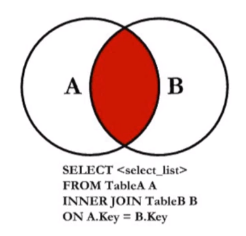
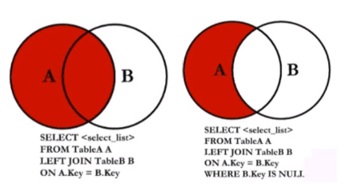
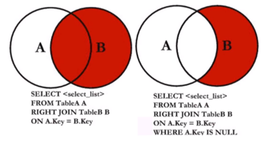
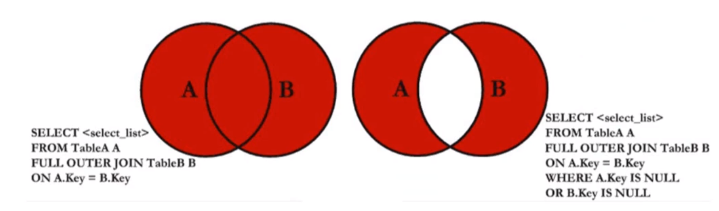

# SQL开发技巧之一

## SQL

- DDL
- TPL
- DCL
- **DML**
  - select
  - update
  - insert
  - delete

框架可以生成 SQL 语句，但是往往生成的 SQL 语句都是很低效的。如果自己去书写 SQL 语句的话，

1. 可以增加数据库处理效率，减少应用相应时间。
2. 减少数据库服务器负载，增加服务器稳定性
3. 减少服务器间通讯的网络流量

## 正确使用join从句

- inner 内连接
- full outer  全外连接
- left outer 做连接
- right outer 右连接
- cross 交叉连接

### inner join

内连接 就是 基于连接为此将两张表的列组合在一起，产生新的结果。

*数学中的合集。*



### left join

有两种使用情况：

1. 原原本本的左连接，就是以左边表为主表，右边表为副表。如果左边表中没有出现右边边中的数据的话会被标记为 NULL 。
2. 变通的左连接。在上第一种基础上加上，如果没有出现右边表数据的话就不显示。 **is not null**



### right join

当然也是两种情况跟左连接相反的：

1. ..
2. ..



### full join

左连接 + 右连接

**mysql 中不支持 full join**，当然可以通过左连接  union all  右连接来实现全外连接。

so ,全外连接能干嘛？

1. 能查询出 两个表中所有的 数据
2. 能查询出 两个表中除公共数据外的所有数据。



### cross join

笛卡尔积连接或者又叫叉乘。

如果 一个表中有 a 条数据，另一个表中有 b 条数据。那么结果集中会有 a*b 条数据。

不需要提供连接词

## join技巧

### 更新表:heavy_check_mark:

如何更新使用过滤条件中包括自身的表？

```sql
update user1 a join (select b.username from user1 a inner join user2 b on a.username=b.username) b 
on a.username=b.username
set b.username='齐天大圣'
```

### 优化子查询:heavy_check_mark:

优化前：

```sql
select a.username,a.over,(select b.over from user2 b where a.username=b.username) as over2
from user1 a
```

优化后：

```sql
select a.username,a.over,b.over as over2
from user1 a left join user2 b 
on a.username=b.username
```

具体性能优化提升效果可参考 MYSQl 优化章节进行对比。就直接告诉你，优化性能快很多。

### 优化聚合子查询:heavy_check_mark:

需求：查询出私人组中打怪最多日期？（避免子查询）

优化前：

```sql
select a.user_name,b.timestr,b.kills
from user1 a join user_kills b
on a.id=b.user_id
where b.kiills=(select max(c.kills) from user_kills c where c,user_id=b.user_id)
```

优化后：

为什么会有having呢？是因为 where 关键字无法与聚合函数一起使用，而 having 字句可以让我们**筛选分组后的各组数据。**

限制条件：要和 group by 一起使用。

```sql
select a.user_name,b.timestr,b.kills
from user1 a
join user_kills b on a.id=b.user_id
join user_kils c on c.user_id=b.user_id
group by a.user_name,b.timestr,b.kills
having b.kills=max(c.kills)
```

### 如何实现分组选择:heavy_check_mark:

需求：每一个人杀怪最多的前两天

优化前：

```sql
select a.user_name,b.timestr,b,kills
from user1 a join user_kills b
on a.id=b.user_id
where user_name ='孙悟空'
order by b.kills desc
limit 2
```

然后循环查询出每一个人的。

优化方案：

- **row_number()**  myql中不支持
- 第二种方式

```sql
select d.user_name,c.timestr,kills
from (
select user_id,timestr,kills,(select count(*) from user_kills b where b.user_id=a.user_id and a,kills<=b.kills) as cnt
    from user_kills a
    group by user_id,timestr,kills
) c join user1 d on c.user_id=d.id
where cnt<=2
```

---

user1  西天取经四人组

| id   | user_name |
| ---- | --------- |
| 1    | 唐僧      |
| 2    | 猪八戒    |
| 3    | 孙悟空    |
| 4    | 沙僧      |


user2  悟空的朋友们

| id   | user_name |
| ---- | --------- |
| 1    | 孙悟空    |
| 2    | 牛魔王    |
| 3    | 蛟魔王    |
| 4    | 鹏魔王    |
| 5    | 狮魔王    |

