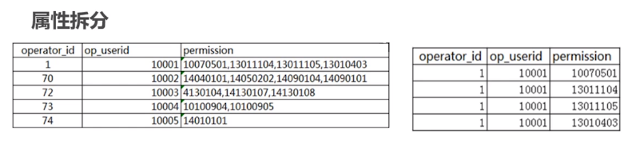

# SQL开发技巧2

## 行列转换

### 行转列

- 报表统计

- 汇总显示

需求：显示悟空，沙僧，八戒三人的打怪总数（列显示）。

:one:如果拿到单个人的打怪总数可以通过 sum 聚合函数来实现

```sql
#实现思路就是两表关联
select sum(kills) s 
from user1 a join user_kills b 
on a.id=b.user_id
and a.user_name ='悟空'
```

如果要三人的总数呢？

```sql
select * 
from (
select sum(kills) as '悟空'
from user1 a join user_kills b 
on a.id=b.user_id
and a.user_name ='悟空' 
) a cross join(
select sum(kills) as '沙僧'
from user1 a join user_kills b 
on a.id=b.user_id
and a.user_name ='沙僧' 
) b cross join(
select sum(kills) as '八戒'
from user1 a join user_kills b 
on a.id=b.user_id
and a.user_name ='八戒' 
) c
```

ok，终于搞定了。但是这种写法是由缺陷的。sql 语句过长导致可扩展性不高。

:two: case 

```sql
select sum(case when user_name='孙悟空' then kills end) as '孙悟空',
sum(case when user_name='猪八戒' then kills end) as '猪八戒',
sum(case when user_name='沙僧' then kills end) as '沙僧'
from user1 a join user_kills b on a.id=b.user_id
```


### 列转行

- 属性拆分

  

- EL数据处理

  

手机号行列转换

```sql
select user_name,
replace(
substring(substring_index(mobile,',',a.id),
char_length(substring_index(mobile,',',a.id-1))+1,',','') as mobile
form tb_sequence a
cross join(
select user_name,concat(mobile,',') ad mobile,
    lenght(mobile)-lenght(replace(mobile,',',''))+1 size
from user1 b
) b on a.id <= b.size
```


#### 利用 union 方式


union / union all

```sql
select user_name,'arms' as equipment,arms
from user1 a join user1_equipment b on a.id = b.user_id
union all
select user_name,'clothing' as equipment,arms
from user1 a join user1_equipment b on a.id = b.user_id
union all
select user_name,'shoe' as equipment,arms
from user1 a join user1_equipment b on a.id = b.user_id;
```

我们也可以看出使用 union 方式 SQL 书写比较长。


#### 利用序列表处理


coalesce 函数 / cross join / case when... then ..end

```sql
select b.user_name,
case when c.id = 1 then 'arms'
	 when c.id = 2 then 'clothing'
	 when c.id = 3 then 'shoe',
coalesce(
case when c.info = 'clothing' then clothing end,
case when c.info = 'arms' then arms end,
case when c.info =  'shoe' then shoe end
) ad eq_name
from user1_equipment a
join user1 b on a.user_id = b.id
cross join tb_sequence c
where c.id <=3
order by user_name;
```

## 生成唯一序列号

1. 数据主键

2. 业务序列号

- MYSQL 

  auto_increment（空洞问题）

- ....

建议优先选择系统提供序列号生成方式。

在特殊情况下可以使用 SQL 方式生成序列号

**存储过程** seq_no

```sql
declare v_cnt int;
declate v_timestr int;
declate rowcount bigint;
set v_timesstr = date_format(now(),'%Y%m%d');
select round(rand()*100,0)+1 into v_cnt;
start transaction;
	update order_seq set order_sn = order_sn + v_cnt where timestr = v_timestr;
	if row_count() = 0 then
		insert into order_seq(timestr,order_sn) values(v_timestr,v_cnt);
    end if;
    select concat(v_timestr,lpad(order_sn,7,0)) ad order_sn
    from order_seq where timestr = v_timestr;
commit;
```

order_seq 表 

| timestr(当前日期） | order_sn(当日最大值) |
| :----------------: | :------------------: |
|      20200511      |         390          |

`call seq_no();`

> 202005110000390


## 删除重复数据


先查询出重复数据 用 having | group by 关键字

```sql
select user_name,count(*)
from user1_test
group by user_name
having count(*)>1
```

删除重复数据，对于相同数据保留 ID 最大的

```sql
delete a from user1_test a join(
select user_name,count(*),max(id) as id
from user1_test
group by user_name 
having count(*)>1
) b on a.user_name=b.user_name
where a.id<b.id
```


