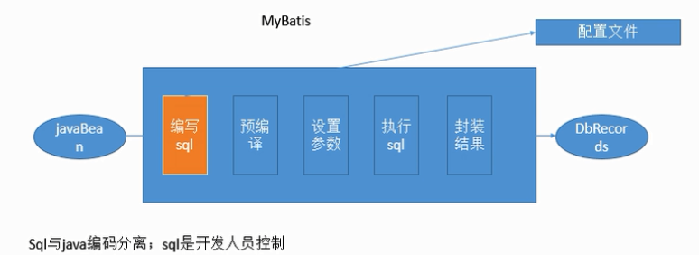

# Mybatis/iBatis
iBatis曾是开源软件组 Apache 推出的一种轻量级的对象关系映射持久层框架，随着开发团队转投 Google Code 旗下，ibtatis 3.x 正式改名为 Mybatis 即iBatis 2.x,MyBatis 3.x

[官网](http://www.mybatis.org/mybatis-3/)

[源码](https://github.com/mybatis/mybatis-3)

---
[MyBatis基础--黑马视频](https://www.evernote.com/l/Ajjo99Mnz05NGrjyGDT_Okj4XiOd8aa4dDI/)

----



## HelloWorld

1. 根据 xml 配置文件（全局配置文件）创建一个 SqlSessionFactory 对象。有数据源一些运行环境信息
2. sql 映射文件：配置每一个 sql ，以及  sql 的封装规则等。
3. 将 sql 映射文件注册在全局配置文件中
4. 代码部分：
   1. 根据全部配置文件得到 sqlSessionFactory 
   2. 使用 sqlSession 工厂，获取 sqlSession 对象使用来执行增删改查；一个 sqlSession 就表示和数据库的一次会话，用完关闭。
   3. 使用 sql 的唯一标识来告诉 Mybatis 执行哪个 sql 。sql 是保存在 sql 映射文件中的。

**参考官方文档 2.1 Getting started**

## 接口式编程

接口和SQL动态绑定

1. 获取 sqlSessionFactory 对象
2. 获取 sqlSession 对象
3. 获取接口的实现类（会为接口自动创建一个代理对象，代理对象去执行增删改查方法）

**平常用的最多的**


```
1.mybatis: XXXMapper ---> XXMapper.xml 
2.SqlSession 代表和数据库的一次会话；用完必须关闭。
3.SqlSession和connection一样都是线程非安全的。每次使用都应该去获取新的对象。
4.mapper接口没有实现类，但是 mybatis 会为这个接口生成一个代理对象。（将接口和xml绑定）
5.两个重要的配置文件：
		mybatis的全局配置文件；包含数据库连接池信息，事务管理信息等....系统运行环境信息
		sql映射文件：保存每一个sql语句的映射信息；将 sql 抽取出来
```

## 全局配置文件

[全局配置文件](https://github.com/helloGitHubQ/FiveYears/blob/master/docs/frame/Mybatis/MybatisGlobalConfig.md)

## 映射文件

[映射文件](https://github.com/helloGitHubQ/FiveYears/blob/master/docs/frame/Mybatis/MapperXMLFiles.md)

## 动态SQL

[动态SQL](https://github.com/helloGitHubQ/FiveYears/blob/master/docs/frame/Mybatis/DynamicSQL.md)

## 缓存

[缓存](https://github.com/helloGitHubQ/FiveYears/blob/master/docs/frame/Mybatis/MybatisCache.md)

## 整合Spring

