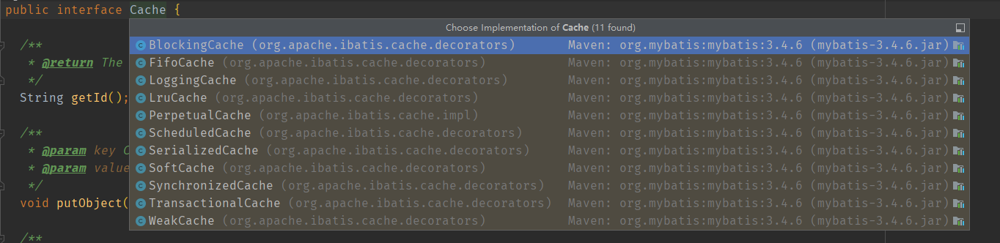
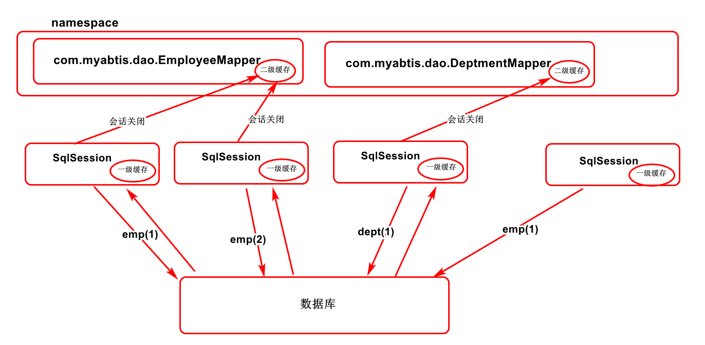

<!--TOC-->

- [一级缓存](#一级缓存)
  - [一级缓存初体验](#一级缓存初体验)
  - [四种失效情况](#四种失效情况)
- [二级缓存](#二级缓存)
  - [工作机制](#工作机制)
  - [使用](#使用)
  - [缓存有关的设置以及属性](#缓存有关的设置以及属性)
- [缓存原理](#缓存原理)

<!--TOC-->

# Mybatis 缓存机制

缓存，带来的好处想必都是知道的。就是说你查询一次数据库之后，下次如果是相同的查询的话。她就会直接从缓存中取出来给你。



## 一级缓存

一级缓存也可以说是本地缓存。她是怎么做的呢？

与数据库的一次会话期间查询到的数据会放在本地缓存中，以后如果需要获取相同的数据，直接从缓存中拿，没有必要再去查询数据库了。

SqlSession 级别的缓存，一级缓存是一直开启的；SqlSession 级别的 Map 。

### 一级缓存初体验

```java
@Test
public void test01(){
    SqlSessionFactory sqlSessionFactory=getSqlSessionFactory();
    SqlSession openSession = sqlSessionFactory.openSession();
    try{
        EmployeeMapper mapper=openSession.getMapper(EmployeeMapper.class);
        Employee emp01 = mapper.getEmpById(1);
        System.out.println(emp01);
        
        //...
        
        Employee emp02 = mapper.getEmpById(1);
        System.out.println(emp02);
         System.out.println(emp02==emp02); //true
    }finally{
        openSession.close();
    }
}
```

上述代码结果就只有输出一次查询语句。而且 emp01==emp02 是 true 。这已经说明问题了。

### 四种失效情况

- SqlSession 不同

```java
@Test
public void test02(){
    SqlSessionFactory sqlSessionFactory=getSqlSessionFactory();
    SqlSession openSession = sqlSessionFactory.openSession();
    try{
        EmployeeMapper mapper=openSession.getMapper(EmployeeMapper.class);
        Employee emp01 = mapper.getEmpById(1);
        System.out.println(emp01);
        
        //...
        EmployeeMapper mapper2=openSession.getMapper(EmployeeMapper.class);
        Employee emp02 = mappe2r.getEmpById(1);
        System.out.println(emp02);
         System.out.println(emp02==emp02); 
    }finally{
        openSession.close();
    }
}
```

- SqlSession 相同，查询条件不同（当前一级缓存中没有这个数据）

```java
@Test
public void test03(){
    SqlSessionFactory sqlSessionFactory=getSqlSessionFactory();
    SqlSession openSession = sqlSessionFactory.openSession();
    try{
        EmployeeMapper mapper=openSession.getMapper(EmployeeMapper.class);
        Employee emp01 = mapper.getEmpById(1);
        System.out.println(emp01);
        
        //...
        EmployeeMapper mapper2=openSession.getMapper(EmployeeMapper.class);
        Employee emp02 = mapper2.getEmpById(3);
        System.out.println(emp02);
         System.out.println(emp02==emp02); 
    }finally{
        openSession.close();
    }
}
```

- SqlSession相同，两次查询之间进行了增删改操作（有可能影响数据）

```java
@Test
public void test04(){
    SqlSessionFactory sqlSessionFactory=getSqlSessionFactory();
    SqlSession openSession = sqlSessionFactory.openSession();
    try{
        EmployeeMapper mapper=openSession.getMapper(EmployeeMapper.class);
        Employee emp01 = mapper.getEmpById(1);
        System.out.println(emp01);
        
        //add
        
        EmployeeMapper mapper=openSession.getMapper(EmployeeMapper.class);
        Employee emp02 = mapper.getEmpById(1);
        System.out.println(emp02);
         System.out.println(emp02==emp02); 
    }finally{
        openSession.close();
    }
}
```

- SqlSession相同，手动清除一级缓存（缓存清空）

```java
@Test
public void test05(){
    SqlSessionFactory sqlSessionFactory=getSqlSessionFactory();
    SqlSession openSession = sqlSessionFactory.openSession();
    try{
        EmployeeMapper mapper=openSession.getMapper(EmployeeMapper.class);
        Employee emp01 = mapper.getEmpById(1);
        System.out.println(emp01);
        
        //..
        openSession.ClearSession();
        
        EmployeeMapper mapper=openSession.getMapper(EmployeeMapper.class);
        Employee emp02 = mapper.getEmpById(1);
        System.out.println(emp02);
         System.out.println(emp02==emp02); 
    }finally{
        openSession.close();
    }
}
```

## 二级缓存

全局缓存。基于 namespace 级别的缓存；一个 namespace 对应一个二级缓存。

### **工作机制**

- 一个会话查询一个数据，这个数据就会被放在当前会话的一级缓存中

- 如果会话关闭，一级缓存中的数据会保存在二级缓存中，新的会话查询信息，就可以参照二级缓存。

- SqlSession    EmployeeMapper  Employee

  ​						DepartmentMapper Department

  不同 namespace 查出数据会放在自己对应的缓存中（map 中）

**效果**：

​	数据会从二级缓存中获取。查出的数据都会被默认先放到一级缓存中，只有会话提交或者关闭以后，一级缓存中的数据才会移交到二级缓存中。

### 使用

1.开启二级缓存配置 

mybatis-config.xml

```xml
...
<Settings>
	<Setting name="cacheEnabled" value="true"/>
</Settings>

...
```

2.去 XXMapper.xml 中配置缓存。

XXXMapper.xml

cache标签

- eviction 缓存回收策略

  - LRU	最近最少使用
  - FIFO    先进先出
  - SOFT    软引用
  - WEAK  弱引用
  - 默认是 LRU

- flushInterval 缓存刷新间隔

  缓存多长时间清空一次，默认不清空，单位是一个毫秒值

- readOnly 是否只读

  - true	只读

    mybatis 认为所有从缓存中获取数据的操作都是只读操作，不会修改数据

    mybatis 为了加快获取速度，直接就会将数据在缓存中的引用交给用户。

    **不安全，速度快**。

  - false  非只读

    mybatis 觉得获取的数据可能会被修改

    mybatis 会利用序列化 & 反序列化技术克隆一份新的数据给你。

    **安全，速度慢。**

- size 缓存存放多少元素

- type 指定自定义缓存的全类名

  如果自定义缓存呢？**实现 Cache 接口即可**

```xml
...
<cache> </cache>
...
```

3.POJO 实现序列化接口

   XXX implements Serializable


```java
@Test
public void test06(){
    SqlSessionFactory sqlSessionFactory=getSqlSessionFactory();
    SqlSession openSession = sqlSessionFactory.openSession();
    SqlSession openSession2 = sqlSessionFactory.openSession();
    try{
        EmployeeMapper mapper=openSession.getMapper(EmployeeMapper.class);
         EmployeeMapper mapper2=openSession2.getMapper(EmployeeMapper.class);
        Employee emp01 = mapper.getEmpById(1);
        System.out.println(emp01);
        
        openSession.close();
       	
        Employee emp02 = mapper2.getEmpById(1);
        System.out.println(emp02);
        openSession2.close();
    }finally{
        
    }
}
```

### 缓存有关的设置以及属性

- cacheEnabled = true  | false ：关闭缓存   /  `<setting>`标签中的配置

  二级缓存关闭，一级缓存可用

- 每一个 select 标签都有 useCache = "true"

  false 不使用缓存。二级缓存不使用，一级缓存依然可使用

- 每一个增删改标签的：flushCache="true" 

  一级缓存二级缓存都会被清除。增删改执行完成后就会清除缓存。

  查询标签  flushCache="false"；如果设置 为 true ，每次查询之后都会清除缓存。

- sqlSession.clearCache()；只是清除当前 session 的一级缓存
- localCacheScope ：本地缓存作用域（一级缓存的session）
  -  SESSION   当前会话的所有数据保存在会话缓存中
  - STATEMENT  可以禁用一级缓存 

## 缓存原理

首先要搞清楚的就是缓存的顺序。 二级缓存  ->  一级缓存 -> 数据库

即新会话进入会先查找二级缓存中是否有对应的数据。



- 一级缓存会话关闭（好几种情况）了会把数据移交给二级缓存。
- 二级缓存比一级缓存范围更大。是针对命名空间的。