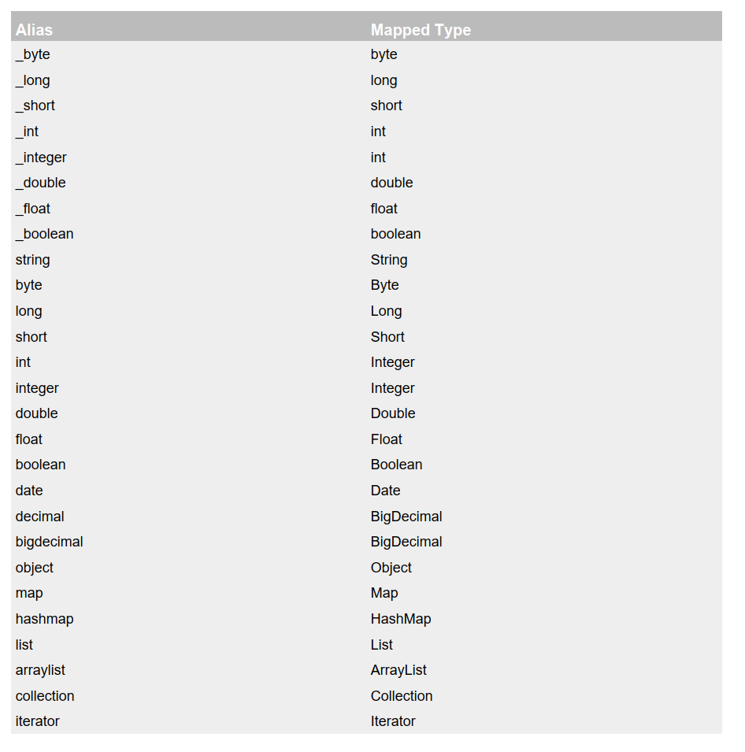
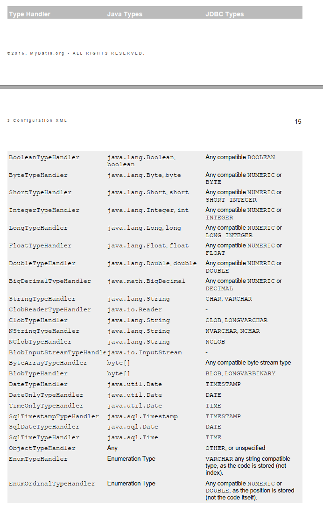

<!--TOC-->

- [1.引入 dtd 约束：](#1.引入 dtd 约束：)
- [2.引入外部配置文件](#2.引入外部配置文件)
- [3.Configuration XML ](#3.Configuration XML )
  - [settings](#settings)
  - [typeAliases ](#typeAliases )
  - [typeHandlers ](#typeHandlers )
  - [plugins ](#plugins )
  - [environments](#environments)
  - [databaseIdProvider ](#databaseIdProvider )
  - [mappers](#mappers)

<!--TOC-->

# 全局配置文件

Configuration XML 

## 1.引入 dtd 约束：

就是为了在 xml  文件中书写配置文件的时候有提示。

idea 中很简单。将光标放在 http://mybatis.org/dtd/mybatis-3-config.dtd 后面，然后 Alt+Enter 组合键，然后回车就可以啦！其他配置文件也是一样的。

```xml
<?xml version="1.0" encoding="UTF-8" ?>
<!DOCTYPE configuration
        PUBLIC "-//mybatis.org//DTD Config 3.0//EN"
        "http://mybatis.org/dtd/mybatis-3-config.dtd">
<configuration>
    <environments default="development">
        <environment id="development">
            <transactionManager type="JDBC"/>
            <!--修改数据源的基本信息-->
            <dataSource type="POOLED">
                <property name="driver" value="com.mysql.jdbc.Driver"/>
                <property name="url" value="jdbc:mysql://localhost:3306/test"/>
                <property name="username" value="root"/>
                <property name="password" value="****"/>
            </dataSource>
        </environment>
    </environments>

    <!---->
    <mappers>
        <mapper resource="EmployeeMapper.xml"/>
    </mappers>
</configuration>
```

## 2.引入外部配置文件

3.1.1 properties 

mybatis 中可以使用 **properties** 来引入外部 properties 配置文件的内容；

有两个标签：

- **resource**：引入类路径下的资源
- **url**：引入网络路径或磁盘路径下的资源

## 3.Configuration XML 

### settings

3.1.2 settings  

**settings** 中包含很多很重要的设置项

setting：用来设置每一个设置项

- name ：设置项名

- value：设置项取值

  ```xml
  <settings>
      <setting name="cacheEnabled" value="true"/>
      <setting name="lazyLoadingEnabled" value="true"/>
      <setting name="multipleResultSetsEnabled" value="true"/>
      <setting name="useColumnLabel" value="true"/>
      <setting name="useGeneratedKeys" value="false"/>
      <setting name="autoMappingBehavior" value="PARTIAL"/>
      <setting name="autoMappingUnknownColumnBehavior" value="WARNING"/>
      <setting name="defaultExecutorType" value="SIMPLE"/>
      <setting name="defaultStatementTimeout" value="25"/>
      <setting name="defaultFetchSize" value="100"/>
      <setting name="safeRowBoundsEnabled" value="false"/>
      <setting name="mapUnderscoreToCamelCase" value="false"/>
      <setting name="localCacheScope" value="SESSION"/>
      <setting name="jdbcTypeForNull" value="OTHER"/>
      <setting name="lazyLoadTriggerMethods" value="equals,clone,hashCode,toString"/>
  </settings>
  ```

### typeAliases 

**typeAliases**  ： 别名处理器，可以为我们的 java 类型起别名。**别名不区分大小写。**

1、typeAlias：为某个 java 类型起别名

​	alias：指定新的别名

​	type：指定要起别名的类型全类名；默认别名就是小写；

```xml
<typeAliases>
    <typeAlias alias="Author" type="domain.blog.Author"/>
    <typeAlias alias="Blog" type="domain.blog.Blog"/>
    <typeAlias alias="Comment" type="domain.blog.Comment"/>
    <typeAlias alias="Post" type="domain.blog.Post"/>
    <typeAlias alias="Section" type="domain.blog.Section"/>
    <typeAlias alias="Tag" type="domain.blog.Tag"/>
</typeAliases>
```

2、package：为某个包下所有类型批量起别名。

​	name：指定报名（为当前包以及下面所有的后代包的每一个类都起一个默认别名）

```xml
<typeAliases>
	<package name="domain.blog"/>
</typeAliases>
```

3、批量起别名的情况下，使用 `@Alias`注解给某个类型起新的别名

```java
@Alias("author")
public class Author {
...
}
```

注意：

- 别名不区分大小写
- mybatis 中预先给我们设定了一些别名（基本数据类型和它们的包装类、集合、日期、迭代器等）



### typeHandlers 

类型处理器

*NOTE* If you use classes provided by JSR-310(Date and Time API), you can use the [mybatistypehandlers-jsr310](https://github.com/mybatis/typehandlers-jsr310)

JDk 1.8  日期和时间处理 API

也就是 Mybatis 3.4 以前的版本需要我们手动注册这些处理器，以后的版本都是自动的。



### plugins 

插件 四大对象

- Executor (update, query, flushStatements, commit, rollback, getTransaction, close, isClosed)
- ParameterHandler (getParameterObject, setParameters)
- ResultSetHandler (handleResultSets, handleOutputParameters)
- StatementHandler (prepare, parameterize, batch, update, query) 

### environments

可以配置多种环境； default 指定使用某种环境。可以达到快速切换。

- environment：配置一个具体的环境环境，必须有两个标签。id代表当前环境的唯一标识
  - transactionManager：事务管理器。
  - type：事务管理器的类型。
    - JDBC（JdbcTransactionFactory）|
    - MANAGED(MabagedTransactionFactory)|
    - 自定义事务管理器：实现 TransactionFactory 接口 ，type 指定为全类名 
  -  dataSource：数据源。

-  type：数据源类型。

  - UNPOOLED(UnpooledDataSourceFactory)|

  - POOLED(PooledDataSourceFactory)|
  - JNDI(JndiDataSourceFactory)|
  - 自定义数据源：实现 DataSourceFactory 接口，type 是全类名

```xml
<environments default="development">
    <environment id="development">
        <transactionManager type="JDBC">
        	<property name="..." value="..."/>
    	</transactionManager>
        <dataSource type="POOLED">
            <property name="driver" value="${driver}"/>
            <property name="url" value="${url}"/>
            <property name="username" value="${username}"/>
            <property name="password" value="${password}"/>
        </dataSource>
    </environment>
</environments>
```

### databaseIdProvider 

支持多数据库厂商。

DB_VENDOR ：作用就是得到数据库厂商的标识（驱动getDatabaseProductName() ），mybatis 就能根据数据库厂商标识来执行不同的sql

```xml
<databaseIdProvider type="DB_VENDOR">
    <property name="SQL Server" value="sqlserver"/>
    <property name="DB2" value="db2"/>
    <property name="Oracle" value="oracle" />
</databaseIdProvider>
```

### mappers

SQL  映射注册到全局配置中，注册配置文件。

- resource：引用类路径下的 sql 映射文件；
- url：引用网络路径或磁盘路径下的 sql 映射文件。


​	注册接口

​	class：引用（注册）接口，

​		1、有 sql 映射文件，映射文件名必须和接口同名，并且放在与接口同一个包下

​		2、没有 sql 映射文件，所有的 sql 都是利用注解写在接口上

推荐做法是：**比较重要的，复杂的 DAO 接口我们来写 sql 映射文件；不重要的，简单的 DAO 接口为了开发快速可以使用注解。**

```xml
<mappers>
    <!-- 注册配置文件 -->
	<mapper resource="myabtis/mapper/EmployeeMapper.xml" />
    <mapper class="com.atguigu.mybatis.dao.EmployeeMapperAnnotation"/>
    
    <!-- 批量注册 -->
    <package name="com.atguigu.mybatis.dao"/>
</mappers>
```

