# Spring Boot
Spring Boot 是 Spring开源组织下的一个子项目，也是Spring组件一站式解决方案，主要是为了简化使用Spring框架的难度，简省繁重的配置。

Spring Boot 提供了各种组件的启动器（starters），开发者只要能配置好对应组件参数，Spring Boot就会自动配置，让开发者能快速搭建依赖于 Spring 组件的 Java 项目

[官网](https://spring.io/projects/spring-boot)

[源码](https://github.com/spring-projects/spring-boot)

[Spring Boot 核心配置文件详解](https://mp.weixin.qq.com/s?__biz=MzI3ODcxMzQzMw==&mid=2247486541&idx=2&sn=436ab454a6367fdc33912162855c02c7&scene=21#wechat_redirect)

[官方文档理解](https://github.com/helloGitHubQ/FiveYears/blob/master/docs/frame/SpringBoot/SpringBootOfficial.md)

---
# SpringBoot 基础~atguigu~ ~--~ ~bilibili~

## SpringBoot 入门
### 1.简介
> 简化 Spring 应用的一个框架
> 
> 整个Spring 技术栈的一个大集合
> 
> J2EE开发的一站式解决方案

### 2.微服务
2014  martin fowler

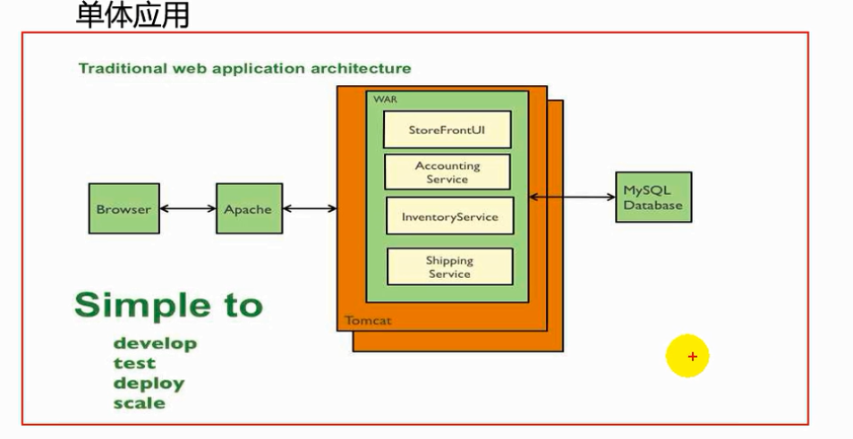

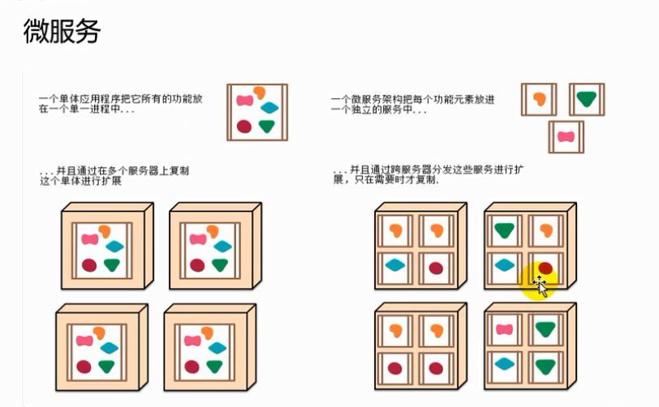

**每一个功能元素最终都是一个可独立替换和独立升级的软件单元。** 

### 3.环境
- 环境约束：

   ```
   jdk 1.8:Spring Boot 是要求1.7及以上  jdk 1.8.0_181
   maven3.x :maven 3.3以上版本  Apache Maven 3.5.4
   IntelliJ IDEA 2018.2.7 (Ultimate Edition) Windows 7 6.1
   SpringBoot 1.5.9.RELEASE: 1.5.9
   ```

- 配置Maven

给 Maven 的 settings.xml 配置文件的 profiles 标签中添加。使 Maven 知道自己是用 jdk 1.8 去启动的。（我这里呢就暂时先没有去改配置文件的路径，只是改了 Maven 的路径）

```xml
 <profile>
  <id>jdk-1.8</id>

  <activation>
  <activeByDefault>true</activeByDefault>
    <jdk>1.8</jdk>
  </activation>

 <properties>
		<maven.compiler.source>1.8</maven.compiler.source>
		<maven.compiler.target>1.8<maven.compiler.target>
		<maven.compiler.compilerVersion>1.8</maven.compiler.compilerVersion>
 </properties>
</profile>
```

- 配置 Idea

使 IDEA 使用我们自己的安装的 Maven。

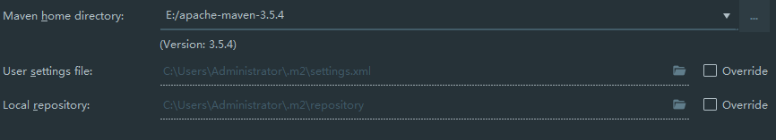

### 4.HelloWorld
浏览器发送请求，服务器接收请求并处理。响应 HelloWorld 字符串。

- 创建一个 Maven 项目
- 在 pom.xml 中导入 SpringBoot 的相关依赖
- 编写主程序：启动 SPringBoot 应用(@SpringBootApplication)
- 编写相关的 Controller、Server
- 测试（运行 main 方法,访问 localhost:8080/hello）
- 简化部署工作

pom.xml 中加入打 jar 包的注解。

运行  Maven Projects->项目下的 Lifecycle->package。

打好 jar 包的位置会出现在 控制台上，找到相应的 jar 包。通过 java -jar 命令进行执行

### 5.HelloWorld探究
- pom 文件

父项目

Spring Boot的版本仲裁中心；
以后我们导入依赖默认是不需要写版本号（没有 dependencies 里面管理的依赖自然需要声明版本号）

启动器(starter)：

```xml
<dependency>
  <groupId>org.springframework.boot</groupId>
  <artifactId>spring-boot-starter-web</artifactId>
</dependency>
```

Spring-boot-starter-==web==:

Spring-boot-starter：Spring-Boot场景启动器；帮我们导入了 web 模块正常运行所依赖的组件。

SpringBoot 将所有的功能场景都抽取出来，做成一个个 starters（启动器），只需要在项目里面引入这些 starter 相关场景的所有依赖都会导入进来。要用什么功能就用什么场景的启动器

- 主程序类、主入口类

  ```java
  /**
   *  @SpringBootApplication 来标注一个主程序类，说明这是一个Spring Boot应用
   */
  @SpringBootApplication
  public class HelloWorldMainApplication {
  
      public static void main(String[] args) {
  
          // Spring应用启动起来
          SpringApplication.run(HelloWorldMainApplication.class,args);
      }
  }
  ```

  

@SpringBootApplication：Spring Boot 应用注解标注在某个类上说明这个类是 SpringBoot 的主配置类。SpringBoot 就应该运行这个类的 main 方法来启动 SpringBoot 应用。

```java
@Target(ElementType.TYPE)
@Retention(RetentionPolicy.RUNTIME)
@Documented
@Inherited
@SpringBootConfiguration
@EnableAutoConfiguration
@ComponentScan(excludeFilters = {
      @Filter(type = FilterType.CUSTOM, classes = TypeExcludeFilter.class),
      @Filter(type = FilterType.CUSTOM, classes = AutoConfigurationExcludeFilter.class) })
public @interface SpringBootApplication {
```


**@SpringBootConfiguration:** SpringBoot 的配置类；

标注在某个类上，说明这个类是 SpringBoot 的配置类。

  @Configuration:配置类上来标注这个注解。配置类 --- 配置文件。配置类也是容器中的组件

**@EnableAutoConfiguration:**开启自动配置功能。

```java
@AutoConfigurationPackage
@Import(EnableAutoConfigurationImportSelector.class)
public @interface EnableAutoConfiguration {
```


 @AutoConfigurationPackage:自动配置包

   @Import(AutoConfigurationPackages.Registrar.class)：Spring 的底层注解 @import ,给容器中导入一个组件；导入的组件由 
AutoConfigurationPackages.Registrar.class

 ==将主配置类(@SpringBootApplication标注的类)的所在包及下面所有子包里面的所有组件扫描到 Spring 容器；==

@Import(EnableAutoConfigurationImportSelector.class);

给容器导入组件。

	EnableAutoConfigurationImportSelector:导入哪些组件的选择器；
	将所有需要导入的组件以全类名的方式返回,这些组件就会被添加到容器中。
	会给容器导入很多的自动配置类（XXXAutoConfiguration）,就是给容器中导入这个场所需要的所有组件，并配置好这些组件。

有了自动配置类，就避免了我们手动编写配置注入功能组件等工作了。

==Spring Boot 在启动的时候从类路径下的 META-INF/spring.factories 中获取 EnableAutoConfiguration 指定的值，将这些值作为自动配置类导入到容器中，自动配置类就生效，帮我们自动配置工作。==

J2EE 的整体整合解决方案和自动配置都在 spring-boot-autoconfigure-1.5.9.RELEASE.jar

### 6.快速创建SpringBoot应用

Spring Initializer:快速向导

选择我们需要的模块，向导会联网创建 SpringBoot 项目。

默认生成的 SpringBoot 项目：主程序已经生成好了，我们只需要书写我们的逻辑。

resources 目录文件：
	

```
static ：保存所有的静态资源。 js css images
templates ：保存所有的模板页面；（Spring Boot 默认 jar 包使用嵌入式的 Tomcat ,默认不支持 JSP 页面）；但是可以使用模板引擎（freemarker、thymeleaf）
application.properties:Spring Boot 应用的配置文件。可以修改一些默认配置。
```

 

## SpringBoot 配置
### 1.配置文件
Spring Boot 使用一个全局的配置文件，配置文件名是固定的。

- application.properties
- application.yml

配置文件的作用：修改 SpringBoot 自动配置的默认值。Spring Boot在底层都给我们自动配置好了。

YAML：是一个标记语言。	**是以数据为中心**，比 json、xml更适合做配置文件。

标记语言：

以前的配置文件，大多数都是使用 xxxx.xml 文件

`YML例子：`

```yaml
server:
  port: 8081
```

`XML例子：`

```xml
<server>
	<port>8081</port>
</server>
```


### 2.YAML语法
- 基本语法

k:(空格)v：表示一对键值对（空格必须有）。

以**空格**的缩进来控制层级关系，只要是左对齐的一列数据，都是同一层级的

```yml
server:
	port: 8081
	path: /hello
```

属性和值大小写敏感。

- 值的写法

	- 字面量：普通值（数字、字符串、布尔）
	
			k:V: 字面量直接写；
			字符串默认不用加上单引号和双引号。
			""：双引号；不会转义字符串中的特殊字符，特殊字符会作为本身想表示的意思。
			name: "zhangsan \n lisi"
			输出:zhangsan 换行 lisi
			'':单引号；会转义特殊字符，特殊字符最后只是一个普通的字符串数据	
			name: "zhangsan \n lisi"
			输出:zhangsan \n lisi

	- 对象、Map（属性和值）（键值对）：

	   k:v: 在下一行来写对象的属性和值的关系。注意缩进
	   	对象还是 k:v的方式
	   	friends:
	   		lastName: zhangsan
	   		age: 20

	   ```yaml
	   行内写法：
   friends: {lastName: zhangsan,age 20}			
	   ```
	
	- 数组（List、Set）：
		
			用 - 值表示数组中的一个元素
			pets:
		
			- cat
			- dog
			- pig
			
		
		```yaml
		行内写法：
		pets: [cat,dog,pig]
		```

### 3.配置文件注入

**@ConfigurationProperties:**告诉 SpringBoot 将本类中的所有属性和配置文件中相关属性进行绑定。

prefix = "person" ：配置文件中哪个下面的所有属性进行一一映射

只有这个组件是容器组件，才能使用容器提供的 @ConfigurationProperties 功能

**@Component：**容器注解

- **properties配置文件编码问题**

idea 默认的 properties 是 UTF-8 编码，需要去 idea 中设置转为 ascii 码(Settings->Editor->File Encodings->勾选 Transparent native-to-ascii conversion    然后 apply -> ok)  这里的设置只是设置当前项目的。

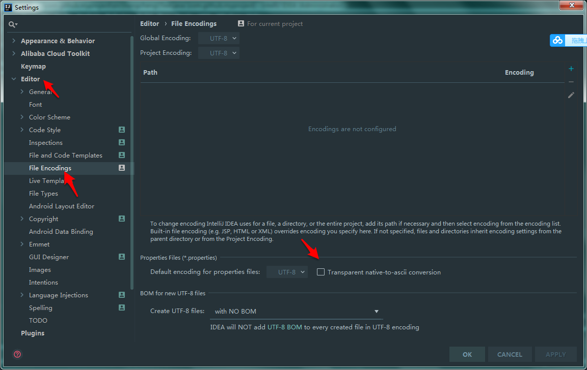

如果想要==全局设置==的话，File->other Settings->Settings for New Projects->Editor->File Encodings->勾选 Transparent native-to-ascii conversion    然后 apply -> ok)

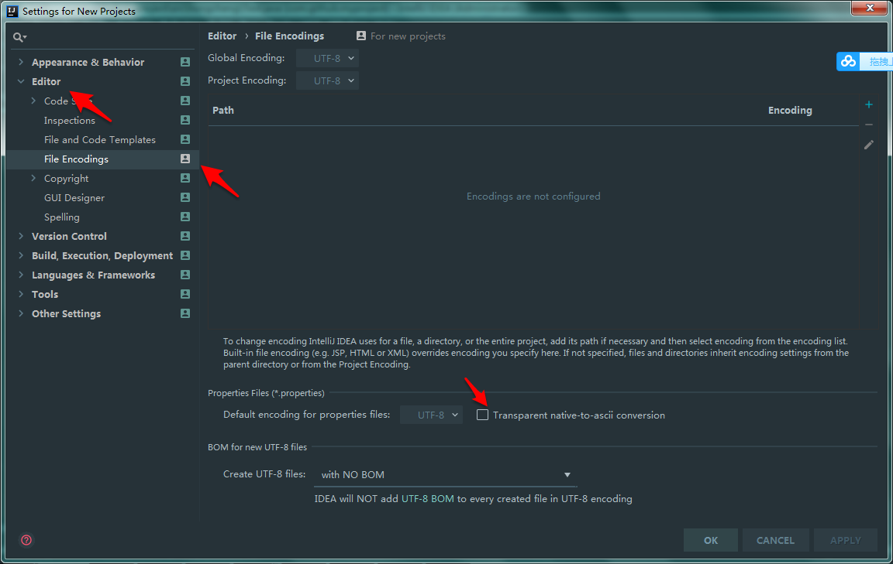

- @Value获取值和@ConfigurationProperties获取值比较

|         | ConfigurationProperties           | @Value  |
| ------------- |:-------------:| -----:|
| 功能      | 批量注入配置文件中的属性 | 一个个指定 |
| 松散绑定（松散语法）      | 支持      |   不支持 |
| SpEL | 不支持    |    支持 |
| JSR303 | 支持    |    不支持 |
| 复杂类型封装 | 支持    |    不支持 |

配置文件yml还是properties他们都能获取值。

如果说，我们只是在某个业务逻辑中需要获取一下配置文件中的某项值，使用 @Value

如果说，我们专门编写一个 javaBean 来和配置文件进行映射，我们就直接使用 @ConfigurationProperties

- 配置文件注入值数据校验


- @PropertySource 和 @ImportResource
	- @PropertySource ：加载指定的配置文件
	
	  ```java
	  /**
	   * 将配置文件中配置的每一个属性的值，映射到这个组件中
	   * @ConfigurationProperties：告诉SpringBoot将本类中的所有属性和配置文件中相关的配置进行绑定；
	   *      prefix = "person"：配置文件中哪个下面的所有属性进行一一映射
	   *
	   * 只有这个组件是容器中的组件，才能容器提供的@ConfigurationProperties功能；
	   *  @ConfigurationProperties(prefix = "person")默认从全局配置文件中获取值；
	   *
	   */
	  @PropertySource(value = {"classpath:person.properties"})
	  @Component
	  @ConfigurationProperties(prefix = "person")
	  //@Validated
	  public class Person {
	  
	      /**
	       * <bean class="Person">
	       *      <property name="lastName" value="字面量/${key}从环境变量、配置文件中获取值/#{SpEL}"></property>
	       * <bean/>
	       */
	  
	     //lastName必须是邮箱格式
	     // @Email
	      //@Value("${person.last-name}")
	      private String lastName;
	      //@Value("#{11*2}")
	      private Integer age;
	      //@Value("true")
	      private Boolean boss;
	  ```
	
	- @ImportResource ：导入 Spring 的配置文件，让配置文件里面的内容生效。
	
	SpringBoot 里面没有 Spring 的配置文件。我们自己编写的配置文件，也不能自动识别。想让 Spring 的配置文件生效，加载进来。@ImportResource标注在一个配置类上
	
	```java
	@ImportResource(locations = {"classpath:beans.xml"})
	//导入Spring的配置文件让其生效
	```
	
	

SpringBoot 推荐给容器中添加组件方式，推荐使用全注解方式

1. 配置类 ==== Spring 配置文件

2. 使用 @Bean 给容器中添加组件

   ```java
   /**
    * @Configuration：指明当前类是一个配置类；就是来替代之前的Spring配置文件
    *
    * 在配置文件中用<bean><bean/>标签添加组件
    *
    */
   @Configuration
   public class MyAppConfig {
   
       //将方法的返回值添加到容器中；容器中这个组件默认的id就是方法名
       @Bean
       public HelloService helloService02(){
           System.out.println("配置类@Bean给容器中添加组件了...");
           return new HelloService();
       }
   }
   ```

- 配置文件占位符

随机数：


```java
${random.value}、${random.int}、${random.long}、${random.int(10)}、${random.int[1024,65536]}
```

占位符之前配置的值，如果没有可以用 : 指定默认值	

```properties
person.last-name=张三${random.uuid}
person.age=${random.int}
person.birth=2017/12/15
person.boss=false
person.maps.k1=v1
person.maps.k2=14
person.lists=a,b,c
person.dog.name=${person.hello:hello}_dog
person.dog.age=15
```


- Profile
	- 多个 profile 文件：我们在主配置文件编写的时候，文件名可以是 appliction-{profile}.properties/yml。默认使用的配置文件是 appliction.properties 的配置
	
	- yml 支持多文档格式
	
	  ```yml
	  
	  server:
	    port: 8081
	  spring:
    profiles:
	      active: prod
	  
	  ---
	  server:
	    port: 8083
	  spring:
	    profiles: dev
	  
	  
	  ---
	  
	  server:
	    port: 8084
	  spring:
	    profiles: prod  #指定属于哪个环境
	  ```
	
	  
	
	- 激活指定的 profile
		- 在配置文件中指定 spring.profiles.active=dev(指定的环境)
		- 命令行：
			java -jar jar包名称 --spring.profiles.active=dev;
			可以直接在测试的时候，配置传入命令行参数
		- 虚拟机参数：
			-Dspring.profiles.active=dev
	
- 配置文件加载的位置

SpringBoot 启动会扫描 application.properties 或 application.yml 文件作为 Spring Boot 的默认配置文件。

	-file:./config/
	-file:./
	-classpath:/config/
	-classpath:/

优先级从高到低，高优先级的配置会覆盖底优先级配置。SpringBoot 会从这四个位置全部加载配置文件。**互补配置**


==还可以通过 spring.config.location 来改变默认的配置文件的位置。==

**项目打包好后，我们还可以使用命令行参数的形式，启动项目的时候来指定配置文件的新位置；指定配置文件和默认加载的配置文件共同作用形成互补配置。**

- 外部配置的加载顺序

SpringBoot 也可以使用外部配置文件。优先级从高到低	；高优先级的配置覆盖低优先级的配置；所有配置会形成互补配置。

	1.命令行参数
	java -jar jar包 --server.port=8087
	多个参数用空格隔开；
	2.来自 java:comp/env 的 JNDI 属性
	3.Java 系统属性（System.getProperties()）
	4.操作系统环境变量
	5.RandomValuePropertySource 配置 random.* 属性值
	6.jar 包外部的 application-{profile}.properties 或 application-{profile}.yml （带spring.profile）配置文件
	7.jar 包内部的 application-{profile}.properties 或 application-{profile}.yml （不带spring.profile）配置文件
	8.jar 包外部的 application.properties 或 application-{profile}.yml （不带spring.profile）配置文件
	9.jar 包内部的 application.properties 或 application-{profile}.yml （不带spring.profile）配置文件
	10.@Configurtion 注解类上的 @PropertySource
	11.通过 SpringApplication.setDefaultProperties 指定的默认属性

所有支持的配置加载来源，参考官方文档！

**由 jar 包外向 jar 包内寻找**

**优先加载带 profile** 

**再加载不带 profile**

- **自动配置原理**

配置文件到底能写什么？怎么写？自动配置原理。

1. SpringBoot 启动的时候加载主配置类，开启了自动配置功能 ==@EnableAutoConfiguration== 

2. @EnableAutoConfiguration 作用：
利用@EnableAutoConfigurationImportSelector 给容器中导入一些组件
可以查看 selectImports() 方法的内容
	
	List<String> configurations = getCandidateConfigurations(annotationMetadata,      attributes);获取候选的配置

==将类路径下 META-INF/spring.factories 里面配置的所有 EnableAutoConfiguration 的值加入到了容器中。==

```properties
# Auto Configure
org.springframework.boot.autoconfigure.EnableAutoConfiguration=\
org.springframework.boot.autoconfigure.admin.SpringApplicationAdminJmxAutoConfiguration,\
org.springframework.boot.autoconfigure.aop.AopAutoConfiguration,\
org.springframework.boot.autoconfigure.amqp.RabbitAutoConfiguration,\
org.springframework.boot.autoconfigure.batch.BatchAutoConfiguration,\
org.springframework.boot.autoconfigure.cache.CacheAutoConfiguration,\
org.springframework.boot.autoconfigure.cassandra.CassandraAutoConfiguration,\
org.springframework.boot.autoconfigure.cloud.CloudAutoConfiguration,\
org.springframework.boot.autoconfigure.context.ConfigurationPropertiesAutoConfiguration,\
org.springframework.boot.autoconfigure.context.MessageSourceAutoConfiguration,\
org.springframework.boot.autoconfigure.context.PropertyPlaceholderAutoConfiguration,\
org.springframework.boot.autoconfigure.couchbase.CouchbaseAutoConfiguration,\
org.springframework.boot.autoconfigure.dao.PersistenceExceptionTranslationAutoConfiguration,\
org.springframework.boot.autoconfigure.data.cassandra.CassandraDataAutoConfiguration,\
org.springframework.boot.autoconfigure.data.cassandra.CassandraRepositoriesAutoConfiguration,\
org.springframework.boot.autoconfigure.data.couchbase.CouchbaseDataAutoConfiguration,\
org.springframework.boot.autoconfigure.data.couchbase.CouchbaseRepositoriesAutoConfiguration,\
org.springframework.boot.autoconfigure.data.elasticsearch.ElasticsearchAutoConfiguration,\
org.springframework.boot.autoconfigure.data.elasticsearch.ElasticsearchDataAutoConfiguration,\
org.springframework.boot.autoconfigure.data.elasticsearch.ElasticsearchRepositoriesAutoConfiguration,\
org.springframework.boot.autoconfigure.data.jpa.JpaRepositoriesAutoConfiguration,\
org.springframework.boot.autoconfigure.data.ldap.LdapDataAutoConfiguration,\
org.springframework.boot.autoconfigure.data.ldap.LdapRepositoriesAutoConfiguration,\
org.springframework.boot.autoconfigure.data.mongo.MongoDataAutoConfiguration,\
org.springframework.boot.autoconfigure.data.mongo.MongoRepositoriesAutoConfiguration,\
org.springframework.boot.autoconfigure.data.neo4j.Neo4jDataAutoConfiguration,\
org.springframework.boot.autoconfigure.data.neo4j.Neo4jRepositoriesAutoConfiguration,\
org.springframework.boot.autoconfigure.data.solr.SolrRepositoriesAutoConfiguration,\
org.springframework.boot.autoconfigure.data.redis.RedisAutoConfiguration,\
org.springframework.boot.autoconfigure.data.redis.RedisRepositoriesAutoConfiguration,\
org.springframework.boot.autoconfigure.data.rest.RepositoryRestMvcAutoConfiguration,\
org.springframework.boot.autoconfigure.data.web.SpringDataWebAutoConfiguration,\
org.springframework.boot.autoconfigure.elasticsearch.jest.JestAutoConfiguration,\
org.springframework.boot.autoconfigure.freemarker.FreeMarkerAutoConfiguration,\
org.springframework.boot.autoconfigure.gson.GsonAutoConfiguration,\
org.springframework.boot.autoconfigure.h2.H2ConsoleAutoConfiguration,\
org.springframework.boot.autoconfigure.hateoas.HypermediaAutoConfiguration,\
org.springframework.boot.autoconfigure.hazelcast.HazelcastAutoConfiguration,\
org.springframework.boot.autoconfigure.hazelcast.HazelcastJpaDependencyAutoConfiguration,\
org.springframework.boot.autoconfigure.info.ProjectInfoAutoConfiguration,\
org.springframework.boot.autoconfigure.integration.IntegrationAutoConfiguration,\
org.springframework.boot.autoconfigure.jackson.JacksonAutoConfiguration,\
org.springframework.boot.autoconfigure.jdbc.DataSourceAutoConfiguration,\
org.springframework.boot.autoconfigure.jdbc.JdbcTemplateAutoConfiguration,\
org.springframework.boot.autoconfigure.jdbc.JndiDataSourceAutoConfiguration,\
org.springframework.boot.autoconfigure.jdbc.XADataSourceAutoConfiguration,\
org.springframework.boot.autoconfigure.jdbc.DataSourceTransactionManagerAutoConfiguration,\
org.springframework.boot.autoconfigure.jms.JmsAutoConfiguration,\
org.springframework.boot.autoconfigure.jmx.JmxAutoConfiguration,\
org.springframework.boot.autoconfigure.jms.JndiConnectionFactoryAutoConfiguration,\
org.springframework.boot.autoconfigure.jms.activemq.ActiveMQAutoConfiguration,\
org.springframework.boot.autoconfigure.jms.artemis.ArtemisAutoConfiguration,\
org.springframework.boot.autoconfigure.flyway.FlywayAutoConfiguration,\
org.springframework.boot.autoconfigure.groovy.template.GroovyTemplateAutoConfiguration,\
org.springframework.boot.autoconfigure.jersey.JerseyAutoConfiguration,\
org.springframework.boot.autoconfigure.jooq.JooqAutoConfiguration,\
org.springframework.boot.autoconfigure.kafka.KafkaAutoConfiguration,\
org.springframework.boot.autoconfigure.ldap.embedded.EmbeddedLdapAutoConfiguration,\
org.springframework.boot.autoconfigure.ldap.LdapAutoConfiguration,\
org.springframework.boot.autoconfigure.liquibase.LiquibaseAutoConfiguration,\
org.springframework.boot.autoconfigure.mail.MailSenderAutoConfiguration,\
org.springframework.boot.autoconfigure.mail.MailSenderValidatorAutoConfiguration,\
org.springframework.boot.autoconfigure.mobile.DeviceResolverAutoConfiguration,\
org.springframework.boot.autoconfigure.mobile.DeviceDelegatingViewResolverAutoConfiguration,\
org.springframework.boot.autoconfigure.mobile.SitePreferenceAutoConfiguration,\
org.springframework.boot.autoconfigure.mongo.embedded.EmbeddedMongoAutoConfiguration,\
org.springframework.boot.autoconfigure.mongo.MongoAutoConfiguration,\
org.springframework.boot.autoconfigure.mustache.MustacheAutoConfiguration,\
org.springframework.boot.autoconfigure.orm.jpa.HibernateJpaAutoConfiguration,\
org.springframework.boot.autoconfigure.reactor.ReactorAutoConfiguration,\
org.springframework.boot.autoconfigure.security.SecurityAutoConfiguration,\
org.springframework.boot.autoconfigure.security.SecurityFilterAutoConfiguration,\
org.springframework.boot.autoconfigure.security.FallbackWebSecurityAutoConfiguration,\
org.springframework.boot.autoconfigure.security.oauth2.OAuth2AutoConfiguration,\
org.springframework.boot.autoconfigure.sendgrid.SendGridAutoConfiguration,\
org.springframework.boot.autoconfigure.session.SessionAutoConfiguration,\
org.springframework.boot.autoconfigure.social.SocialWebAutoConfiguration,\
org.springframework.boot.autoconfigure.social.FacebookAutoConfiguration,\
org.springframework.boot.autoconfigure.social.LinkedInAutoConfiguration,\
org.springframework.boot.autoconfigure.social.TwitterAutoConfiguration,\
org.springframework.boot.autoconfigure.solr.SolrAutoConfiguration,\
org.springframework.boot.autoconfigure.thymeleaf.ThymeleafAutoConfiguration,\
org.springframework.boot.autoconfigure.transaction.TransactionAutoConfiguration,\
org.springframework.boot.autoconfigure.transaction.jta.JtaAutoConfiguration,\
org.springframework.boot.autoconfigure.validation.ValidationAutoConfiguration,\
org.springframework.boot.autoconfigure.web.DispatcherServletAutoConfiguration,\
org.springframework.boot.autoconfigure.web.EmbeddedServletContainerAutoConfiguration,\
org.springframework.boot.autoconfigure.web.ErrorMvcAutoConfiguration,\
org.springframework.boot.autoconfigure.web.HttpEncodingAutoConfiguration,\
org.springframework.boot.autoconfigure.web.HttpMessageConvertersAutoConfiguration,\
org.springframework.boot.autoconfigure.web.MultipartAutoConfiguration,\
org.springframework.boot.autoconfigure.web.ServerPropertiesAutoConfiguration,\
org.springframework.boot.autoconfigure.web.WebClientAutoConfiguration,\
org.springframework.boot.autoconfigure.web.WebMvcAutoConfiguration,\
org.springframework.boot.autoconfigure.websocket.WebSocketAutoConfiguration,\
org.springframework.boot.autoconfigure.websocket.WebSocketMessagingAutoConfiguration,\
org.springframework.boot.autoconfigure.webservices.WebServicesAutoConfiguration
```


每一个这样的 xxxxAutoConfiguration 类都是容器中的一个组件，都加入到容器中。用它们来做自动配置。

3. 每一个自动配置类进行自动配置功能

4. 以 **HttpEncodingAutoConfiguration** 为例解释自动配置原理

		```java
	@Configuration   //表示这是一个配置类，以前编写的配置文件一样，也可以给容器中添加组件
	@EnableConfigurationProperties(HttpEncodingProperties.class)  //启动指定类的ConfigurationProperties功能；将配置文件中对应的值和HttpEncodingProperties绑定起来；并把HttpEncodingProperties加入到ioc容器中
	
	@ConditionalOnWebApplication //Spring底层@Conditional注解（Spring注解版），根据不同的条件，如果满足指定的条件，整个配置类里面的配置就会生效；    判断当前应用是否是web应用，如果是，当前配置类生效
	
	@ConditionalOnClass(CharacterEncodingFilter.class)  //判断当前项目有没有这个类CharacterEncodingFilter；SpringMVC中进行乱码解决的过滤器；
	
	@ConditionalOnProperty(prefix = "spring.http.encoding", value = "enabled", matchIfMissing = true)  //判断配置文件中是否存在某个配置  spring.http.encoding.enabled；如果不存在，判断也是成立的
	//即使我们配置文件中不配置pring.http.encoding.enabled=true，也是默认生效的；
	public class HttpEncodingAutoConfiguration {
	  
	  	//他已经和SpringBoot的配置文件映射了
	  	private final HttpEncodingProperties properties;
	  
	   //只有一个有参构造器的情况下，参数的值就会从容器中拿
	  	public HttpEncodingAutoConfiguration(HttpEncodingProperties properties) {
			this.properties = properties;
		}
	  
	    @Bean   //给容器中添加一个组件，这个组件的某些值需要从properties中获取
		@ConditionalOnMissingBean(CharacterEncodingFilter.class) //判断容器没有这个组件？
		public CharacterEncodingFilter characterEncodingFilter() {
			CharacterEncodingFilter filter = new OrderedCharacterEncodingFilter();
			filter.setEncoding(this.properties.getCharset().name());
			filter.setForceRequestEncoding(this.properties.shouldForce(Type.REQUEST));
			filter.setForceResponseEncoding(this.properties.shouldForce(Type.RESPONSE));
			return filter;
		}
	```
	
	

根据当前不同的条件判断，决定这个配置类是否生效？

一旦配置类生效，这个配置类就会给容器添加各种组件；这些组件的属性是从对应的 properties 类中获取的，这些类里面的每一个属性又和配置文件绑定的。

5. 所有配置文件中能配置的属性都是在 XXXProperties 类中封装着；配置文件能配置什么就可以参照某个对应的这个属性类。

   ```java
   @ConfigurationProperties(prefix = "spring.http.encoding")  //从配置文件中获取指定的值和bean的属性进行绑定
   public class HttpEncodingProperties {
   
   public static final Charset DEFAULT_CHARSET = Charset.forName("UTF-8");
   ```

   

精髓：

	SpringBoot 启动会加载大量的自动配置类
	我们看我们需要的功能 SpringBoot 有没有默认写好的自动配置类
	我们再来看这个自动配置类到底配置了哪些组件(只要我们要用的组件由，我们就不需要再配置了)。
	给容器中自动配置添加组件的时候，会从 properties 类中获取某些属性。我们就可以在配置文件中指定这些属性了。

xxxxAutoConfiguration：自动配置类。给容器中添加组件

xxxxProperties : 封装配置文件中的相关属性。

- @Conditional

作用：必须是@Conditional指定的条件成立，才给容器中添加组件，配置配里面的所有内容才生效；

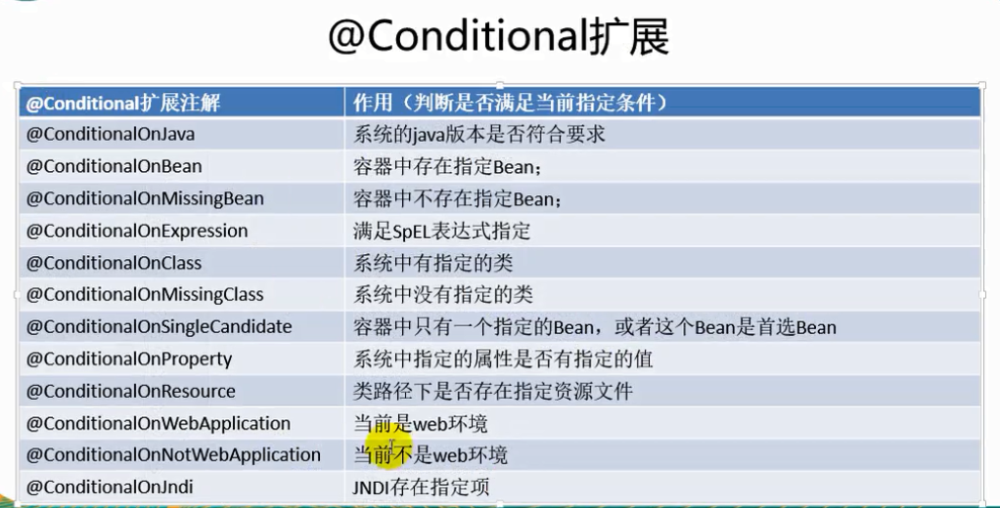

**自动配置类必须在一定条件下才能生效。**

自动配置报告：我们可以通过启动 SpringBoot 的 debug模式。

==用 debug=true 属性（在 application.preproties 配置文件中配置）。来让控制台打印自动配置报告==。这样我们就方便知道哪些自动配置类生效了。

```java
=========================
AUTO-CONFIGURATION REPORT
=========================


Positive matches:（自动配置类启用的）
-----------------

   DispatcherServletAutoConfiguration matched:
      - @ConditionalOnClass found required class 'org.springframework.web.servlet.DispatcherServlet'; @ConditionalOnMissingClass did not find unwanted class (OnClassCondition)
      - @ConditionalOnWebApplication (required) found StandardServletEnvironment (OnWebApplicationCondition)
        
    
Negative matches:（没有启动，没有匹配成功的自动配置类）
-----------------

   ActiveMQAutoConfiguration:
      Did not match:
         - @ConditionalOnClass did not find required classes 'javax.jms.ConnectionFactory', 'org.apache.activemq.ActiveMQConnectionFactory' (OnClassCondition)

   AopAutoConfiguration:
      Did not match:
         - @ConditionalOnClass did not find required classes 'org.aspectj.lang.annotation.Aspect', 'org.aspectj.lang.reflect.Advice' (OnClassCondition)
```


## SpringBoot与日志
### 日志框架
JUL、JCL、Jboss-logging、logback、log4j、log4j2、slf4j.....

[日志门面，日志实现]

	左边一个日志门面(抽象层)，右边一个日志实现。
	日志门面：slf4j
	日志实现：Logback

SpringBoot 底层采用是 Spring 框架，Spring 框架默认是 JCL；

==SpringBoot 选用 SLF4j 和 logback==

- SLF4j使用  （https://www.slf4j.org）

开发的时候，日志记录方法的调用，不应该来直接调用日志的实现类，而是调用日志抽象层里面的方法。

给系统里面导入 slf4j 和 logback 的实现类

```java
import org.slf4j.Logger;
import org.slf4j.LoggerFactory;

public class HelloWorld {
  public static void main(String[] args) {
    Logger logger = LoggerFactory.getLogger(HelloWorld.class);
    logger.info("Hello World");
  }
}
```


每一个日志的实现框架都有自己的配置文件。使用 slf4j 以后，**配置文件还是做成日志实现框架自身的配置文件。**

- 遗留问题

a（slf4j+logback）: Spring（commons-logging）、Hibernate（jboss-logging）、MyBatis、xxxx

统一日志记录，即使是别的框架和我一起统一使用slf4j进行输出？


其他日志框架统一转换为 slf4j ：

1. ==将系统中的其他日志框架先排除出去==
2. ==用中间包来替换原有的日志框架==
3. ==我们导入 slf4j 的其他实现==

- SpringBoot 日志关系

		```xml
	<dependency>
	      <groupId>org.springframework.boot</groupId>
	      <artifactId>spring-boot-starter</artifactId>
	</dependency>
	```
	
	

SpringBoot 使用它来做日志功能：

```xml
<dependency>
  <groupId>org.springframework.boot</groupId>
  <artifactId>spring-boot-starter-logging</artifactId>
</dependency>
```

[SpringBoot日志关系图]-底层依赖关系	

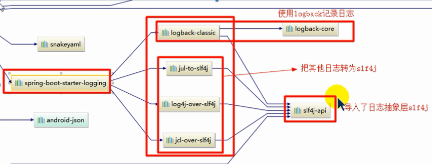

总结：

	1）SpringBoot 底层也是使用 slf4j+logback 的方式进行日志记录
	2）SpringBoot 也把其他日志都替换成了 slf4j
	3）中间替换包
	@SuppressWarnings("rawtypes")
	public abstract class LogFactory {
	
	    static String UNSUPPORTED_OPERATION_IN_JCL_OVER_SLF4J = "http://www.slf4j.org/codes.html#unsupported_operation_in_jcl_over_slf4j";
	
	    static LogFactory logFactory = new SLF4JLogFactory();
	
	4）如果我们要引入其他框架，一定要把这个框架的默认日志依赖移除掉。
	Spring框架采用的是 commons-logging;
	
	<dependency>
				<groupId>org.springframework</groupId>
				<artifactId>spring-core</artifactId>
				<exclusions>
					<exclusion>
						<groupId>commons-logging</groupId>
						<artifactId>commons-logging</artifactId>
					</exclusion>
				</exclusions>
	</dependency>

**SpringBoot 能够自适配所有的日志，而且底层使用 slf4j + logback 的方式记录日志，引入其他框架的时候，只需要把这个框架依赖的日志框架排除掉。**
	

- SpringBoot 默认配置

日志级别:

由低到高  trace<debug<info<warn<error

可以调整输出的日志级别（在配置文件中设置 logging.level=warn ）；日志就只会在这个级别及以后的高级别生效。


SpringBoot 默认给我使用的 info 级别的，没有指定级别就用 SpringBoot 默认规定的级别

```properties
	不指定路径在当前项目下生成 spring.log 日志。可以指定完整的路径。
	logging.file=G:/springboot.log

	在当前磁盘的根路劲下创建 spring 文件夹和里面的 log 文件夹；使用 spring.log 作为默认文件
	logging.path=/spring/log

	在控制台输出的日志格式
	logging.pattern.console=
	指定文件中日志的输出格式
	logging.pattern.file=	
```

- 指定日志文件

给类路径下放每个日志框架自己的配置文件即可；SpringBoot 就不使用其他默认配置了。

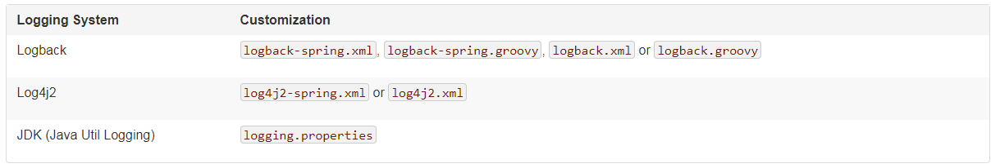

logback.xml:直接被日志框架识别

**logback-spring.xml:**日志框架就不直接加载日志的配置项，由 SpringBoot 解析日志配置，可以使用 SpringBoot 的高级 Profile 功能。否则就会报错！

```xml
<springProfile name="staging">
    <!-- configuration to be enabled when the "staging" profile is active -->
</springProfile>

<springProfile name="dev, staging">
    <!-- configuration to be enabled when the "dev" or "staging" profiles are active -->
</springProfile>

<springProfile name="!production">
    <!-- configuration to be enabled when the "production" profile is not active -->
</springProfile>
```

如果使用logback.xml作为日志配置文件，还要使用profile功能，会有以下错误

 `no applicable action for [springProfile]`

- 切换日志框架

  可以按照 slf4j 的日志适配图，进行相关的切换。

slf4j+log4j的方式；

```xml
<dependency>
  <groupId>org.springframework.boot</groupId>
  <artifactId>spring-boot-starter-web</artifactId>
  <exclusions>
    <exclusion>
      <artifactId>logback-classic</artifactId>
      <groupId>ch.qos.logback</groupId>
    </exclusion>
    <exclusion>
      <artifactId>log4j-over-slf4j</artifactId>
      <groupId>org.slf4j</groupId>
    </exclusion>
  </exclusions>
</dependency>

<dependency>
  <groupId>org.slf4j</groupId>
  <artifactId>slf4j-log4j12</artifactId>
</dependency>
```


切换为 log4j2

```xml
<dependency>
            <groupId>org.springframework.boot</groupId>
            <artifactId>spring-boot-starter-web</artifactId>
            <exclusions>
                <exclusion>
                    <artifactId>spring-boot-starter-logging</artifactId>
                    <groupId>org.springframework.boot</groupId>
                </exclusion>
            </exclusions>
        </dependency>

<dependency>
  <groupId>org.springframework.boot</groupId>
  <artifactId>spring-boot-starter-log4j2</artifactId>
</dependency>
```


## SpringBoot与Web开发

### 1.web开发简介

使用 SpringBoot :

1) 创建 SpringBoot 应用，选中我们需要的模块

2) SpringBoot 已经默认将这些场景配置好了，只需要在配置文件中指定少量配置就可以运行起来

3) 自己编写代码

### 2.静态资源映射配置规则

```java
@ConfigurationProperties(prefix = "spring.resources", ignoreUnknownFields = false)
public class ResourceProperties implements ResourceLoaderAware {
  //可以设置和静态资源有关的参数，缓存时间等
```


```java
	WebMvcAuotConfiguration：
		@Override
		public void addResourceHandlers(ResourceHandlerRegistry registry) {
			if (!this.resourceProperties.isAddMappings()) {
				logger.debug("Default resource handling disabled");
				return;
			}
			Integer cachePeriod = this.resourceProperties.getCachePeriod();
			if (!registry.hasMappingForPattern("/webjars/**")) {
				customizeResourceHandlerRegistration(
						registry.addResourceHandler("/webjars/**")
								.addResourceLocations(
										"classpath:/META-INF/resources/webjars/")
						.setCachePeriod(cachePeriod));
			}
			String staticPathPattern = this.mvcProperties.getStaticPathPattern();
          	//静态资源文件夹映射
			if (!registry.hasMappingForPattern(staticPathPattern)) {
				customizeResourceHandlerRegistration(
						registry.addResourceHandler(staticPathPattern)
								.addResourceLocations(
										this.resourceProperties.getStaticLocations())
						.setCachePeriod(cachePeriod));
			}
		}

        //配置欢迎页映射
		@Bean
		public WelcomePageHandlerMapping welcomePageHandlerMapping(
				ResourceProperties resourceProperties) {
			return new WelcomePageHandlerMapping(resourceProperties.getWelcomePage(),
					this.mvcProperties.getStaticPathPattern());
		}

       //配置喜欢的图标
		@Configuration
		@ConditionalOnProperty(value = "spring.mvc.favicon.enabled", matchIfMissing = true)
		public static class FaviconConfiguration {

			private final ResourceProperties resourceProperties;

			public FaviconConfiguration(ResourceProperties resourceProperties) {
				this.resourceProperties = resourceProperties;
			}

			@Bean
			public SimpleUrlHandlerMapping faviconHandlerMapping() {
				SimpleUrlHandlerMapping mapping = new SimpleUrlHandlerMapping();
				mapping.setOrder(Ordered.HIGHEST_PRECEDENCE + 1);
              	//所有  **/favicon.ico 
				mapping.setUrlMap(Collections.singletonMap("**/favicon.ico",
						faviconRequestHandler()));
				return mapping;
			}

			@Bean
			public ResourceHttpRequestHandler faviconRequestHandler() {
				ResourceHttpRequestHandler requestHandler = new ResourceHttpRequestHandler();
				requestHandler
						.setLocations(this.resourceProperties.getFaviconLocations());
				return requestHandler;
			}

		}
```


- ==所有 /webjars/** ,都去 classpath:/META-INF/resource/webjars/ 找资源==

webjars : 以jar包的形式引入静态资源。

[webjars官网](https://www.webjars.org/)

```xml
<!-- 引入jquery-webjars,在访问的时候写入下面的资源名称即可 -->
<dependency>
    <groupId>org.webjars</groupId>
    <artifactId>jquery</artifactId>
    <version>3.4.1</version>
</dependency>
```

- ==/** 访问当前项目的任何资源（静态资源文件夹）==

  ```java
  "classpath:/META-INF/resources/",
  "classpath:/resources/",
  "classpath:/static/",
  "classpath:/public/",
  "/":当前项目的根路径
  ```

  localhost:/8080/abc -- 去静态资源文件夹下去找abc

- ==欢迎页；静态资源文件夹下的 index.html 页面；被 /** 映射；==

  localhost:8080/   找 Index 页面

- ==所有的  **/favicon.ico 都是在静态资源文件下找。==

### 3.模板引擎

#### Thymeleaf 介绍

JSP、Velocity、Freemarker、Thymeleaf

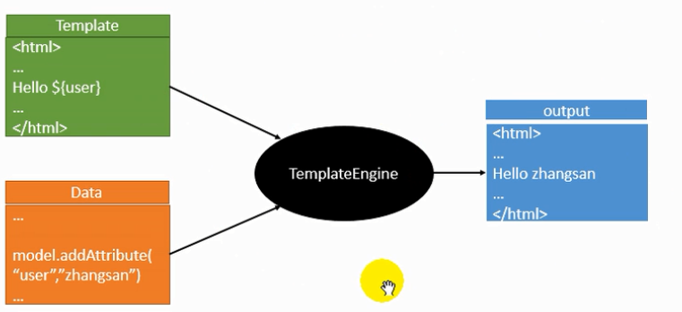

SpringBoot 推荐的 Thymeleaf，功能更强大，语法更简单。

**布局功能支持程序**：

thymeleaf 3 主程序 -- layout 2 以上版本

```
Thymeleaf Layout Dialect 2.0.0
Layout dialect rewritten to support Thymeleaf 3 
```

thymeleaf 2 主程序 -- layout1

```xml
<!--引入Thymeleaf-->
<dependency>
			<groupId>org.springframework.boot</groupId>
			<artifactId>spring-boot-starter-thymeleaf</artifactId>
          	2.1.6
		</dependency>
切换thymeleaf版本
<properties>
		<thymeleaf.version>3.0.9.RELEASE</thymeleaf.version>
		<!-- 布局功能的支持程序  thymeleaf3主程序  layout2以上版本 -->
		<!-- thymeleaf2   layout1-->
		<thymeleaf-layout-dialect.version>2.2.2</thymeleaf-layout-dialect.version>
  </properties>
```


#### Thymeleaf 使用&语法

只要把 html 页面放在 classpath:/templates ，thymeleaf就能自动渲染了。

- **使用**

1. 导入 thymeleaf 的名称空间

   ```html
   <html lang="en" xmlns:th="http://www.thymeleaf.org" >
   ```

2. 使用 thymeleaf 语法

   ```html
   <!DOCTYPE html>
   <html xmlns:th="http://www.thymeleaf.org">
   <head>
   <title>Good Thymes Virtual Grocery</title>
   <meta http-equiv="Content-Type" content="text/html; charset=UTF-8" />
   </head>
   <body>
   <!--th:text 将p标签中内容设置为-->    
   <p th:text="#{home.welcome}">Welcome to our grocery store!</p>
   </body>
   </html>
   ```

- **语法**

1. th:text


2. 表达式

- Simple expressions: 模板引擎

  - Variable Expressions: ${...} 获取变量值

    4.2 Variables 

  - Selection Variable Expressions: *{...} 选择表达式和${...}在功能上一样。补充，配合 th:object="${session.user}  使用

    4.3 Expressions on selections (asterisk syntax) 

  - Message Expressions: #{...}   获取国际化内容

    4.1 Messages 

  - Link URL Expressions: @{...} 定义 URL 

    4.4 Link URLs 

  - Fragment Expressions: ~{...} 片段引用表达式

    4.5 Fragments 

- Literals （字面量）

  - Text literals: 'one text' , 'Another one!' ,…

  - Number literals: 0 , 34 , 3.0 , 12.3 ,…

  - Boolean literals: true , false

  - Null literal: null

  - Literal tokens: one , sometext , main ,…

- Text operations:（文本操作）

  - String concatenation: +

  - Literal substitutions: |The name is ${name}|

- Arithmetic operations:（数字运算）

  - Binary operators: + , - , * , / , %

  - Minus sign (unary operator): -

- Boolean operations:（布尔运算）

  - Binary operators: and , or

  - Boolean negation (unary operator): ! , not

- Comparisons and equality:（比较运算）

  - Comparators: > , < , >= , <= ( gt , lt , ge , le )

  - Equality operators: == , != ( eq , ne )

- Conditional operators:（条件运算 - 三元运算符）

  - If-then: (if) ? (then)

  - If-then-else: (if) ? (then) : (else)
  - Default: (value) ?: (defaultvalue)

- Special tokens:

  - No-Operation: _ 
  
    

### 4.SpringMVC的自动配置原理

#### 1.SpringMVC 的自动配置

**27.1.1 Spring MVC auto-configuration**

Spring Boot provides <!--提供--> auto-configuration for Spring MVC that works well with most applications.<!--应用-->

The auto-configuration adds the following features on top of Spring’s defaults:

- Inclusion of `ContentNegotiatingViewResolver` and `BeanNameViewResolver` beans.

  - 自动配置了 ViewResolver（视图解析器：根据方法的返回得到视图对象（View），视图对象决定如何渲染（转发？，重定向？））
  - ContentNegotiatingViewResolver：组合所有的视图解析器的
  - 如何定制：我们可以自己给容器中添加一个视图解析器；自动的将其组合进来

- Support for serving static resources, including support for WebJars (see below).    静态资源文件夹和 webjars

- Automatic registration  <!--自动注册--> of `Converter`, `GenericConverter`, `Formatter` beans.

  - Converter ：转换器。类型转换使用
  - Formatter ：格式化器。

  ==自动添加的格式化转换器，我们只需要放在容器中即可==

- Support for `HttpMessageConverters` (see below).   

  - HttpMessageConverters：SpringMVC用来转换 http 请求和相应的。
  - HttpMessageConverters：是从容器中确定的；获取所有的HttpMessageConverters；

  ==自己给容器中添加HttpMessageConverter，只需要将自己的组件注册到容器中（@Bean，@Component）。==

- Automatic registration of `MessageCodesResolver` (see below).  定义错误代码的生成规则

- Static `index.html` support. 静态欢迎页面

- Custom `Favicon` support (see below).  favicon.icon

- Automatic use of a `ConfigurableWebBindingInitializer` bean (see below).

  ==我们可以配置一个ConfigurableWebBindingInitializer来替换默认的；（添加到容器中）==

If you want to keep Spring Boot MVC features, and you just want to add additional [MVC configuration](https://docs.spring.io/spring/docs/4.3.25.RELEASE/spring-framework-reference/htmlsingle#mvc) (interceptors, formatters, view controllers etc.) you can add your own `@Configuration` class of type `WebMvcConfigurerAdapter`, but **without** `@EnableWebMvc`. If you wish to provide custom instances of `RequestMappingHandlerMapping`, `RequestMappingHandlerAdapter` or `ExceptionHandlerExceptionResolver` you can declare a `WebMvcRegistrationsAdapter` instance providing such components.

If you want to take complete control of Spring MVC, you can add your own `@Configuration` annotated with `@EnableWebMvc`.

#### 2.扩展 SpringMVC

==编写一个配置类（@Configuration），是 WebMvcConfigurerAdapter 类型；不能标注 @EnableWebMVC==

即保留了所有的自动配置，也能用我们扩展的配置。

```java

```

原理：

​		WebMvcAutoConfiguration 是 SpringMVC 的自动配置类；

​		在做其他自动配置时会导入；@Import（EnableWebMvcConfiguration.class）

​		容器中所有的 WebMvcConfigurer 都会一起起作用；

​		我们的配置类也会被调用

效果：SpringMVC 的自动配置和我们的扩展配置都会起作用

#### 3.全面接管 SpringMVC

SpringBoot 对 SpringMVC 的自动配置不需要了，所以我们自动配置；所有的 SpringMVC 自动配置都失效了。

**我们需要在配置类中添加 @EnableWebMvc 即可；**


原理：为什么加了@EnableWebMvc SpringMVC的自动配置就失效了？

​		@EnableWebMvc 的核心

​		...

​		@EnableWebMvc 将 WebMvcConfigurationSupport 组件导入进来

​		导入的 WebMvcConfigurationSupport 只是 SpringMVC 最基本功能

### 5.如何修改 SpringBoot 的默认配置

**模式：**

1. SpringBoot 在自动配置很多组件的时候，先看容器中有没有用户自己配置的（@Bean、@Component）如果有就用用户配置的，如果没有，才自动配置；如果有些组件可以有多个（ViewResolver）将用户配置的和自己默认的组合起来
2. 在 SpringBoot 中有很多 XXXConfigurer 帮助我们扩展配置。

### 6.web开发 实验

- 默认访问首页

- 国际化

  -  **编写国际化配置文件**
  - 使用 Resource BundleMessageSource 管理国际化资源文件
  - 在页面使用fmt:message 取出国际化内容
  - 点击链接切换国际化

- 登录，拦截器

  **模板引擎页面要实时生效**

  第一步：禁用模板引擎的缓存（在配置文件中写入 spring.thymeleaf.cache=false）

  第二步：html 文件中修改之后要重新编译一下（Ctrl+F9）

  - 错误消息的显示
  - 登录成功的页面
  - 拦截器进行登录检查

- 员工列表

  RestfulCRUD:CRUD满足Rest 风格；

  URL: /资源名称/资源标识  HTTP  请求方式区分对资源CRUD操作

  |      | 普通CRUD（uri来区分操作） | RestfulCRUD       |
  | ---- | ------------------------- | ----------------- |
  | 查询 | getEmp                    | emp---GET         |
  | 添加 | addEmp?xxx                | emp---POST        |
  | 修改 | updateEmp?id=1&xxx        | emp/{id}---PUT    |
  | 删除 | deleteEmp?id=1            | emp/{id}---DELETE |

  - 公共页面抽取

    ```html
    1.抽取公共片段
    2.引入公共片段
    
    ```

    三种引入功能片段的th属性：

    1）.**th:insert** is the simplest: it will simply insert the specified fragment as the body of its host tag.

    将公共片段真个插入到声明引入的元素中

    2）**.th:replace** actually replaces its host tag with the specified fragment.

    将声明的元素替换为公共片段

    3）.**th:include** is similar to th:insert , but instead of inserting the fragment it only inserts the contents of this
    fragment 

    将被引入的片段的内容包含进这个标签中

    ```html
    <!--引入方式-->
    <div th:insert="footer :: copy"></div>
    <div th:replace="footer :: copy"></div>
    <div th:include="footer :: copy"></div
     
    <!--效果-->    
    <div>
        <footer>
        &copy; 2011 The Good Thymes Virtual Grocery
        </footer>
    </div>
    <footer>
    &copy; 2011 The Good Thymes Virtual Grocery
    </footer>
    <div>
    &copy; 2011 The Good Thymes Virtual Grocery
    </div>
    ```

    链接高亮。
  
- 员工添加

  提交的数据格式不对。

- 员工修改

- 员工删除

### 7.错误处理机制

#### 1. SpringBoot 默认的错误处理机制

默认效果：

​	浏览器的话，返回一个默认的错误页面

​	如果是其他客户端，默认响应一个 json 数据

原理：

​	可以参照 ErrorMvcAutoConfiguration ；错误处理的自动配置

​	给容器中添加了以下组件：

​	1）DefaultErrorAttributes

​	2）BasicErrorController

​	3）ErrorPageCustomizer

​	4）DefaultErrorViewResolver

步骤：

​	一旦系统出现 4xx 或 5xx 之类的错误；ErrorPageCustomizer 就会生效（定制错误的响应规则）；就会来到  /error 请求；就会被  **BasicErrorController** 处理。

​			1）响应页面；去哪个页面是由 **DefaultErrorViewResolver**

#### 2.如何定制错误响应

- **如何定制错误页面**

  - ==有模板引擎的情况下，error /状态码；==（将错误页面命名为 错误状态码.html 放在模板引擎文件夹里面的 error 文件夹下），发生此状态码的错误会来到此页面。

    我们可以使用 4xx 和 5xx 作为错误页面的文件夹名来匹配这种类型的所有错误，精选优先（优先寻找精选的状态码.html）

    页面能获取到的信息： 

    | 英文      | 意义                          |
    | --------- | ----------------------------- |
    | timestamp | 时间戳                        |
    | status    | 状态                          |
    | error     | 错误提示                      |
    | exception | 异常对象                      |
    | message   | 异常消息                      |
    | errors    | JSR303 数据校验的错误都在这里 |

  - 没有模板引擎的话（模板引擎找不到这个页面），静态资源文件夹下找

  - 以上都没有错误页面，就是默认来到 SpringBoot 默认的错误提示页面

- 如何定制错误的 json 数据

  - 自定义异常处理 & 返回定制 json 数据（没有自适应效果）

  - 转发到 /error 进行自适应响应效果处理

  - **将我们的定制数据携带出去**

    出现错误之后，会来到 /error 请求，会被 BasicErrorController 处理，响应出去可以获取的数据是由  getErrorAttributes 得到（是 AbstractErrorController 规定的方法）。

    ​	 1） 完全编写一个 ErrorController 的实现类（或者编写一个 AbstractErrorController 的子类），放在容器。

    ​	2）页面上能用的数据，或者是 json 返回能用的数据都是通过 errorAttributes.getErrorAtrributes 得到。

    ​		容器中 DefaultErrorAttributes.getErrorAttributes() 默认进行数据处理的

    自定义 ErrorAttributes

  ​	

  最终效果：响应是自适应的，可以通过定制 ErrorAttributes 改变需要返回的内容。

### 8.嵌入式 Servlet 容器配置

SpringBoot 默认使用 Tomcat 作为嵌入式的 Servlet 容器

#### 1.如何定制和修改 Servlet 容器的相关配置

- 修改和 server 有关的配置（ServerProperties）
- 编写一个 EmbeddedServletContainerCustomizer ：嵌入式的 Servlet 容器的定制器，来修改 Servlet 容器的配置

#### 2.注册 Servlet  三大组件 （Servlet 、Filter、Listener）

由于 SpringBoot 默认是以 jar 包的方式启动嵌入式的 Servlet 容器来启动 SpringBoot 的 web 应用，没有 web.xml 文件。

注册三大组件用以下方式

ServletRegistrationBean

FilterRegistrationBean

ServletListenerRegistrationBean


SpringBoot 帮我们自动配置 SpringMVC 的时候，自动的注册 SpringMVC 的前端控制器；DispatcherServlet

#### 3.SpringBoot 能不能支持其他的 Servlet 容器

Tomcat（默认使用）

Jetty（长连接）

Undertow（不支持 jsp  ）

####  4.嵌入式 Servlet 容器自动配置原理

EmbeddedServletContainerAutoConfiguration 嵌入式 Servlet 容器自动配置

 

- EmbeddedServletContainerFactory（嵌入式 Servlet 容器工厂）

- EmbeddedServletContainer（嵌入式的 Servlet 容器）

- 我们对嵌入式配置修改怎么生效?

  

步骤：

1）、SpringBoot 根据导入的依赖情况，给容器中添加相应的 EmbeddedServletContainerFactory [**TomcatEmbeddedServletContainerFactory**]

2）、容器中某个组件创建对象的时候会惊动后置处理器 EmbeddedServletContainerCustomizerBeanProcessor 

3）、后置处理器，从容器中获取所有的 **EmbeddedServletContainerCustomizer**，调用定制器的定制方法。

#### 5.嵌入式 Servlet 容器启动原理

获取嵌入式的 Servlet 容器工厂：

1）、SpringBoot 应用启动运行 run 方法

2）、refreshContext(context);SpringBoot 刷新 IOC 容器【创建 IOC 容器对象，并初始化对象，创建容器中每一个组件】；如果是 web 应用创建 **AnnotationConfigEmbeddedWebApplicationContext**，**否则AnnotationConfigApplicationContext**

3）、refresh(context);刷新刚才创建好的 ioc 容器

4）、onRefresh()；web 的 ioc 容器重写了 onRefresh 方法

5）、webioc 容器会创建嵌入式的 Servlet 容器; **createEmbeddedServletContainer()**

6）、**获取嵌入式的 Servlet 容器工厂**：

​		从 ioc 容器中获取 EmbeddedServletContainerFactory  组件；

​		TomcatEmbeddedServletContainerFactory  创建对象，后置处理器是这个对象，就获取所有的定制器来先定制 Servlet 容器的相关配置。

7）、**使用容器工厂获取嵌入式的 Servlet 容器**

8）、嵌入式的 Servlet 容器创建对象并启动 Servlet 容器

**先启动嵌入式的 Servlet 容器，再将 ioc 容器中剩下的没有创建出的对象获取出来；**

**IOC 容器启动创建嵌入式的 Servlet 容器。**

### 9.使用外置的 Servlet 容器

嵌入式 Servlet 容器：jar 

​				优点：简单、便捷

​				缺点：默认不支持 JSP 、优化定制比较复杂

外置的 Servlet 容器：外面安装 Tomcat  -- 应用 war 包的方式打包

步骤：

1）、必须创建一个 war 项目（**利用 idea 创建目录结构**）；

2）、将嵌入式的 Tomcat 指定为 provided

3）、必须编写一个 SpringBootServletInitializer 的子类，并调用 configure 方法

4）、启动服务器就可以使用；

**原理**：

jar包：执行  SpringBoot 主类的 main 方法，启动 ioc 容器，创建嵌入式的 Servlet 容器

war包：启动服务器，服务器启动 SpringBoot 应用，启动 ioc 容器


**servlet3.0**

规则：

1）、服务器启动（web 应用启动）会创建当前 web 应用里面每一个 jar 包里面  ServletContainInitalizer 实例

2）、ServletContainerInitializer的实现放在 jar 包的 META-INF/services 文件夹下，有一个名为 javax.servelt.ServletContainerInitalizer 的文件，内容是 ServletContainerInitalizer  实现类的全类名

3）、还可以使用@HandlesType ,在应用启动的时候加载我们感兴趣的类


流程：

1）、启动  Tomcat

2）、javax.servelt.ServletContainerInitalizer

Spring 的 web 某块里面有这个文件：org.springframework.web.SpringServletContainerInitializer

3）、SpringServletContainerInitializer 将@HandlesTypes(WebApplicationInitializer.class) 标注的所有这个类型的类传入到 onStartup 方法的set<Class<?>> ;为这些 WebApplicationInitalizer 类型的类创建实例

4）、每一个 WebApplicationInitalizer 都调用自己的 onStartup 方法

5）、相当于我们的 SpringBootServletInitalizer 的类会被创建对象，并执行 onStartup 方法

6）、SpringBootServletInitalizer 实例执行 onStartup 方法的时候会 createRootAplicationContext ；创建容器

7）、Spring 应用就启动并且创建 IOC 容器

启动  Servlet 容器，在启动 SpringBoot 应用


## SpringBoot与Docker

### 1.Docker简介


Docker 是一个**开源的应用容器引擎**，让开发者可以打包他们的应用以及依赖包到一个可移植的镜像中，然后发布到任何流行的 Linux或Windows 机器上，也可以实现虚拟化。容器是完全使用沙箱机制，相互之间不会有任何接口。 

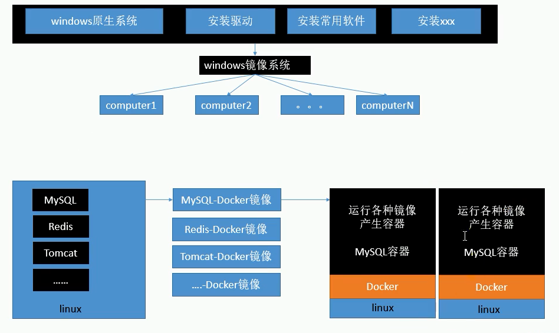

### 2.核心概念

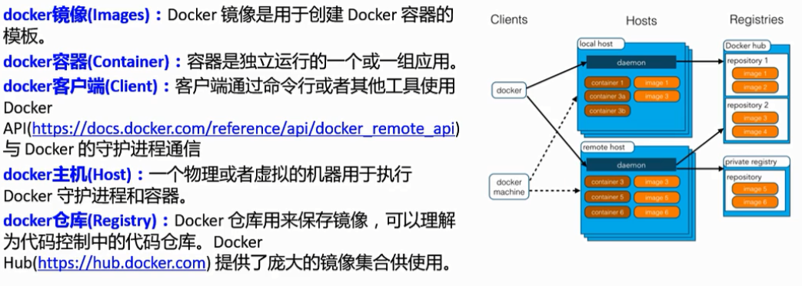

使用 Docker 步骤：

1）、安装 Docker

2）、去 Docker 仓库找到这个软件对应的镜像

3）、使用 Docker 运行这个镜像，这个镜像会生成一个 Docker 容器

4）、对容器的启动停止就是对软件的启动停止

### 3.安装Docker

1）、安装 Linux 虚拟机

​		1、VWare、VirtualBox（安装）

​		2、导入虚拟机文件 centos7

​		3、双击启动 linux 虚拟机；使用 root/123456 登陆

​		4、使用客户端连接 linux 服务器进行命令操作

​		5、设置虚拟网络；

​				桥接网络  --  ==选好网卡==  -- 接入网线

​		6、设置好网络之后使用命令重启虚拟机的网络

​		7、查看 linux 的 ip 地址

​		8、使用客户端连接

2）、Docker 安装

​	步骤：

```shell
1.检查内核版本，必须是3.10及以上版本
uname -r
2.安装 docker
yum install docker
输入 y 确认暗转
3.启动 docker 
systemctl start docker
4.开机启动docker
systemctl enbale docker
5.停止 docker
systemctl stop docker	
```

### 4.Docker常用命令

- 镜像操作

  | 操作 | 命令                                        | 说明                                                      |
  | ---- | ------------------------------------------- | --------------------------------------------------------- |
  | 检索 | docker search 关键字 eg:docker search mysql | 我们经常上 Docker Hub 上去检索信息                        |
  | 拉取 | dcoker pull 镜像名:tag                      | :tag 是可选的，tag 表示标签，多为软件的版本，默认是latest |
  | 列表 | docker images                               | 查看本地所有镜像                                          |
  | 删除 | docker rmi image-id                         | 删除本地指定的镜像                                        |

  [*Docker* Hub](https://hub.docker.com/)

- 容器操作

  软件镜像（QQ安装程序） --- 运行镜像 --- 产生一个容器（正在运行的软件，运行的QQ）

  | 操作     | 命令                                          | 说明                                                         |
  | -------- | --------------------------------------------- | ------------------------------------------------------------ |
  | 运行     | docker run -name container-name -d image-name | --name：自定义容器名；-d：后台运行；image-name：指定镜像模板 |
  | 列表     | docker ps(查看运行中的容器)                   | 加上 -a ：可以查看所有容器                                   |
  | 停止     | docker stop container-name/container-id       | 停止当前你在运行的容器                                       |
  | 启动     | docker start container-name/container-id      | 启动容器                                                     |
  | 删除     | docker rm container-id                        | 删除容器                                                     |
  | 端口映射 | -p 6379:6379                                  | -p：主机端口（映射到）容器内部的端口                         |
  | 容器日志 | dockers logs container-name/container-id      |                                                              |

  #### 5.Docker 安装 MYSQL

  [官方文档](https://hub.docker.com/_/mysql)

  ```shell
  $ docker run --name some-mysql -e MYSQL_ROOT_PASSWORD=my-secret-pw -d mysql:tag
  没做端口映射还是用不了。
  ```

  做了端口映射之后就可以访问


​		几个其他的高级操作：

```SHELL
1.$ docker run --name some-mysql -v /my/custom:/etc/mysql/conf.d -e MYSQL_ROOT_PASSWORD=my-secret-pw -d mysql:tag

2.$ docker run --name some-mysql -e MYSQL_ROOT_PASSWORD=my-secret-pw -d mysql:tag --character-set-server=utf8mb4 --collation-server=utf8mb4_unicode_ci
```

## SpringBoot与数据访问

### 1.简介

JDBC、MyBatis、JPA

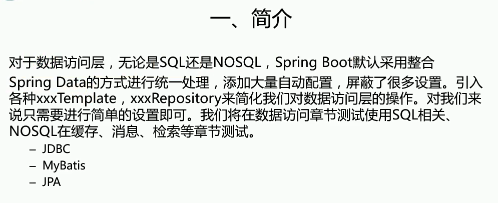

### 2.JDBC和自动配置

效果：

​		默认是用 org.apche.tomcat.jdbc.pool.DataSource 作为数据源。

​		数据源的相关配置都在 DataSourceProperties 里面；

自动配置原理：

org.springframework.boot.autoconfigure.jdbc

​		1、参考 DataSourceConfiguration ,根据配置创建数据源，默认使用 Tomcat 连接池；可以使用 spring.datasource.type 指定自定义的数据源类型；

​		2、SpringBoot 默认可以支持 org.apache.tomcat.jdbc.pool.DataSource、HikariDataSource、BasicDataSource

​		3、自定义数据源类型

​		4、DataSourceInitalizer：ApplicationListener;

​		作用：

​				1）、runSchemaScript()；运行建表语句

​				2）、runDataScripts()；运行插入数据的 sql 语句

默认只需要将文件命名为：

```properties
schema-*.sql data-*.sql
```

​			5、操作数据库：自动配置了 jdbcTemplate 操作数据库

### 3.整合 Druid 数据源

pom中引入 Druid 数据源（https://mvnrepository.com/artifact/com.alibaba/druid）

```xml
<!-- https://mvnrepository.com/artifact/com.alibaba/druid -->
<dependency>
    <groupId>com.alibaba</groupId>
    <artifactId>druid</artifactId>
    <version>1.1.19</version>
</dependency>
```

然后书写配置文件


配置 Druid 的监控

1）、配置一个管理后台的 Servlet（StartViewServlet）

2）、配置一个 web 监控的 filter（webStatFilter）

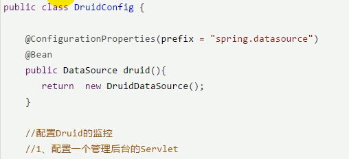

### 4.整合MyBatis

mybatis-spring-boot-starter


步骤：

​		1）、配置数据源相关属性（见上一节  Druid）

​		2）、给数据库建表

​		3）、创建 javaBean	

**4）、注解版**

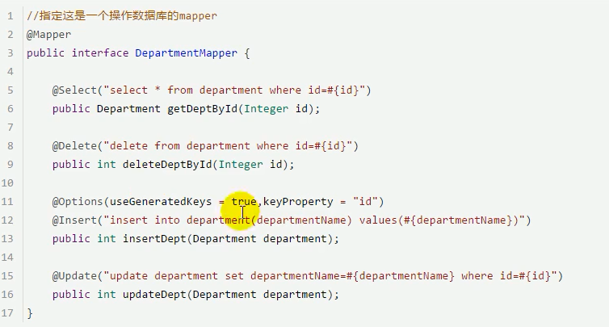


自定义 Mybatis 的配置规则：给容器中添加一个 ConfigurationCustomizer

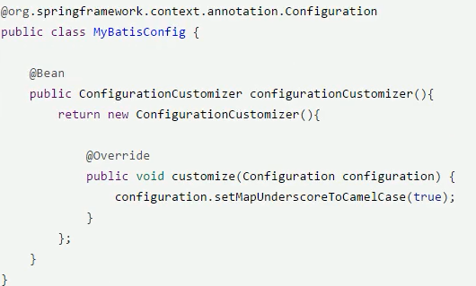


​	还可以使用 @MapperScan 批量扫描所有的 Mapper 接口

```java
@MapperScan(value="包名")
```

**4）、配置版**

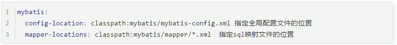

### 5.整合JPA

SpringData ：[官网](https://spring.io/projects/spring-data)

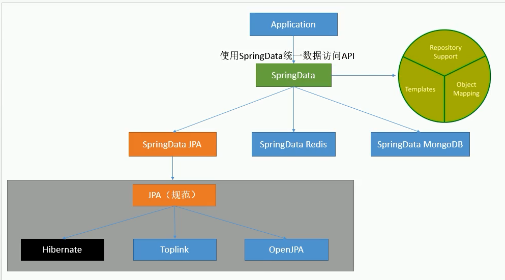

JPA：ORM（Object Relational Mapping）

1）、编写一个实体类（bean）和数据表进行映射，并配置好映射关系；

2）、编写一个 Dao 接口来操作实体类对应的数据表（Repository）

3）、基本的配置 JpaProperties

## SpringBoot启动配置原理

- SpringBoot 原理

几个重要的事件回调机制

配置在METE-INF/spring.factories

**ApplicationContextInitializer**

**SpringApplicationRunListener**


只需要放在 ioc 容器中

**ApplicationRunner**

**CommandLineRunner**


启动流程：

1、**创建 SpringApplication 对象**

```java
initialize(sources);
private void initialize(Object[] sources) {
    //保存主配置类
    if (sources != null && sources.length > 0) {
        this.sources.addAll(Arrays.asList(sources));
    }
    //判断当前是否一个web应用
    this.webEnvironment = deduceWebEnvironment();
    //从类路径下找到META-INF/spring.factories配置的所有ApplicationContextInitializer；然后保存起来
    setInitializers((Collection) getSpringFactoriesInstances(
        ApplicationContextInitializer.class));
    //从类路径下找到ETA-INF/spring.factories配置的所有ApplicationListener
    setListeners((Collection) getSpringFactoriesInstances(ApplicationListener.class));
    //从多个配置类中找到有main方法的主配置类
    this.mainApplicationClass = deduceMainApplicationClass();
}
```


2、运行 run 方法

```java
public ConfigurableApplicationContext run(String... args) {
   StopWatch stopWatch = new StopWatch();
   stopWatch.start();
   ConfigurableApplicationContext context = null;
   FailureAnalyzers analyzers = null;
   configureHeadlessProperty();
    
   //获取SpringApplicationRunListeners；从类路径下META-INF/spring.factories
   SpringApplicationRunListeners listeners = getRunListeners(args);
    //回调所有的获取SpringApplicationRunListener.starting()方法
   listeners.starting();
   try {
       //封装命令行参数
      ApplicationArguments applicationArguments = new DefaultApplicationArguments(
            args);
      //准备环境
      ConfigurableEnvironment environment = prepareEnvironment(listeners,
            applicationArguments);
       		//创建环境完成后回调SpringApplicationRunListener.environmentPrepared()；表示环境准备完成
       
      Banner printedBanner = printBanner(environment);
       
       //创建ApplicationContext；决定创建web的ioc还是普通的ioc
      context = createApplicationContext();
       
      analyzers = new FailureAnalyzers(context);
       //准备上下文环境;将environment保存到ioc中；而且applyInitializers()；
       //applyInitializers()：回调之前保存的所有的ApplicationContextInitializer的initialize方法
       //回调所有的SpringApplicationRunListener的contextPrepared()；
       //
      prepareContext(context, environment, listeners, applicationArguments,
            printedBanner);
       //prepareContext运行完成以后回调所有的SpringApplicationRunListener的contextLoaded（）；
       
       //s刷新容器；ioc容器初始化（如果是web应用还会创建嵌入式的Tomcat）；Spring注解版
       //扫描，创建，加载所有组件的地方；（配置类，组件，自动配置）
      refreshContext(context);
       //从ioc容器中获取所有的ApplicationRunner和CommandLineRunner进行回调
       //ApplicationRunner先回调，CommandLineRunner再回调
      afterRefresh(context, applicationArguments);
       //所有的SpringApplicationRunListener回调finished方法
      listeners.finished(context, null);
      stopWatch.stop();
      if (this.logStartupInfo) {
         new StartupInfoLogger(this.mainApplicationClass)
               .logStarted(getApplicationLog(), stopWatch);
      }
       //整个SpringBoot应用启动完成以后返回启动的ioc容器；
      return context;
   }
   catch (Throwable ex) {
      handleRunFailure(context, listeners, analyzers, ex);
      throw new IllegalStateException(ex);
   }
}
```

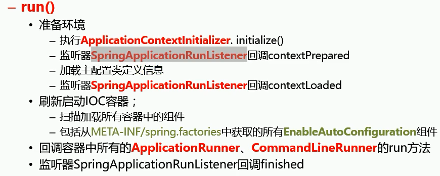


- 事件监听机制

  配置在METE-INF/spring.factories
  
  **ApplicationContextInitializer**
  
  ```java
  public class HelloApplicationContextInitializer implements ApplicationContextInitializer<ConfigurableApplicationContext> {
      @Override
      public void initialize(ConfigurableApplicationContext applicationContext) {
          System.out.println("ApplicationContextInitializer...initialize..."+applicationContext);
      }
  }
  ```
  
  
  
  **SpringApplicationRunListener**
  
  ```java
  public class HelloSpringApplicationRunListener implements SpringApplicationRunListener {
  
      //必须有的构造器
      public HelloSpringApplicationRunListener(SpringApplication application, String[] args){
  
      }
  
      @Override
      public void starting() {
          System.out.println("SpringApplicationRunListener...starting...");
      }
  
      @Override
      public void environmentPrepared(ConfigurableEnvironment environment) {
          Object o = environment.getSystemProperties().get("os.name");
          System.out.println("SpringApplicationRunListener...environmentPrepared.."+o);
      }
  
      @Override
      public void contextPrepared(ConfigurableApplicationContext context) {
          System.out.println("SpringApplicationRunListener...contextPrepared...");
      }
  
      @Override
      public void contextLoaded(ConfigurableApplicationContext context) {
          System.out.println("SpringApplicationRunListener...contextLoaded...");
      }
  
      @Override
      public void finished(ConfigurableApplicationContext context, Throwable exception) {
          System.out.println("SpringApplicationRunListener...finished...");
      }
  }
  ```
  
  
  
  
  
  只需要放在 ioc 容器中
  
  **ApplicationRunner**
  
  ```java
  @Component
  public class HelloApplicationRunner implements ApplicationRunner {
      @Override
      public void run(ApplicationArguments args) throws Exception {
          System.out.println("ApplicationRunner...run....");
      }
  }
  ```
  
  
  
  **CommandLineRunner**
  
  ```java
  @Component
  public class HelloCommandLineRunner implements CommandLineRunner {
      @Override
      public void run(String... args) throws Exception {
          System.out.println("CommandLineRunner...run..."+ Arrays.asList(args));
      }
  }
  ```
  
  

## SpringBoot自定义starters

starter：

​			1、这个场景需要使用到什么依赖？

​			2、如何编写自动配置

​		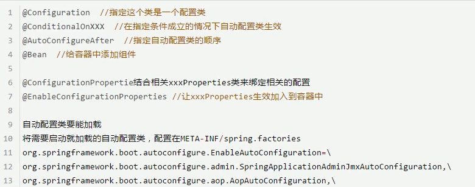

​		3、模式：

启动器只用来做依赖导入；

专门写一个自动配置模块；

启动器依赖自动配置；	别人只需要引入启动器（starter）

**命名约束**

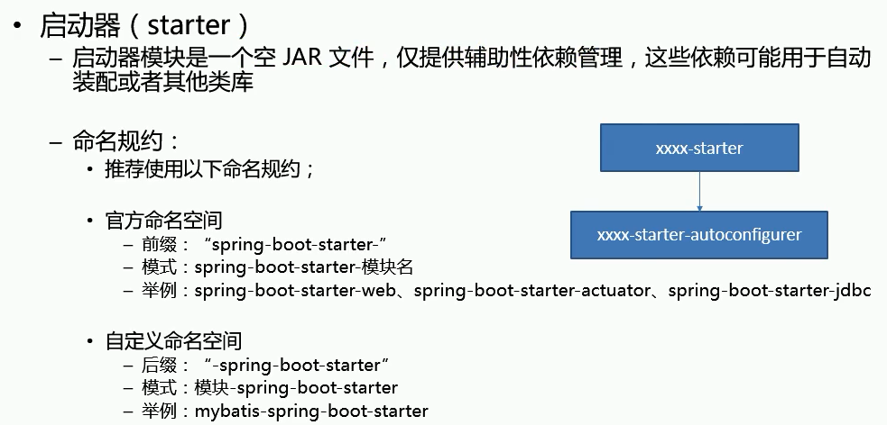


步骤：

1）、启动器模块

```xml
<?xml version="1.0" encoding="UTF-8"?>
<project xmlns="http://maven.apache.org/POM/4.0.0"
         xmlns:xsi="http://www.w3.org/2001/XMLSchema-instance"
         xsi:schemaLocation="http://maven.apache.org/POM/4.0.0 http://maven.apache.org/xsd/maven-4.0.0.xsd">
    <modelVersion>4.0.0</modelVersion>

    <groupId>com.atguigu.starter</groupId>
    <artifactId>atguigu-spring-boot-starter</artifactId>
    <version>1.0-SNAPSHOT</version>

    <!--启动器-->
    <dependencies>

        <!--引入自动配置模块-->
        <dependency>
            <groupId>com.atguigu.starter</groupId>
            <artifactId>atguigu-spring-boot-starter-autoconfigurer</artifactId>
            <version>0.0.1-SNAPSHOT</version>
        </dependency>
    </dependencies>

</project>
```

2）、自动配置模块

```xml
<?xml version="1.0" encoding="UTF-8"?>
<project xmlns="http://maven.apache.org/POM/4.0.0" xmlns:xsi="http://www.w3.org/2001/XMLSchema-instance"
   xsi:schemaLocation="http://maven.apache.org/POM/4.0.0 http://maven.apache.org/xsd/maven-4.0.0.xsd">
   <modelVersion>4.0.0</modelVersion>

   <groupId>com.atguigu.starter</groupId>
   <artifactId>atguigu-spring-boot-starter-autoconfigurer</artifactId>
   <version>0.0.1-SNAPSHOT</version>
   <packaging>jar</packaging>

   <name>atguigu-spring-boot-starter-autoconfigurer</name>
   <description>Demo project for Spring Boot</description>

   <parent>
      <groupId>org.springframework.boot</groupId>
      <artifactId>spring-boot-starter-parent</artifactId>
      <version>1.5.10.RELEASE</version>
      <relativePath/> <!-- lookup parent from repository -->
   </parent>

   <properties>
      <project.build.sourceEncoding>UTF-8</project.build.sourceEncoding>
      <project.reporting.outputEncoding>UTF-8</project.reporting.outputEncoding>
      <java.version>1.8</java.version>
   </properties>

   <dependencies>

      <!--引入spring-boot-starter；所有starter的基本配置-->
      <dependency>
         <groupId>org.springframework.boot</groupId>
         <artifactId>spring-boot-starter</artifactId>
      </dependency>

   </dependencies>


</project>

```


```java
package com.atguigu.starter;

import org.springframework.boot.context.properties.ConfigurationProperties;

@ConfigurationProperties(prefix = "atguigu.hello")
public class HelloProperties {

    private String prefix;
    private String suffix;

    public String getPrefix() {
        return prefix;
    }

    public void setPrefix(String prefix) {
        this.prefix = prefix;
    }

    public String getSuffix() {
        return suffix;
    }

    public void setSuffix(String suffix) {
        this.suffix = suffix;
    }
}

```

```java
package com.atguigu.starter;

public class HelloService {

    HelloProperties helloProperties;

    public HelloProperties getHelloProperties() {
        return helloProperties;
    }

    public void setHelloProperties(HelloProperties helloProperties) {
        this.helloProperties = helloProperties;
    }

    public String sayHellAtguigu(String name){
        return helloProperties.getPrefix()+"-" +name + helloProperties.getSuffix();
    }
}

```

```java
package com.atguigu.starter;

import org.springframework.beans.factory.annotation.Autowired;
import org.springframework.boot.autoconfigure.condition.ConditionalOnWebApplication;
import org.springframework.boot.context.properties.EnableConfigurationProperties;
import org.springframework.context.annotation.Bean;
import org.springframework.context.annotation.Configuration;

@Configuration
@ConditionalOnWebApplication //web应用才生效
@EnableConfigurationProperties(HelloProperties.class)
public class HelloServiceAutoConfiguration {

    @Autowired
    HelloProperties helloProperties;
    @Bean
    public HelloService helloService(){
        HelloService service = new HelloService();
        service.setHelloProperties(helloProperties);
        return service;
    }
}

```


# SpringBoot高级

[SpringBoot高级](https://github.com/helloGitHubQ/FiveYears/blob/master/docs/frame/SpringBoot/SpringBootHighLevel.md)

