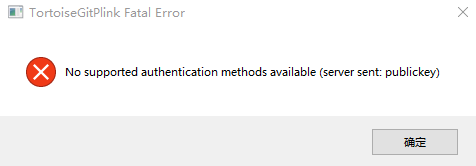
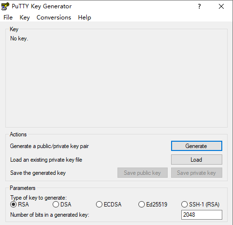

Git
---
[Git常用命令速查表（收藏大全）](https://www.evernote.com/l/AjjNMu8GV5lIlbg7NIEqoCW1fMkPmw5f1gY/)

### 5/11/2019 4:46:42 PM ###

**.gitingore 忽略的文件**

---

**git pull 和 git fetch的区别:**

git pull 是从远程获取最新到本地，并会合并merge.

git fetch 是从远程获取最新到本地，并不会合并merge.

在实际使用中, git fetch 更加安全一些。 

---
**Git使用:**

ssh-keygen -t rsa -C "youremail@example.com" --生成SSH

git remote add origin git@github.com:用户名/项目名.git --关联GitHub

git push -u origin master --推送本地库到远程仓库

git pull -v origin master --从远程仓库获取最新

git clone git@github.com:用户名/项目名.git --克隆远程仓库到本地

Git教程请点击如下网址:

[https://www.liaoxuefeng.com/wiki/896043488029600](https://www.liaoxuefeng.com/wiki/896043488029600 "Git教程")

目前使用的工具是(TortoiseGit/avengers)如下图所示：

---
执行Git命令时出现各种 SSL certificate problem 的解决办法:

git config --global http.sslVerify false

---
### 6/11/2019 10:38:30 PM 

    You have not concluded your merge (MERGE_HEAD exists).
    Please, commit your changes before you can merge.问题
    
    解决办法：（拉代码，丢掉本地修改的代码）
    git fetch --all
    
    git reset --hard origin/master
    
    git fetch

[分支冲突的3种解决办法](https://blog.csdn.net/xlgen157387/article/details/51146949 "分支冲突解决办法")

---

### **2019/11/5**

​		因为换了一台新的电脑，所以 git 生成密钥（有公钥和私钥）是没有问题的。但是就是用 TortoiseGit 去推送(push)的时候出现以下图片中的问题

意思就是使用 TortoiseGit 没有去配置相应的公钥。

1. 开始 -> TortoiseGit -> PuTTYgen -> （加载一个已经存在的私钥文件）Load 

   

   *注：这一步我是因为之前就通过 git 生成过密钥所以就直接加载。如果没有生成过的话，也可以通过 TortoiseGit 去生成一个。*

2. Save private key（位置可以自己选但是要记住）保存完之后你选择的地方就会有一个 .ppk的文件存在。现在离成功已经不远了。
3. Settings -> Git -> Remote -> 选择分支 -> Putty Key（选择后面的 ... 去添加刚刚生成的那个文件） 
4. 再去推送(push)，成功！

### 2019/12/16

本地有git仓库，github上没有git仓库的情况下怎么办？

[**远程仓库教程**](https://www.liaoxuefeng.com/wiki/896043488029600/896954117292416)

1. 确认自己是否已经在 github 上添加SSH。

2. 在 github 上创建项目（和本地的项目一样）,先不要创建 readme 文件。

3. 添加远程仓库的分支（origin）

   `$ git remote add origin git@github.com:XXX/XXX.git`

4. 在本地 git 仓库中推送本地文件（第一次推送）。

   `$ git push -u origin master`

5. 以后推送本地 git 仓库的话用 `git push origin master`

