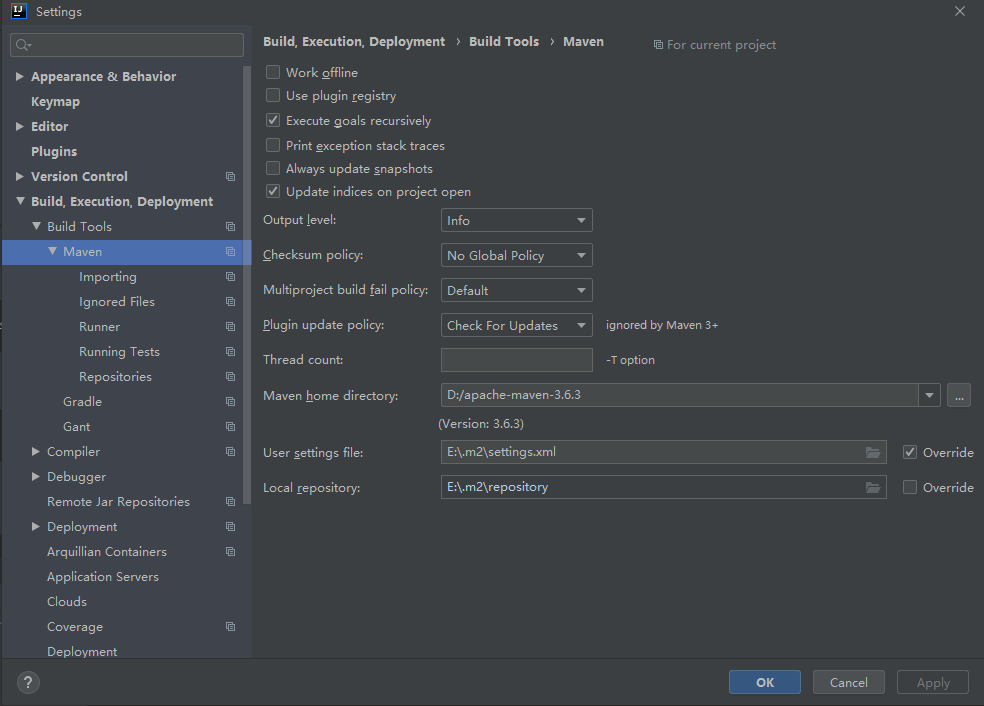

# Maven

Maven is a software project management and comprehension tool. Based on the concept of a Project Object Model (POM), Maven can manage a project's  build, reporting and documentation from a central piece of information.

---

## 下载

[Maven官网](http://maven.apache.org/)


选择图中标记的 zip 格式的文件。

## 配置

apache-maven-3.6.3 -> conf -> settings.xml（打开这文件）

### 先设置本地的仓库

```xml
<settings>
	<!-- localRepository
   | The path to the local repository maven will use to store artifacts.
   |
   | Default: ${user.home}/.m2/repository
  -->
    <localRepository>自己想把仓库放置的位置</localRepository>
</settings>
```

### 将仓库的镜像改成 阿里的镜像（下载速度快）

```xml
<mirrors>
    <!-- mirror
     | Specifies a repository mirror site to use instead of a given repository. The repository that
     | this mirror serves has an ID that matches the mirrorOf element of this mirror. IDs are used
     | for inheritance and direct lookup purposes, and must be unique across the set of mirrors.
     |
     -->
  <mirror>
      <id>alimaven</id>
      <name>aliyun maven</name>
      <url>http://maven.aliyun.com/nexus/content/groups/public/</url>
      <mirrorOf>central</mirrorOf>
    </mirror>
  </mirrors>
```

好啦，现在呢配置文件配置好了。然后就可以开始从阿里的镜像上下载 maven 依赖了。

### 配置 JDK 版本

通过 Maven 创建工程,JDK 默认版本是 JDK 1.5

在 settings.xml 的<profiles> 标签内部添加如下配置：

```xml
<profile>
    <id>development</id>
    <activation>
       <jdk>1.8</jdk>
       <activeByDefault>true</activeByDefault>
    </activation>
    <properties>   					       <maven.compiler.source>1.8</maven.compiler.source>     <maven.compiler.target>1.8</maven.compiler.target>  <maven.compiler.compilerVersion>1.8</maven.compiler.compilerVersion>
    </properties>
</profile>
```


## 使用

IDEA :

File | Settings | Build, Execution, Deployment | Build Tools | Maven

界面如下：



主要有三个要改的地方：

- Maven home directory（改成自己下载的那个 maven 的位置）
- User settings file（可以使用 maven 中的那个 xml 配置文件也可以自己拷贝一个放在和自己仓库同级别的地方）
- Local repository（本地仓库的位置）

然后 apply - ok

## 完成

重新建一个 Maven 项目，之后 idea 就可以自动下载 阿里云仓库上的东西。此时开始自己的 Maven 仓库中会发现已经有很多文件了。

