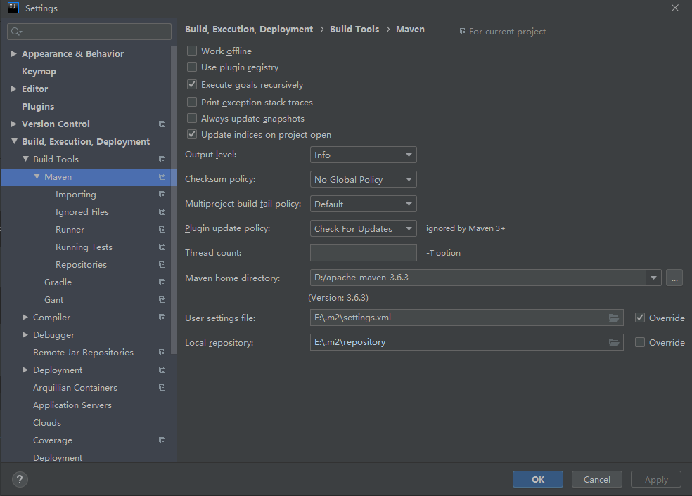
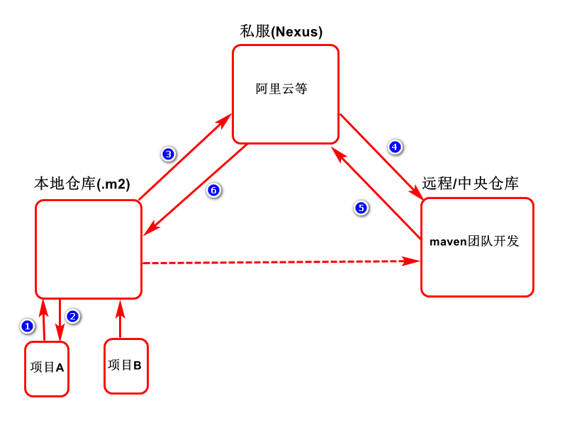

# maven

## 什么是maven呢

它是一个项目管理工具，使用maven用来管理企业级的 Java 项目开发和依赖管理。

使用 maven 开发，可以简化项目配置，统一项目结构。

## 为什么会有 maven 项目呢

**jar 包依赖管理**，jar 包放的到处都是（导入 jar 的方式有很多）。真的让人看得都头大。所以就有了 maven 。

jar包依赖管理：

一个 Java 项目中往往需要依赖一些第三方的 jar 包。依赖管理就是对项目中所有依赖的 jar 包进行规范管理。

```
1.不使用 Maven ,采用传统方式管理 jar 包的弊端：
	1) ##jar包找起来比较麻烦。##在一些大型项目中会使用一些框架，比如SSM或者SSH框架，而框架中所包含的jar包非常多（甚至还依赖其他第三方的jar包），如果这些jar包我们手动去网上寻找，有些jar包不容易找到，比较麻烦。
	
	2) ##将 jar 包导入添加到项目中,可能导致项目体积变大。##传统方式会将jar包添加到工程中，比如Java工程中将jar包放在工程根目录或者放在自建的lib目录下；JavaWeb工程会将jar包放在:/WEB-INF/lib目录下，这样会导致项目文件的体积暴增（例如，有些项目代码本身体积可能仅仅几兆，而加入jar包后，工程的体积可能会达到几十兆甚至百兆）
	
	3) ##在传统的 Java 项目中是所有的 jar 包统一拷贝的同一目录中,可能会存在 jar 包文件名称冲突的问题。##
	
	4) ##在进行项目整合时,可能会出现 jar 包版本冲突问题。##
	
	5) ##在传统java项目中通过编译（手动编译或者在eclipse保存自动编译）、测试（手动在main函数中测试、junit单元测试）、打包部署(手动打war包/手动发布)、运行(手动启动tomcat运行)，最终访问程序。##


2.使用 Maven 来开发项目,管理 jar 包的优势：
	1) Maven 团队维护了一个非常全的 Maven 仓库（中央仓库）,其中几乎包含了所有的 jar 包,使用 Maven 创建的项目可以自动到 Maven 仓库中下载 jar 包，方便且不易出错。
	另外，在 Maven 构建项目中,如果要使用到一些框架,我们只需要引入框架的核心 jar 包,框架所依赖的其他第三方 jar 包,Maven 也会一并去下载。
	
	2) 在 Maven 构建的项目中,不会将项目所依赖的 jar 包拷贝到每一个项目中,而是将 jar 包统一放在仓库中管理,在项目中值需要引入 jar 包的位置即可.这样就是实现了 jar 包的复用
	
	3) Maven 采用坐标来管理仓库中的 jar 包,其中的目录结构为【公司名称+项目/产品名称+版本号】,可以根据坐标定位到具体的 jar 包。即使使用不同公司中同名的 jar 包,坐标不同（目录结构不同）,文件名也不会冲突。
	
	4) Maven 构建的项目中,通过 pom 文件对项目中所依赖的 ja r包及版本进行统一管理,可避免版本冲突。
	
	5) 在 Maven 项目中,通过一个命令或者一键就可以实现项目的编译（mvn complie）、测试（mvn test）、打包部署（mvn deploy）、运行（mvn install）等。
	
	还有发布到 tomcat 服务器中运行: mvn tomcat7:run。如果想实现上面的所有过程，只需要记住一个命令：mvn install
```

总之,使用 Maven 遵循规范开发有利于提高大型团队的开发效率,降低项目的维护成本,大公司都会优先使用 Maven 来构建项目


## 依赖管理

依赖管理也就是所谓的 jar 包管理。

jar 包都不知道在哪里就去管理它呀！我来告诉你 jar 包在哪里！

`apache-maven-3.6.3 -> conf -> settings.xml`

配置 maven 环境的时候有个 settings.xml 文件。文件中有个 `<localRepository>` 标签。就是它标签中所指定的位置。


**idea** 也可以通过  File | Settings | Build, Execution, Deployment | Build Tools | Maven 去查看 jar 包所在的位置。



## maven仓库



如上图所示，Maven 仓库有三种：本地仓库，私服，中央仓库

- 本地仓库

默认的本地仓库位置在：c:/${user.dir}/.m2/repository，其中`${user.dir}`表示windows下的用户目录。本地仓库的作用是，用于保存（存储）从私服或者从中央仓库下载下来的jar包（或插件）。当项目中需要使用jar包和插件时，优先从本地仓库查找。

如果本地仓库中没有所需的jar包，可以到私服或者到中央仓库中下载后再保存到本地仓库。

- 私服

镜像仓库，私服(Nexus)。

私服一般由公司搭建并维护（也可以自己搭建）。如果项目中用到的 jar 包本地仓库没有可以到 私服中去下载，如果还是没有就会到中央仓库上下载。

- 中央仓库

中央仓库，远程仓库，公服。

Maven 团队维护，全世界的人都在用。包含世界上大部分流行的开源项目的 jar 包。


**maven项目的主要标识：**

pom.xml 依赖文件(idea - mavenHelper)

## 添加依赖

[maven资源库](https://mvnrepository.com/)

在 maven 资源库中搜索并把 `<dependency>`

添加到 pom文件中的 `<dependencies>` 标签内部

## 常见问题:question:

在实际开发中，maven 的环境很容易遭到破坏。

- 找不到 jar 包

  剪切报错的依赖信息，等待 idea 重新加载依赖。然后再把依赖信息粘贴过来。