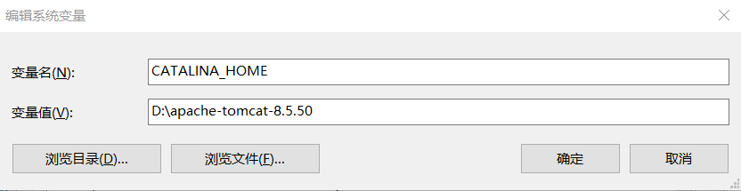
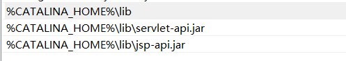
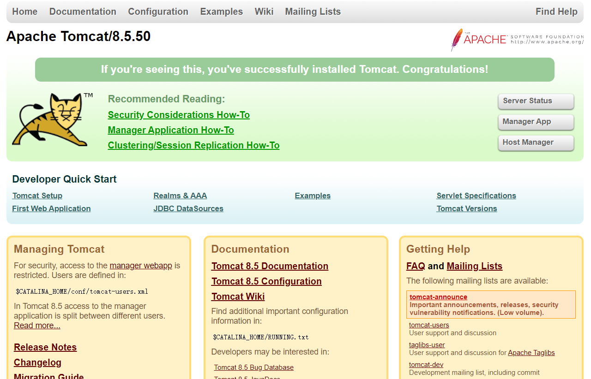

# Tomcat使用过程

## 新环境:smiley:

- 官网上下载 zip 格式文件，直接解压就可以用。

- 配置环境变量（此电脑 -> 属性 -> 高级系统设置 -> 环境变量 ->系统变量）

  - 新增一个 CATALINA_HOME 的变量名

    变量值时 tomcat 的解压路径

  

  - 修改 Path 的变量名

    新增三个变量值

    ​	%CATALINA_HOME%\lib

    ​	%CATALINA_HOME%\lib\servlet-api.jar

    ​	%CATALINA_HOME%\lib\jsp-api.jar

    

- 配置用户信息

  在 conf 目录下有个 tomcat-users.xml 文件打开。加入（最后一行之前）以下内容：

  ```xml
  <role rolename="manager-gui"/> 
  <role rolename="admin-gui"/>  
  <user username="admin" password="admin" roles="admin-gui"/>
  <user username="tomcat" password="admin" roles="manager-gui"/>
  ```

- 起 Tomcat 

  在 bin 目录下找到 startup.bat 点击启动 Tomcat

- 成功！

`org.apache.catalina.startup.Catalina.start Server startup in 618 ms`

- 访问 & 结束

  http://localhost:8080/

  会出现以下界面。收工！！！



## 启动&关闭

```
apache-tomcat-8.5.50	--软件安装目录
	|bin	--tomcat服务器存放批处理文件的存放目录
		|shutdown.bat	--关闭
		|startup.bat	--启动 
```

- 启动：就直接点击 bin 目录下的  shartup.bat 就可以了，启动成功是窗口中会有一行输出 `org.apache.catalina.startup.Catalina.start Server startup in 667 ms`

- 关闭：
  - 点击 bin 目录下的 shutdown.bat 
  - 直接关闭窗口

## 虚拟主机&web应用

- 虚拟主机(Host)

  ```xml
  <Host name="localhost"  appBase="webapps"
              unpackWARs="true" autoDeploy="true">
  
          <!-- SingleSignOn valve, share authentication between web applications
               Documentation at: /docs/config/valve.html -->
          <!--
          <Valve className="org.apache.catalina.authenticator.SingleSignOn" />
          -->
  
          <!-- Access log processes all example.
               Documentation at: /docs/config/valve.html
               Note: The pattern used is equivalent to using pattern="common" -->
          <Valve className="org.apache.catalina.valves.AccessLogValve" directory="logs"
                 prefix="localhost_access_log" suffix=".txt"
                 pattern="%h %l %u %t &quot;%r&quot; %s %b" />
  
        </Host>
  ```

- web应用：

  说白了就是一个**目录**呗！根据所实现的功能，按照一定的目录结构组织起来，就是一个 WEB 应用程序。

在虚拟主机中可以部署多个 Web 应用，每一个 Web 应用都是一个目录。

- **Web 应用的目录结构**：	

  ```
  news	--Web应用程序
  	|
  	|xxx	--普通目录: 放在普通目录中的资源文件(html/css/js/jsp/图片等),浏览器可以直接访问
      |WEB-INF	-- 特殊的,受保护的目录,放在其中的 web 资源文件浏览器无法直接访问
      	|classes	--用于存放编译后的 class 文件 
          |lib 	--用于存放当前 web 应用所需要的 jar 包
          |web.xml 	--是 web 应用的核心配置文件
  ```

  

  **Web 资源（html/js/css/图片等）不能直接放在虚拟主机中，必须放在 Web 应用中，再将 Web 应用发布到虚拟主机，才能进行访问。**

## 部署 web 应用到虚拟主机

只需要将Web应用的目录直接拷贝到虚拟主机所管理的目录下即可。

## 配置缺省的(默认的) web 应用

如果你想访问的时候直接省去 web 应用的名字，就这样：

```
如果没有将news配置为默认的(缺省的)Web应用，访问news下的hello.html路径为:
http://localhost/news/hello.html

如果将news配置为默认的Web应用，访问news下的hello.html路径为:
http://localhost/hello.html
```

将news配置为缺省的(默认的)Web应用，方式为：

​	将news应用的目录改为一个大写的ROOT。

## 配置web应用主页

如果你想访问的时候连主页目录都省了的话，就继续看下去。

```
如果将ROOT下的hello.html配置为ROOT应用的主页，在访问hello.html时，访问路径为：
http://localhost
http://localhost/hello.html (/hello.html可以省略)
```


WEB-INF / web.xml中加入以下部分即可.

```xml
<welcome-file-list>
    <welcome-file>hello.html</welcome-file>
</welcome-file-list>
```

## 打war包

什么是 jar 包？就是已经编译过的 .class 文件

什么是 war 包？它不仅包括 .class 文件还包括 jsp html js css 图片等文件

为什么 web 应用会打成 war 包呢？有几个好处：

- 体积小,节省空间
- 在传输的时候比文件传输的速度快
- 将 war 包发布， tomcat 服务器能自动解压发布！

那么如何打 war 包呢？两步，将要发布的文件打成 .zip 压缩包，然后修改后缀名为  .war 即可！

注意事项：

- rar 包可能不太好使，最好打成 **zip 包**
- 打包目录和文件名**不能有中文**，否则服务器将不会自动解压
- war 包的名字不能于已发布的应用名一样，否则服务器将也不会自动解压

## 问题:question:

### 端口被占用

- 解决方式:one: 运行 shutdown.bat 关闭没有完全关闭的 tomcat 服务器。再次启动服务器看是否能正常启动
- 解决方式:two: 在 CMD 窗口中输入 `netstat -ano`命令查看当前活动的线程，找到 tomcat 服务器运行的那个端口对应的 PID 。然后杀死进程！`taskkill /f /pid PID`