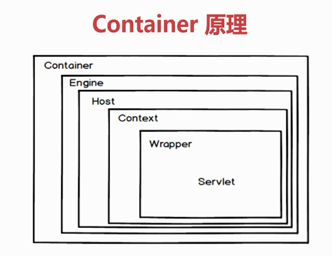
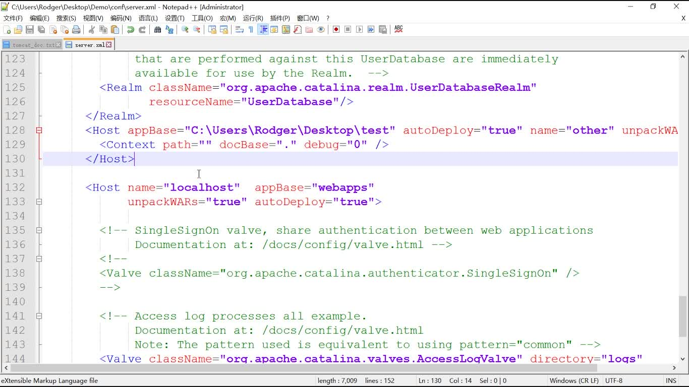
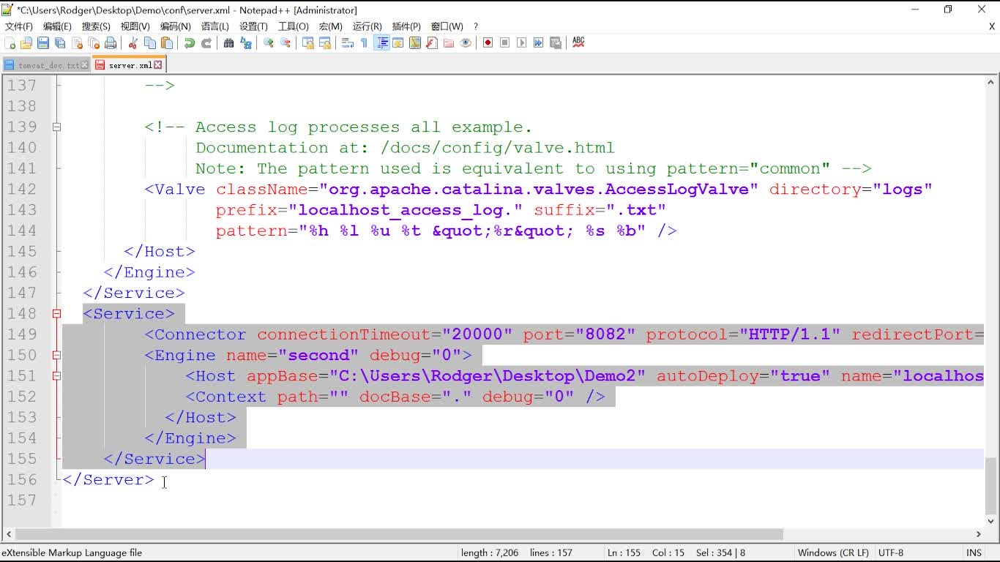

<!-- TOC -->
- [Tomcat](#Tomcat)
	- [运行原理](#运行原理)
    - [环境搭建](#环境搭建)
    - [部署](#部署) 
	  
	- [单点登录](#单点登录)
	
	- [多域名访问](#多域名访问)

	- [Tomcat安全配置](#Tomcat安全配置)
	
	- [性能优化](#性能优化)
	
	  <!-- /TOC -->
# Tomcat:warning: 
Tomcat 7

**打war包**

Apache

## 运行原理


- Connecter 组件

接收客户端连接

加工处理客户端请求 

- Container 原理


## 环境搭建
1. java 开发环境

安装jdk

配置环境变量

2. Tomcat 环境搭建

**目录：**

```txt
apache-tomcat-8.5.50	--软件安装目录
	|bin: 	--批处理文件的存放目录 bat (windows操作)/ sh (linux操作)
	|conf: 	--配置文件的存放目录
	|lib: 	--运行时所依赖的jar包存放目录
	|logs: 	--运行时所产生的日志存放的目录  
	|temp: 	--临时文件的存放目录
	|webapps: 	--存放应用程序，打war包什么的/资源的存放目录,可以被浏览器访问
	|work: 		--编译后的文件，清除缓存（删除work下的文件，重启tomcat）
```

## 部署
- **修改端口号**

server.xml 关闭端口、HTTP端口（修改这个）、AJP端口。

- 修改内存参数

```
堆内存
栈内存
静态内存区
内存溢出异常，(OutputMemoryError)：
Java heap sapce 异常 / PermGen space 异常 / StackOverflowError
设置内存参数。
```

- 热部署

配置热部署：

1. 把 web 文件（war包）放在 webapps下
2. 在server.xml 中配置Context（</host>之上）

	  <Context docBase="D:\work\P2P\web\WebContent" path="/ifcb" reloadable="false"/>
      <Context docBase="D:\work\P2P\management\WebContent" path="/ifcm" reloadable="false" />
      <Context docBase="D:\work\P2P\bank\WebContent" path="/ifcw" reloadable="false"/>

reloadable 为true的话，就会自动加载新增或者修改的 .class 文件

3. 在 Catalina 下的 localhost 下新建一个 xml 文件。 

 

- 配置连接池和数据源

## Tomcat实现web管理

- 管理界面

[http://localhost:8080/](http://localhost:8080/)

 三大块：
Server Status/Manager App/Host Manager

- 发布项目

## 单点登录


SSO：用户只需要登录一次就可以访问所有相互信任的应用系统。

CAS：开源的企业级单点登录解决方案。（基于HTTPS）

CAS Server | CAS Client 


下载 CAS 的war包和两个客户端的war包；cas 的Tomcat和两个客户端的Tomcat。

cas->..->server.xml

cas的war包放到cas Tomcat->webapps中去。

deployerConfigContext.xml

## 多域名访问
提高资源利用率

- 配置多域名访问（IP/端口）

通过 ip 配置多域名访问：

server.xml中加入同级的 HOST 标签。



通过端口配置多域名访问：



server.xml中加入同级的 server 标签。

*实际开发过程中是使用 Nginx 的代理来实现多域名访问。*

## Tomcat安全配置

- 初始化配置

1. 关闭服务器端口

通过命令去关闭服务。并这个字符串不能被其他人知道。

2. 隐藏版本信息

jar包中的 `catalina.jar(org/apeche/catalina/util/ServerInfo.properties) `
修改文件中 server.info

3. 禁用tomcat的管理界面

通过创建空文件夹即把原来的文件夹重命名，然后新建一个ROOT的文件夹。

4. 自定义错误页面

在ROOT下去创建error.html文件。然后去在web.xml中配置error-page。


5. AJP端口管理

AJP协议，如果用 nginx做反向代理的话，就在 server.xml 文件中找到 AJP 协议，然后注掉就好了。

6. 启用cookie的HttpOnly 	 	 	

- Tomcat 安全规范

1. 账号管理，认证授权

共享，无关账号：

tomcat-users.xml

口令密码：

用户权限：

2. 日志配置操作

server.xml 中最下面，默认注释。

3. 设备其他配置操作

server.xml 中 HTTP 中connectionTimeout设置时间。


## 性能优化

缓存优化（nginx,gzip）

运动模式：

- BIO：tomcat7以下默认模式

- NIO：基于缓存区、非阻塞的I/O（推荐）

- APR：tomcat7以上默认模式

---
Tomcat 启动 java 项目：

把 war 包放到tomcat安装目录下的webapps下，然后重新启动tomcat即完成。