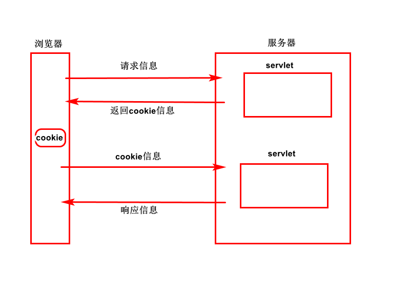
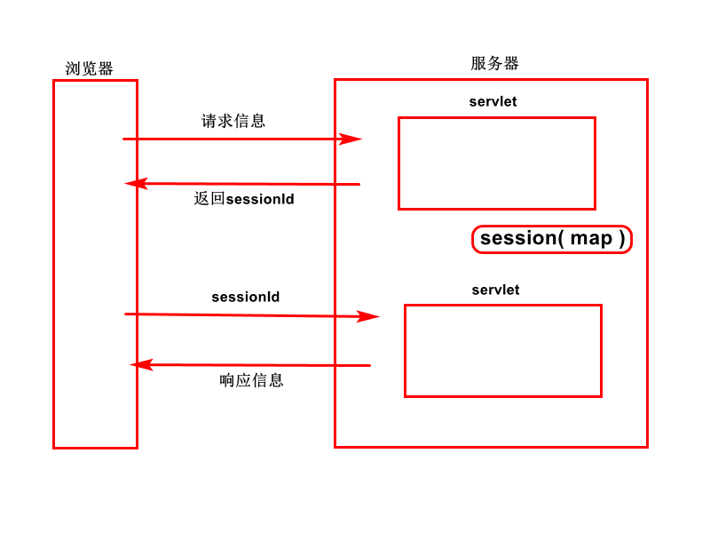

## 会话管理

会话管理，我们先说说什么是会话。

会话是从浏览器访问服务器开始，到浏览器关闭访问服务器为止，会话结束。从浏览器访问服务器开始到访问服务器结束为止，这个期间产生所有的请求和响应加在一起，称之为 是浏览器和服务器之间的一次会话。

在一次会话中往往会产生一些数据，而这些数据往往需要我们保存起来，**如何保存会话中产生的数据呢？**请继续往下看

## cookie

**cookie工作原理**：



**使用 cookie 保存会话中产生的数据**：

-  cookie 是将会话过程中产生的数据保存在浏览器（客户端），是一种客户端技术。
- cookie 是基于两个头进行工作的：**set - cookie 响应头和 cookie 请求头。**
- 其中服务器会将创建好的 cookie 添加到响应中，通过 set - cookie 响应头将 cookie 信息发送给浏览器，让浏览器保存在内部。
- 浏览器保存了 cookie ，只要 cookie 不过期，以后每次访问服务器都会通过 cookie 请求头将之前保存的所有 cookie 都带回给服务器，服务器可以获取请求中的 cookie 进行使用。

#### API

- 创建 cookie 对象

  ```java
  //创建cookie对象，同时指定cookie的名字和cookie中保存的值。都是字符串类型。
  Cookie c = new Cookie(String name, String value);
  ```

- 将 cookie 添加到 response 响应中

  ```java
  //将创建好的cookie对象添加到响应中，在服务器响应浏览器时，会将cookie一起响应给浏览器。
  //可以多次调用该方法，即在一个响应中可以发送多个cookie。
  response.addCookie( Cookie c )
  ```

- 获取请求中的所有 cookie 对象组成的数组

  ```java
  //如果请求中没有cookie，getCookies方法会返回一个null值（不是空数组）
  //如果请求中有cookie（哪怕只有一个），也会返回一个Cookie对象数组。
  Cookie[] cs = request.getCookies();
  ```

- 删除 cookie 

  可惜的是 **cookie 没有提供删除 cookie 的方法**，可以通过别的方式间接删除！

  例如:删除名称为cart的cookie，删除方法是：
  创建一个同名的cookie（也叫作cart），并设置cookie的最大生存时间为零，再把cookie发送给浏览器。

  由于浏览器是根据cookie的名字来区分cookie（主机名、path），如果同一个主机前后给浏览器发送了两个同名的cookie，浏览器会认为是同一个。之前发送的会被后来发送的cookie覆盖。由于后发送的cookie设置了生存时间为零，因此浏览器收到后也会立即删除。

  ```java
  //------删除名称为cart的cookie-----------
  
  //创建一个名称为cart的cookie
  Cookie c = new Cookie("cart", "");
  
  //设置cookie的最大生存时间。
  c.setMaxAge( 0 );
  
  //将cookie发送给浏览器
  response.addCookie( c );
  out.write("成功删除了名称为cart的cookie...");
  ```

- 常用方法

  cookie.getName()	-- 获得 cookie 的名字

  cookie.getValue()	--  获得 cookie 保存的值

  cookie.setValue()	-- 设置 / 修改 cookie 中保存的值

  cookie.setMaxAge() 

#### setMaxAge方法

这个方法是干什么用的呢？

**用来设置 cookie 的最大生存时间的。**

​			默认情况下（如果不设置该方法）， cookie 默认生存时间是一次会话，会话结束，cookie 会销毁（因为 cookie 是存在浏览器的内存中，浏览器关闭，内存会释放，所以 cookie 必然会跟着销毁）。

​			如果设置了 setMaxAge 方法（并且是一个正值）, cookie就不会保存在浏览器的内存中， cookie 会以文件的形式保存在浏览器的临时文件夹中，即使浏览器关闭，内存释放，硬盘上的文件还在，因此 cookie 不会销毁。当浏览器再次启动，还可以通过文件获取到之前的 cookie 。


总结：**如果希望浏览器关闭后，cookie 还能存活，就可以为 cookie 设置最大存活时间，可以保证 cookie 保存在浏览器的临时文件夹中而不是内存中。**

## session

